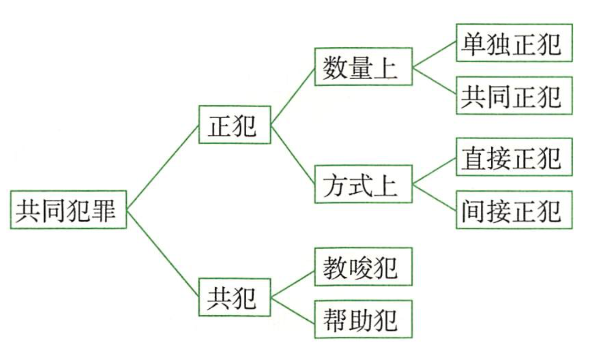
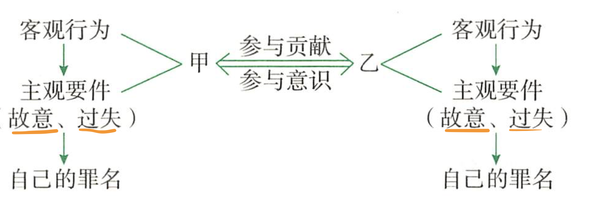
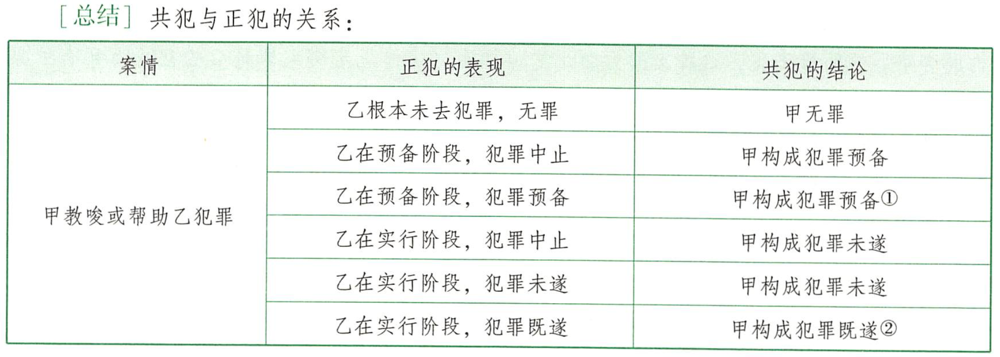
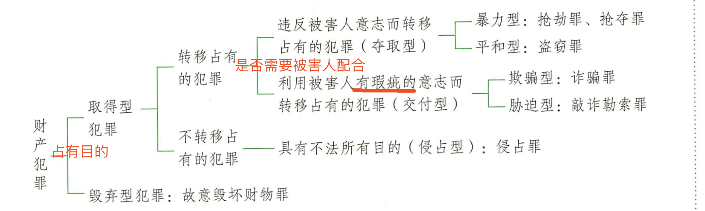
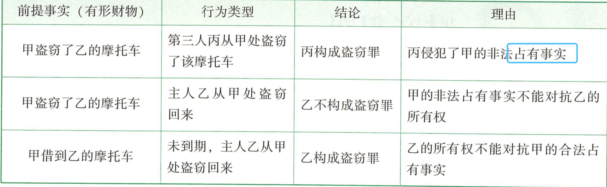
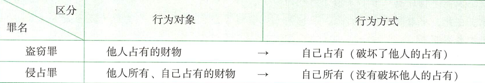
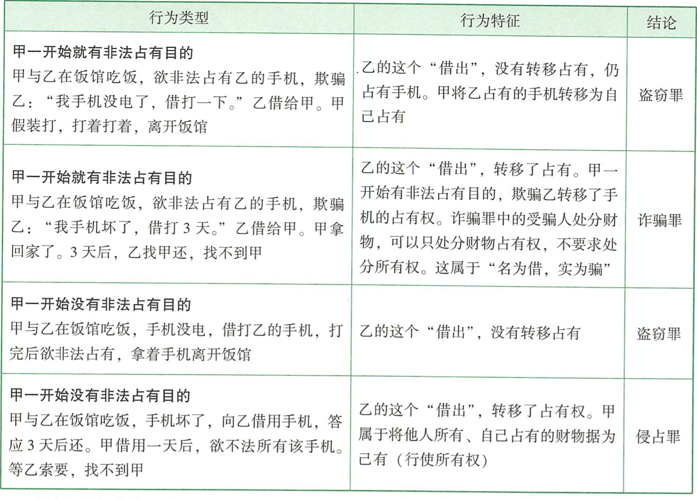

# 刑法论

## 一 刑法的解释学

**刑法的两大任务，保护法益和保障人权。**

本科，刑法的解释学；研究生，博士，刑法的哲学，司法考试本科毕业，因此注重司法的解释。

两个核心店，解释的技巧，结论的产生。

### 1扩大解释和类推解释的区分(必考点)

- 看结论有么有明显超出词语的语义的射程范围
- 解释结论有么有明显超出国民的预测可能性

### 2 解释的理由，论证结论的合理性

- 重点是**体系解释**，就是一个解释放到一个体系里面必须能逻辑自洽，很和谐
  - 同义用语的含义相对化，一词多义
  - 不同用户的含义的同一化，多次一意
  - 同类解释规则，兜底条款如何解释，“等”，"其他" 

抢劫罪中的其他方法和强奸罪中的其他方法是否相同？ 强奸罪中的其他=抢劫+盗窃

### 3 解释技巧和解释理由的关系

- 多种解释技巧的内部关系，排斥关系，结论的生产只能是唯一的
- 理由是并存关系，并存。体系解释，当然解释并存关系
- 技巧和理由是相辅相成的关系，分工不同

## 二 刑法的基本原则

### 1 罪刑法定->保障人权

- 思想基础，民主主义（人民选出来）和自由主义(人权，行动自由也就是基于国民行为预测可能性原理对自己行为自由度的把控)
 - 成文，事前（禁止溯及既往，但不禁止有利于被告人的溯及既往）的罪刑法定，严格的罪刑法定（禁止类推解释，但不禁止有利于被告人的类推解释），确定的，不残虐
    - 确定的罪刑法定原则
    - 禁止不当罚的原则
      	- 刑法和其他法的关系，高位阶和低位阶的关系
      	- 顺序先民法低位阶，再看高位阶刑法（刑事附带民事） 不残虐

###  2 罪刑相适应原则

- 法益侵害性
- 可谴责性
- 人身危险性，再犯可能性，预防刑

## 三 刑法的效力

### 1 时间效力

 - 刑法的时间效力，从旧兼从轻，刑法没有溯及力（不能用事后的法律来判之前的罪，原则上不禁止溯及既往。不禁止有利于被告人的溯及既往）
 - 司法解释的时间效力和对应法条的时间效力，他不是条文，是条文的解释
 - 同一个条文有多个司法解释的时候，哪个有利于被告选哪个

### 2 空间效力

- 属地管辖(考的最多，考点是对地的扩大解释)，属人管辖（中国人在外部），保护管辖，普遍管辖
 - 属地：犯罪的行为地,犯罪的结果地

 - 管辖之间的区别
   	- 贪官外逃，属地
    - 金正男在马来西亚被越南籍杀害，一般按属地管辖优先
   - 电信诈骗，台湾人在马来西亚诈骗国内，我们按照属地来管的

# 犯罪构成

两阶层定罪是定罪的体系，三阶段推理是定罪的方法

## 一 两阶层犯罪体系

人类判断一件事物的新的视角，事实判断和价值评价

- 事实判断，判断在事实层面有没有制造一个法益侵害的事实，行为具有法益侵害性，
  - 符合客观要件，实质违法性（简称违法性）
  - 违法阻却事由
- 价值评价，就是能不能否定评价，能不能谴责，可谴责性简称责任性
  - 责任阻却年龄<14,14~16,18
  - 可谴责性
- 考点
  - 犯罪概念的阶层化理解
  - 客观主义，先客观后主管

## 二 三段论推理

大前提(法律规定)，小前提(案件事实)

### 考点

- 如何解释大前提
	如何解释法律规定，用解释方法技巧来对“法律规定”，也就是罪状，进行解释，罪状的最小单位进行分类，这个最小单位就是构成要件建要素，记述的要素和规范的要素(哲学上价值评价)。
- 如何认识小前提 -> 认清案件事实，难点在于“无法查明的案件”
  存疑时有利于被告 ，一个人干了两件事
  - 疑罪从无，狗蛋无法证明车是买来的，有偷盗嫌疑，定无罪
  - 无法查明是轻重罪，选轻罪，无法确定被撞人死亡是当场还是因为逃逸不救导致，定肇事
- 如何正确的推导三段论
  -  大前提是法律规定，小前提是案件事实
    - 如单位诈骗罪，主体
  - 循环往复使用三段论，一个案件事实可以用N个法律条文来推导
    - 想象竞合，择一重罪，(不同犯罪构成间的认识错误，循环运用三段论)

# 行为主体

### 自然人和单位

### 自然人犯罪

 - 身份犯，身份问题	
    - 真正身份犯，定罪身份， 只有有身份才能成为实行犯。间接正犯是实行犯也要有身份。

 - 国家工作人员的身份认定 
    - 只要依法从事公务，重点是看做的事情，公务是必须有下面两点：
      	- 具有公共管理性
      	- 具有行政的职责性
          - 村长的公务区分，村自治组织内部的村务不是公务

### 单位犯罪

 - 分类
   	- 纯正的单位范围，只能由单位
      	- 不纯正的单位犯罪，经济里面很多
      	- 纯正的自然人犯罪
 - 成立条件，体现单位意志(单位集体决策，基于职权)，为单位谋取利益
    - 如何区分没有单位意志，只有个人意志的情况
       - 没经过单位同意
      	- 盗用冒用单位名义
      	-  干的事情和单位没关系
    - 案例：刘墉案，组织领导黑社会
      	- 黑社会成员杀人罪没有算黑社会上，但有证据表明会议上有授权 
 - 单位犯罪，双罚制，既罚单位，也罚个人
   	- 特殊，如果以犯罪为主要目标和活动的单位不定义单位犯罪
      	- 单位犯罪和个人犯罪的核心点要注意为单位的非法利益
      	- 单位主体消失，真没了就追究单位负责人的责任，假没了追求原单位的单位犯罪
 - **纯正的自然人犯罪**
    - 单位策划故意杀人罪 直接责任人的帮助犯

#    作为

就是积极的制造危险，不作为就是消极的不消除危险

作为就是积极的制造危险，不作为就是消极的不消除危险

## 一 危害行为

### 特征

- 有体性，思想无罪

- 有意性，精神病，癫痫，梦游中的行为都不是刑法行为

- 有害性，有法益侵害，侵犯了刑法值得保护的法益
   - 如同性恋是没有法益侵害的，无罪
   - 兽奸罪也是无罪

### 定义

- 创设了法律不允许的危险
  - 区分犯罪行为和生活行为，生物学博士当服务员看到毒蘑菇给客人是危害行为
  - 降低危险和替代危险，只要帮助了降低或者替代就不是危害行为，就无罪
    - 失火楼上扔婴儿，有罪无责，紧急避险
  - 被害人自陷风险, 女朋友让男票买敌敌畏堕胎，结果女死，结论是无罪，判定步骤
    -  **1 危险的实行者**，女生
    -  **2 对危险有认识能力和控制能力** ，知道敌敌畏，能不喝
    - **3 自己支配和实行危险往前** ，作死，自己负责

## 二 不作为

#### 真正不作为

只能由不作为构成的，法条规定好的

- 如何判断
  - 刑法是否有规定义务
  - 核心行为，不履行义务作为的方式
    - 有积极的，如主动丢弃
    - 有消极的，如离家出走
- 案例
  - 丢枪不报告
  - 遗弃罪

#### 不真正不作为

消极的不作为

-  成立条件
   -  客观条件，应为，能为，不为，等价性
      -  **应为**, 作为义务如何产生？危险源的监管义务或者保护义务(特定关系，特定领域)
         -  **危险源的监管义务**
            -  1 对危险物的监管义务，
            -  2 对危险行为的监管家属会精神病等
            -  3 对自己先行创设的法律不允许的危险
               -  行为降低危险，不产生义务
               -  被害人自陷危险，不产生义务
               -   客观排除事由，正当防卫，紧急避险，法令职责
               -   犯罪行为成为先行行为而产生义务
         -  **对法益对象的保护义务**
            -  特定关系，基于特定关系，某项法益的保护的依赖行为人，因此法益危险要保护
               -  1 法律规范，父母子女，夫妻
               -  2 基于职务、业务、制度规定产生的义务
               -  3 基于合同，仓库保管员对仓库
               -  4 基于自愿行为产生的，弃婴捡回家后产生义务，落水丢了绳子后
            -  特定领域
               -  行为人是特定领域的管理者，出租车司机对车内
               -  行为人对特定领域的危险具有排他支配，被害人对行为人有依赖
      -  能为，是指能力层面能否履行
      -  不为，就是说如果行为人对危险结果是可以避免的，结果不能避免就不能认为有罪
      -  等价性，如果不作为与对应的作为犯罪具有等价性才能构成犯罪
   -  **主观，主观上要有故意或者过失**
      -  1 行为人对产生作为义务存基础事实在认识错误，误以为落水小孩不是自己的，免责
      -  2 对事实没有错误认识，对法律义务有错误认识，不排除故意，不能免责

# 结果

犯罪过程，危险制造->危险升高->危险转为实害结果，实害犯和危险犯

法益侵害事实有俩形态：

- 实害结果(危害结果，结果)

 - 危险
   	- 具体危险，甲在砍乙被逮住
      	- 抽象危险，缓和不紧迫，比如行凶买刀路上，抢劫预备阶段

###  结果加重犯

一个行为，制造两个结果

- 强奸，抢劫，拐卖，防火致人重伤死亡，既可以过失又可以故意
- **法定性，**只有刑法规定的加重才能构成结果加重犯。结果加重犯和想象竞合犯的区别在于都是一个行为多种最，但是想象竞合是择一重处，而结果加重是单独对特定情况单独制定了刑罚，如果去掉这个单独的条文则退化为想象竞合犯。
- **因果关系**，基本行为和加重结果的因果关系。
  - 因的辨认，行为与故意同时存在才能认为是加重的**因**
  - 因果关系，？

#  因果关系

就是为了找到谁该为犯罪结果负责。更多的是在人身犯罪伤亡案件中。

## 基本原理

客观规则理念

### 1 行为要求

行为人创设了法益**不允许**的危险

- 没有创设危险，劝人坐飞机希望坠毁
- 没有创设法律不允许的危险，毒药扔猪圈
- 没有对实害对象创设危险
  - 德国沙漠案，甲穿越沙漠，乙投毒，丙钻孔，甲渴死。丙杀人既遂，乙未遂。

### 2 结果

要符合一定的价值评价要求

- 现实发生，没发生不是
- 保护范围内结果，高速撞人
- 责任范围内结果，因尾灯警察接管的行驶

### 3 过程中

危险不断发展造成实害结果,一个结果要能归责于一个行为，就要求该结果是该行为制造的为吸纳的实现。

#### 1 作为犯

- 不是假定的因果关系。提前按下绞刑，父亲要负责
- 重叠的因果关系。2人独立开枪，单独**都不致死**，同时行为，最终死亡。多因一果，都负责。
- 二重因果。
  - 2人独立开枪，单独**都致死**，同时行为，最终死亡。多因一果，都负责。
  - 医生放毒，特殊体质正常也死亡，加毒共同作用，有因果。
- 被害人特殊体质
  - 行为引发特殊体质，打击导致疾病发作
  - 诱因不一定有责，鸣笛无意致人死亡

#### 2 不作为犯

# 共同犯罪

刑法的青藏高原

## 基本原理

### 共同犯罪的本质

要解决的问题是什么？甲犯罪其他人要不要负责。

现代法学的连带性是指其他人对犯罪的事实有贡献，一起制造了违法事实。

**违法是连带的，责任是独立的。**

共同犯罪，是一起去制造违法事实。判断二人是否成立共同犯罪。客观事实，责任能力层面判断

**考点**期待可能性的共同犯罪。

- 甲偷车，让乙给车销赃。乙是构成共同犯罪，掩饰隐瞒罪。
- **行为模型**，咖啡馆案
  - 老板给店员说保管毒咖啡，过后店员给遗忘的老板毒咖啡，毒死了客人。二人共同犯罪。
    - 老板，过失致人死亡罪
    - 店员， 故意杀人罪帮助犯

### 共同犯罪的分类

#### 1 从结构上共同犯罪分为任意共同犯罪和必要共同犯罪

- 任意共犯，可以一个犯，也可以多人犯。杀人，盗窃等
- 必要共犯，重婚罪，聚众斗殴
  - 对向犯，双方的罪名和法定刑相同，重婚
  - 双方的罪名和法定刑不同，行贿和受贿
  - 只处罚一方，片面的对象犯，如贩卖淫秽物品，只罚贩卖的

#### 2 从作用上，主犯，从犯，胁从犯

#### 3 从分工上，实行犯，教唆犯，帮助犯

**案例分析顺序**

- 正犯(共同正犯，间接正犯)
- 共犯(教唆犯，帮助犯)
- 共同犯罪的特殊形式（承继的，片面的共同犯罪）
- 共同犯罪的结合问题(共同犯与身份犯，不作为犯，认识错误，犯罪形态的结合)

## 共同正犯

共同实行犯。共同实行行为，共同制造违法事实。

### 1 违反的连带性

- 客观上参与人具有**相互协作的关系和贡献**
- 主观上，行为人有相应的**参与**意识

- 1 参与意识
  - 参与意识 。 **案例：**甲乙相约搞个女的，二人违法时被抓，审讯甲想抢劫，乙想强奸。二人构成共同犯罪，但定罪不同。
  - 
  - 单向的，片面的共同犯罪
  - 双方均没参与意识，同时犯，不是共同犯罪
- 2 部分实行，全部负责
  - 二人商量杀人，一人打中打死。二人均构成故意杀人既遂。
  - **考点**, 两人同时开枪，无法查明谁打死。
    - 二人有协作时，是共同犯罪，因此可以部分实行，全部负责
    - 二人是同时犯，无法查明。甲乙均不需对结果负责，二人均杀人未遂。

### 2 形式的相同性

- 1）完全犯罪共同说（错误），部分犯罪共同说
- 2）行为共同说

## 间接正犯

间接正犯和教唆犯，共同点都是引起了他人违法事实，根本区别在**间接正犯对行为人有支配力**。

间接正犯的支配情形：一是强制手段，二是欺骗手段，三是法律规定的要素

### 强制手段

- **1 迫使无责任年龄的人实施犯罪**
  - 行为者的支配不取决于年龄。叫经常犯的不满15岁的去偷东西，教唆犯。
  - 张三让不满15的李四刑讯逼供，张三刑讯逼供的教唆犯。
- 2 强迫他人实施犯罪
- 3 强迫被害人实施自损行为

### 欺骗手段

- 1 欺骗他人有过失的行为。医生让护士打毒针。医生间接正犯，护士过失致人死亡
- 2 欺骗利用有犯罪故意的行为。
  - 屏风案，甲让乙不知情犯故意毁坏财务罪的故意，实行杀人。
  - 甲拿面粉当毒品给丙人去卖让乙买。甲诈骗罪的间接正犯。丙不能犯。

### 法律规定的要素

- 1 身份犯，有身份的警察支配无身份的保洁。警察让清洁工，打犯人。刑讯逼供的间接正犯。
- 2 目的犯。
  - 为索取财物

## 狭义共犯

### 必要条件

- 1 违法从属性，教唆犯和帮助犯成立前提必须以实行犯有违法性为前提。

  - 甲让乙丙去偷东西，乙望风，丙偷，但丙未偷。都无罪。

  

- 2 责任的独立性。
  - 甲要杀人毁尸，乙提供刀。乙要定帮助毁灭证据罪
  - 甲杀人教唆乙碎尸，乙照搬。乙要定帮助毁灭证据罪

### 充分条件

## 教唆犯

教唆者引起正犯制造违法行为(成立)，并引起违法结果(既遂)

### 违法阶层

**引起正犯制造违法事实**。

甲让乙去小区杀A，结果杀了B。故意杀人既遂，故意杀人预备，择一重处。甲犯罪预备。

### 责任阶层

**故意引起正犯制造违法事实**。

- 1 过失教唆。说者无意，听者有心。
  - 狗蛋老爸说要杀村长，狗蛋过几天杀了。老爸不是教唆犯，因为不是故意犯罪。
  - 领导坐车去机场，结果司机开车撞车。领导不是教唆犯。

- 2 故意引起他人制造违法事实
  - 故意引起他人制造故意的违法事实
  - 故意引起他人制造过失的违法事实
    - 甲教唆乙打死前面的“野猪”小芳。甲故意杀人罪的**间接正犯**。
    - 土药案。

## 帮助犯

## 违法阶层

- 1 帮助形式，
  - 物理性帮助
  - 心理性帮助
  - 提供情况，技能方法
- 2 成立条件，帮助行为**促进正犯**制造违法行为
  - 帮助他人制造**违法结果**，是**既遂**。
    - 甲想要乙用钥匙来偷东西。
      - a)乙没有成功送来钥匙，乙不构成
      - b)乙送来钥匙，乙构成帮助犯
      - c)乙送来钥匙，甲在路上弄丢。乙犯罪预备
      - c)乙送来钥匙，甲去发现门开着。乙犯罪预备
      - d)乙送来钥匙，甲去发现钥匙开不开，脚踹开。乙犯罪预备。

## 责任阶层

- 1 **故意促进**让人制造违法事实
- 2 故意促进**他人制造**违法事实

# **间接正犯，教唆犯，帮助犯都是故意犯罪**

# 财产罪

非法占有目的来区分取得和毁坏。转移占有区分侵占和其他。

案例：对保姆钓鱼执法，不构成盗窃罪，主要是意愿。

## 一 基本原理

财产犯罪保护权益，所有权，占有事实。

### 保护权益

先是所有权，然后是占有事实。所有权>占有事实。

占有既有合法，也有非法占有。

背后逻辑，刑法是其他法的基础逻辑，保护底层的财产秩序的稳定性。

所有权=**占有**+使用+收益+处分

### 行为对象：财务

- 1 种类

  - **财产性利益**，有形财务以外的财产利益。不包括“劳务”，骗人给钱写作业，非法利益保护。认定原则行为和行为对象同时存在。
  - 无体物，电，通信网络信号
  - 虚拟财产，Q币，bit币
  - 违禁品，非法持有毒品或假币
  - 债权凭证，存折，银行卡
  - 不动产，房屋
  - 不包括你身体，但是从人分离出来的血液

- 2 价值要求

  - 客观和主观价值。一封情书
  - 积极价值和消极价值
  - 量额刑保
    - `>`2000完整保护，所有的财产犯罪都要保护，盗，偷，抢等
    - 数额不大，有限保护。抢劫，特殊盗窃(入户，多次)
    - 价值微薄，不值得**刑法**保护

- 3 **非法占有的目的**

  非法占有目的由排除排除意思和利用意思构成。排除意思是终局性排除占有人的占有，将财务转为自己占有的意思，利用意思是指对财物进行利用的意思。

  - 排除意思

    - 缺少排除意思不构成盗窃罪。盗用车买酱油后放回。

      盗窃成立情况：

      - 用完不返回。盗用车买酱油后丢弃。
      - 虽有返回，但是妨害使用情况严重。盗用抢救孕妇的车子
      - 虽有返回，但是非法要财务交换。盗了相机要钱赎回。

  - 利用意思，一切可能价值利用方式都可以

    缺少利用意思，就可能造成故意损坏财务。偷了自行车不是想用而是毁弃，毁坏财务罪

    - 有利用意思，不要求正常用。

      案例：

      - 偷内衣猥亵，盗窃罪。
      - 偷书垫桌角，偷钢铁卖废品，盗窃罪。

    - 不利用，也不毁坏，单藏起来。损坏财务罪。

  案例：偷了欠条和银行卡都是第二档。

  - **既包含为自己非法占有，也包含给第三人的非法占有**。第三人和他人是有区别的，第三人有特定对象。

每组都是轻罪+重罪

## 二 侵占

### 行为对象

他人所有，我的占有

- 委托物

  婚礼现场伴娘拿着戒指，是**占有的辅助者**，拿走就成为盗窃罪

  - 不法原因而委托的财物

    - 委托给付的财物

      行贿财务经过第三人转交时，第三人不给，不构成侵占罪

    - 委托保管的财物

      对于非法原因的托管有返还请求权，比如帮忙托管掩饰赃物，不构成犯罪，但是合法原因的转托，有返还请求权。

      **偷来的摩托去修，不给是侵占罪。**

- 遗忘埋藏物

### 行为方式

行为人行使了财务的所有权，主要是处分权。

**案例** ： 吃了别人帮养的狗，侵占罪。提前花了别人代管的钱，不构成。

- 1 特定物
- 2 种类物

## 三 盗窃

#### 行为结构

- 1 对象：他人**占有**的财物

- 2 方式：平和手段，转移占有

  - 秘密性，盗窃不一定是秘密的(多数说），少数说是认为盗窃是需要秘密的

    考点：误将熟知当真知，黑天鹅事件

- 3 主观是故意，具有非法占有目的 

  - 要求主观认识到“数额较大”，天价葡萄
  - 偷自己托运的货物

#### 成立条件

##### **盗窃罪和侵占罪的区分**

判断顺序：先判断主人是否占有，然后判断行为人是否在占有

占有分事实上的占有和观念上的占有。

- 1 **事实上的占有，财物在主人实力控制范围内**

  - 1)主人占有，不要求随身携带

    常考，主人占有财物，但又有一定距离，行为人又持有该财物，然后将该财物脱离主人占有范围，变成自己占有,盗窃。

  - 2）财物明显出于主人实力范围内，即使主人短暂遗忘。饭店遗忘。

  - 3）占有转化。特定场所的财物，主人丧失占有，便转化为场所管理占有，不要求场所管理者意识到

    - 钱包遗忘宾馆，出租车。但是遗忘公交，火车，只能视为无人占有的遗忘物。

  - 4）上下占有，小卖部老板被外甥拿东西回家，没有授权，占有盗窃，有授权，侵占。

    送货，有司机和秘书，司机拿货是盗窃，如果送货只有司机那是侵占。

  - 5）共同占有，合伙买的电脑，一个私卖盗窃。皮鞋2，4，6穿分割后价值损失，盗窃

  - **6）存款的占有**

    - 存款在银行，是债权，银行是所有权
    - 小偷偷了卡，ATM机取款，触发银行的盗窃罪，卡主的银行债权盗窃，想象竞合，择一重处。

  - 7）封缄物

    - 行李箱里，拿宝，盗窃，不还，侵占。
    - 充值卡，刮开偷充，盗窃。不还，侵占

- **2 观念占有**

  - 出差在家的自行车，偷了盗窃
  - 共享单车，1)拆锁只供自己用，盗窃，2）搬到楼道，方便自己用，不盗窃。3）搬到偏僻，不盗窃。
  - 车坏野外放置，被开走，盗窃。

- 3 占有意思

  客观占有，主观没有意识，不存在占有

  - 死者占有
    - 当场杀，当场拿，盗窃
    - 当场杀，过后拿，侵占
    - 第三人任何时候，都是侵占
    - 家里杀，家里拿，盗窃

#### 其他类型

- 1 多次盗窃，2年3次
- 2 入户盗窃
- 3 携凶器盗窃
- 4 扒窃，公开尝试盗窃随身

#### 既遂条件

- 1 既遂标准，取得控制，小偷把财物置于自己的实控范围是既遂

  - 1）空间上，可控制财物
  - 2）状态上，取得控制要平稳状态

- 2 数额在犯罪成立和犯罪既遂中地位

  成立和既遂是前后两个时间段的不同问题，犯罪成立不意味着犯罪既遂

  伸手去偷，就成立，金额不够未遂。

  - 1） 数额较大开偷就是盗窃成立，到手是既遂，主客观相统一才能构成

- 3 数额升格条件

  - 必须主客观一致，案例：阿姆斯特丹洋葱头。卖淫1w手表。

  - 主客观一致是加重犯的构成要件，和基本犯是想象竞合关系

    案例：欲偷100w，偷了50w，50w的既遂，100w的未遂，择重处罚

#### 罪数

- 1 盗打电话，盗用网络，以资费损失来计

- 2 盗窃+后续行为  

  - 1）盗后销赃，如果销售欺诈其他人财物，构成诈骗，数罪并罚。

    盗了违禁品，然后又进行售卖，文物，假币，毒品，赎罪并发

## 四 抢夺

### 行为结构

对物平和和对人没危险是盗窃

**对物暴力，对人有危险**是抢夺

对人暴力，**压制反抗**是抢劫

- 1 抢夺本质是对物实施暴力，不能对人实施暴力，但对人有危险性
- 2 表现情形，不管有没有防备

###  携带凶器抢夺

带凶器抢夺，定抢劫

- 1)凶器
  - A)性质上的凶器，枪支，管制刀具
  - B)用法上的凶器，本来不是凶器，但可以用来杀人的物品
    - 杀伤力大小
    - 一般人对物品的恐惧程度
    - 平日携带的可能性，板砖
- 2）携带
  - 不要随身携带
  - 不要求显示
  - 不要求使用
  - 要有随时使用的可能性，**刀在箱中**不具有随时可能性，荆轲刺秦王，
  - 要有对人使用的意图

### 认定问题

- 1 飞车抢夺
- 2 抢夺致人重伤死亡，重伤->严重情节，死亡->特别严重情节

## **五 抢劫**

### 行为结构

- 实施暴力、胁迫等强制手段（成立条件，只要满足就成立，四个全满足是既遂）
  - **可以是财物主人，财物占有辅助人，财物的保护者**
- 压制对方反抗
- 对方因无法反抗而放弃财物
- 行为人取得财物

##### 1 行为方式

- 暴力
- 胁迫
- 其他方法
  - 本质是让对方不知反抗，不能反抗
  - 昏醉抢劫
  - 拘禁抢劫，锁阳台抢劫

##### 2 行为对象

有形和财产性利益，债权，凭证等

案例：张三李四强行在收费站收费。如何定罪？

 **做题章法**：

- 1 先找出犯罪人，张三李四 
- 2 找出被害人，为了找被害人就得把司机和收费站的关系搞清楚，债权人和债务人的关系，收费员是债权人，过路司机是债务人。先考虑司机是被害人，因为是给钱的一方，
  - 债务人是不是受害人：
    - 1 有没有财产损失
    - 2 给钱之后能不能视为履行了债务
  - 所以司机不是受害人，收费员是受害人，债权人遭受了财产损失
- 3 行为方式，拘禁强制
- 4 最终定为抢劫罪

##### 3 因果关系

- 1 成立必须具备暴力和不能反

  - 欧阳克先想猥亵黄蓉，结果被软为佳扎手，解开打狗棍拿走，问犯了什么罪？没有抢劫暴力，不构成抢劫罪。猥亵未遂，盗窃。行为和主观必须一致。

  - 打人被主动给钱，故意伤害+侵占

- 2 既遂，必须要有因果的第三和第四

  - 抢劫跑的过程中钱包掉了被捡，抢劫未遂+侵占罪

### 事后转抢劫

#### 1 成立条件

- 三个轻罪，实施了盗窃、诈骗、抢夺,具有财产犯罪的属性，符合这三个罪的构成要件，

- 三大目的，暴力主观上要求是“窝赃(已经取得财物)，抗拒抓捕(客观已经在抓捕)或毁灭罪证”

- 当场实行暴力或以暴力威胁，要求和犯罪一起

  - 当场是时间概念

    案例：回家发现小偷，小偷打主人，时间不连续，不构成抢劫

    偷后逃跑，跑了一公里后为了抗拒抓捕，把追者打伤，盗窃转抢劫

  - 使用暴力

    - **对象**，暴力威胁对象不限于被害人

    - **程度**，暴力要达到足以**压制**对方反抗，能压制就行，不用压制住反抗

      踹一脚，不到抢劫，泼开水造成抢劫

    - **结果**，导致对方重伤或是死亡

#### 2 两种抢劫的区分

**临时起意升级的抢劫**就是指正常的普通抢劫，看使用暴力的目标是不是为了继续取得财物

已经取得财物，为了三大目的，转化为抢劫。

- 相同点：都是着手实施抢劫，都对人使用了暴力
- 区分
  - 性质不同，正常抢劫和转化抢劫的构件要素不一样
  - 暴力目的不同，**正常抢劫暴力是为了取得财物，转化抢劫是为了保住财物**

#### 3 两种抢劫的关系

#### 4 事后转抢劫的既遂标准

#### 5  事后转抢劫的共犯问题 

事后抢劫=前提事实(盗窃者，诈骗者，抢夺者)+实行行为(事后使用暴力)

- 1）一人盗
  - 甲盗了逃，逃时，碰到乙
    - 教唆甲用暴力，甲转化抢劫犯，乙转化唆使犯
    - 甲教唆乙去拦，甲转化抢劫的间接正犯，乙为甲的帮助犯
    - 甲骗乙，乙动手，乙假想防卫
    - **乙帮甲拦人动手，甲不知情。乙构成窝藏罪和故意伤害，择一重处。**
- 2）二人盗，一干，一帮忙
- 3)共同盗，共同实行

### 法定升格 

#### 1 入户抢劫

- 非法-入-户，入是身体要进房子
  - 非法入户保护的是住宅的安宁

#### 2 公共交通抢劫

公共交通工具，是针对这个上面的人抢劫

#### 3 抢劫银行或者其他金融机构

金店不属于金融机构

#### 4 多次抢劫或抢劫数额巨大

#### 5 抢劫致人重伤或死亡（结果加重犯）

抢劫后把人重伤

#### 6 冒充军警抢劫

- 以假冒真，不同警种冒充

#### 7 持枪抢劫

#### 8 抢劫军用物资或抢险，救灾，救济物资

## 抢劫罪与绑架罪

### 1 区分

绑架最核心是主观向第三人勒索财物

### 2 联系

想象竞合。商场歹徒挟制小孩问母亲要钱。

### 3 罪数

## 六  敲诈勒索

### 行为结构

- 实施恐吓行为，**以恶害相通告，不给钱就是施加恶害行为**
- 对方产生恐惧心理，
- 对方基于恐惧心理交付财物
- 行为人取得财物

### 敲诈勒索和抢劫的区分

- 被害人的意志自由被剥夺程度不同

- 敲诈有的选，最好选

- 抢劫，没得选，必须选

  案例：	

  - 1 明天不给钱，明天砸你店，敲诈
  - 2 现在不给钱，明天砸你店，敲诈
  - 3 现在不给钱，现在砸你店，抢劫

### 敲诈勒索与行使权力的区分

- 主观上要有非法占有其他人财物的目的
- 客观上属于恐吓行为

### 敲诈勒索与诈骗的关系

- 敲诈是恐惧交钱，诈骗是认识错误交钱

- 被骗产生恐惧交钱，敲诈+诈骗，想象竞合，择一重处

- 恐惧是必须是直接的行为人才能形成敲诈

  转告虚假恐吓信息使人恐惧，构成诈骗罪

## 七 诈骗

### 行为构成

- 1 欺骗行为
- 2 对方产生或者维持认识错误
- 3 对方基于认识错误处分财物
- 4 行为人取得财物
- 5 对方遭受财产损失

#### 欺骗行为

- 欺骗方式，作为和不作为
- 欺骗类型
  - 虚构事实
  - 隐瞒真相

#### 认识错误

- 必须是人类有意思自治的人产生的错误

### 诈骗和盗窃罪的区分

核心被害人**基于认识错误处分财物**

#### 客观处分行为

- 1）调虎离山
  - 商场试鞋穿跑，盗窃，侵占还是诈骗？盗窃。被害人没有处分财物，是行为人实施了转移占有
- 2）趁不注意
  - 甲魔法变10块趁机拿跑这个乙的钱，属于盗窃。乙没处理占有权。
- 3）欺骗借用
  - 吃饭借手机打着跑了，盗窃
  - 借来用几天。“名为借，实为骗”
- 解题思路：
  - 1 非法占有的目的是一开始还是占有后有的，一开始就骗就骗
  - 2 判断主人给的行为是不是处分占有

#### 主观处分意识

被害人**意识到将自己占有的财物**转移给行为人占有。

- 1）被害人具有意思自治能力，骗小孩，盗窃。
- 2）被害人具有意志自由，卫生纸装书包去银行，属抢劫。
- 3）被害人意识到自己是财物的占有者，支配者。公园长凳，睡着，送书，盗窃罪。
- 4）处分意识的判断，被害人要意识到自己是财物的处分权。
  - 案例
    - 司机看到后排有手机，问第二乘客，是否是拥有的。司机没有处分意识，没有意识到自己的占有，是盗窃。
    - 第一个顾客落下钱包，第二个在结账，第三个指出落下的钱包，第二个人拿走收银员默认，那么这时候第二个人是盗窃。
  - 1 整体处分和单个处分(论斤卖而非论个卖)，需要区分数量错误和种类错误
    - 数量错误不影响处分意识，诈骗要求有处分意识即可，不要求有正确。超市偷抓米放到称好的袋子里，结账按已经称好的来算，构成诈骗。
    - 种类错误。米里放枣，没认识到枣的存在，是盗窃。
  - 2 个别处分，论个卖的，只要多个其他的没意识到就是盗窃。
    - 相机盒里放手机，偷窃
    - 傻瓜相机盒替换单反，诈骗
    - 处分资金

## 诈骗，盗窃，侵占的总结

盗窃罪：将他人所有，占有的财物-》通过平和手段-》变成自己占有，所有

诈骗罪：将他人所有，占有的财物-》通过欺骗手段-》变成自己占有，所有

侵占罪：将他人所有，自己占有的财物-》变成自己占有，所有

####  **罪种区分**

- 1 一开始是否有非法占有目的
- 2 判断主人给你的行为是不是处分占有

##八 职务侵占罪

本罪没有侵害他人的占有权，只侵害了他人所有权。

# 22 贪污贿赂罪

## 贪污罪

- 行为公式：	贪污公式=A+B+C+D

- A:  取得型财产犯罪(盗窃，侵占，诈骗)

- B：行为主体(国家工作人员)

- C：行为对象（公共财物）

- D：行为方式（利用职务便利）

  少一个条件退化为普通财物犯罪	

### 构成要件

- 1 行为主体
- 2 行为对象
- 3 行为方式
- 4 实行行为

