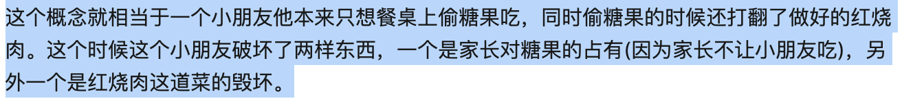

## 20200529 

- 1 今天还是不够专注，有2~3个小时没有好好复习，效率有些低

## 罪刑法定

法律适用顺序，刑事附带民事诉讼。在民法是低位阶，

法律效力

対实害	

想象竞合犯

打击错误和偶然防卫

打击错误是三边关系

偶然防卫

着手，现实紧迫直接的危险   

事实错误，统一构成错误，层层辨认。因果关系的

不能犯考的是空间和时间

## 什么是体系思维？[体系思维的姿态及体系解释方法的运用 ](http://www.iolaw.org.cn/showNews.aspx?id=65419)

我国的刑法典由刑法总则和刑法分则构成，总则中对于犯罪和刑罚做了一般规定；分则则是对于具体罪名的犯罪构成要件及刑事责任。

1. 刑法总论

刑法的体系很是严格，想要学好的话必须树立刑法的体系思维，刑法总论可以简单概述为罪—责—刑。

具体来说，刑法总论包括刑法论、犯罪论、刑罚论。第一部分刑法论包括刑法概述、刑法解释（重点）、刑法的基本原则、刑法的效力。

这一部分内容占刑法总论考试比例的10%左右，在复习的时候要重点学习刑法解释和一些基本的原则，理解就可以，考试最多考一两道选择题。

2. 罪—责

犯罪论这一块应当作为重中之重，考试占到70%左右，这一部分知识点比较难理解，需要重点学习。

法考一般考到的定罪体系是两阶层犯罪构成体系、分为客观（违法）阶层和主观（责任）阶层。

客观（违法）阶层分为：行为主体，危害行为、行为对象、危害结果、因果关系。

客观违法阻却事由：正当防卫、紧急避险、被害人承诺。

主观（责任）阶层分为：犯罪故意、犯罪过失、无罪过事件，事实认识错误等。

主观责任阻却事由：责任年龄、责任能力、违法性认识可能性、期待可能性。

两阶层体系以下有很多分支，要重点区分，将整个体系串联起来，综合记忆效果会更好。

在判断是否构成犯罪后，就要判断犯罪的形态。犯罪形态一般分为犯罪预备、犯罪未遂、犯罪中止、犯罪既遂。这几种形态要搞清楚，一不留神就会出错，特别是未遂和中止的区别，这里就要看是否是犯罪人自动放弃的犯罪。

3. 看完这些之后就是很重要的一章，每年必考的内容，共同犯罪这一章，法考采用的是共同犯罪理论，与之前学习的传统的共同犯罪的理论有很大差异，要重点注意。

这一章主要包含共犯的一般原理、正犯和共犯、共犯的特殊情形，以及一些处罚规定，知识点比较零散，但是重点比较多。

犯罪论还有最后一节内容就是罪数问题，主要讲行为单数、行为复数、数罪的问题。行为单数包括继续犯、结果加重犯、法条竞合、想象竞合等内容，其中想象竞合应作为重点，与数罪并罚不要搞混了。

行为复数包括结合犯、集合犯、连续犯、吸收犯、牵连犯、不可罚的事后行为。

4. 下一个部分就是刑罚部分，一般占到考试的20%左右，分为三章内容，分别是刑罚体系、刑罚的裁量和刑罚的执行和消灭，我们一起看下。

刑罚体系分为：主刑、附加刑、非刑罚处罚措施。

刑罚的裁量分为：量刑情节、累犯、自首、立功、数罪并罚、缓刑等。

刑罚的执行与消灭分为：减刑、假释、时效、赦免。

刑法分论

刑罚分论要注意把握注意规定和法律拟制。

分为三部分内容，主要包括侵犯个人法益、侵犯社会法益和侵犯国家法益。

侵犯个人法益又细分为人身犯罪和财产犯罪，人身犯罪包括生命、身体、自由、名誉、婚姻等权利；财产犯罪包括抢劫罪、抢夺罪、诈骗罪、侵占罪等损害财产权利的犯罪。

侵犯社会法益包括危害公共安全犯罪、破坏经济秩序犯罪、妨害社会管理犯罪。

侵害国家权益主要包括贪污贿赂犯罪、渎职犯罪、危害国家安全罪等。

刑法分论在复习的过程中方法很重要，应该重点理解一些常考的罪名，记忆常考罪名的知识点，不必面面俱到。

5. 刑法学在法考中就是考察一些常见罪名，然后用刑法总论的知识分析为什么构成这些罪名。

搭建好刑法体系，有有助于考生全面系统的分析法律问题，将总则和分则结合起来，准确把握各个罪名的构成要件，做到罪与罪之间合理区分。

## 什么叫观点展示

就是说有关这个问题，司法实践中有不同做法，学理界也有不同的观点
学理界的不同观点大多都是张明楷，周光权提出
司法考试中的考点就在于，你要知道每种不同的观点结论，和该结论的理由

## [想象竞合是什么意思?](https://zh.wikipedia.org/wiki/想像競合)

**想象竞合**（德语：Idealkonkurrenz、英语：ideal concurrence），《[德国刑法](https://zh.wikipedia.org/w/index.php?title=德国刑法&action=edit&redlink=1)》上又称**犯罪单数**（德语：Tateinheit、英语：coincidence (commission of two or more offences in one act)），即一行为数罪，是指行为人实施的同一个行为（德语：dieselbe Handlung、英语：same action）数次实现不法构成要件而成立数罪。形象地说即一石二鸟、一箭双雕、一炮双响。

## [法条竞合；想象竞合，犯罪竞合的体系位置与原则](http://www.iolaw.org.cn/showNews.aspx?id=62896)

## 什么是[阻却违法事由](https://zh.wikipedia.org/zh-hans/阻却违法事由)？ [阻卻違法](https://zh.wikipedia.org/wiki/阻卻違法) 

http://www.faxuejia.org.cn/CN/abstract/abstract115.shtml

违法阻却性事由，又称排除犯罪事由，是大陆法系中的一个概念，是指排除符合犯罪构成要件的行为的违法性的事由[1]。

普通法系（Commom Law System)亦有类似概念，称作“合法化事由”（Justification)，包括正当防卫（Self-Defense )、防卫他人（Defense Of Others)、依法令的行为（Law Enforcement)......等等。

[违法阻却事由与犯罪构成体系](./docs/参考文献/违法阻却事由与犯罪构成体系.pdf)

## [中华人民共和国刑法罪名列表](http://chinalaw.wiki/wiki/中華人民共和國刑法罪名列表)

## [假释](https://zh.wikipedia.org/zh-hans/假释)

**假释**是指犯人在他们的被判刑罚结束前，提前释放，但一般仍处于某种监督之下在监狱外服满刑期。