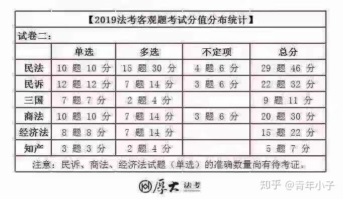

# 学习策略

##  资源推荐总441讲

## 众合

***\*内部系统强化\**：**

刑法-徐光华

民法-孟献贵

行政法-李佳

刑诉-左宁

刑诉-肖沛权

民诉-戴鹏

商经-郄鹏恩

理论法-马峰

三国法-李曰龙

链接: [https://pan.baidu.com/s/1xQHhmSmxnC6wnHlzYXnHgw ](https://pan.baidu.com/s/1xQHhmSmxnC6wnHlzYXnHgw )

提取码: 5i7y

***\*真金题：
\****

刑法-徐光华 https://www.bilibili.com/video/BV1YK4y1b72C?p=1

民法-孟献贵 

行政法-李佳 https://www.bilibili.com/video/BV1iE411A7WX?p=1

刑诉-左宁 https://www.bilibili.com/video/BV1G54y197qw?p=1

民诉-戴鹏 [https://www.bilibili.com/video/BV1iE411A7od?from=search&seid=769912371501846129](https://www.bilibili.com/video/BV1iE411A7od?from=search&amp;amp;amp;seid=769912371501846129)

商经-郄鹏恩 https://www.bilibili.com/video/BV1mc411h77Z

理论法-马峰 

三国法-李曰龙 https://www.bilibili.com/video/BV1R541167o4?p=1

链接: https://pan.baidu.com/s/16h6m3eAIySlmhaA3HLsgFQ

提取码: nft4

***\*
\****

**精讲：**

刑法-徐光华 https://www.bilibili.com/video/BV1uJ411s78Z

民法-孟献贵 https://www.bilibili.com/video/BV1JQ4y1K7fS

行政法-李佳 https://www.bilibili.com/video/BV1YJ411H7j7

刑诉-左宁 https://www.bilibili.com/video/BV18K4y1C7dd

民诉-戴鹏 https://www.bilibili.com/video/BV1XJ411h7Qa

商经-郄鹏恩 https://www.bilibili.com/video/BV1XJ411L7Gu

理论法-马峰 https://www.bilibili.com/video/BV17p4y1172F

三国法-李曰龙 https://www.bilibili.com/video/BV1NE411A74E

链接: [https://pan.baidu.com/s/114_UZL_cBDY6HIQQ6WO8GQ ](https://pan.baidu.com/s/114_UZL_cBDY6HIQQ6WO8GQ )

提取码: ia9r

#  

**新法100分：**

链接: https://pan.baidu.com/s/1nk1N-xhthhYMirfhiL_hHA

提取码: su2u

**勘误、增补：**

链接: [https://pan.baidu.com/s/1WTi385q7wYQzZrZI9jCGlQ ](https://pan.baidu.com/s/1WTi385q7wYQzZrZI9jCGlQ )

提取码: cim2 

***\*重点学科\**：**

链接: https://pan.baidu.com/s/1YBJ0U8V_mtYEyRCBHxgncg

提取码: 595d

**法律法规汇编：**

链接: [https://pan.baidu.com/s/1U6BAptwCG_1XWoL28-mKcw ](https://pan.baidu.com/s/1U6BAptwCG_1XWoL28-mKcw )

提取码: xruf

------

## 瑞达 

**内部精讲：**

刑法-刘凤科

民法-钟秀勇

行政法-徐金桂

刑诉-杨雄

民诉-韩心怡

商经-李晗

理论法-宋光明

三国法-杨帆

链接: [https://pan.baidu.com/s/1o_jkGuvbtjHUJ39_Z5uSIA ](https://pan.baidu.com/s/1o_jkGuvbtjHUJ39_Z5uSIA )

提取码: wedh

***\*
\****

***\*内部真题：\**
**

刑法-刘凤科

行政法-徐金桂

刑诉-杨雄

商经-刘安琪

三国法-杨帆***\*
\****

***\*
\****

链接: https://pan.baidu.com/s/1bgOcCbCPJXK_YEByZUTMUQ

提取码: te24

**真金题：**

刑法-刘凤科 https://www.bilibili.com/video/BV19z4y1X7zK?p=1

行政法-徐金桂 https://www.bilibili.com/video/BV1Vz411z718?p=1

刑诉-杨雄 https://www.bilibili.com/video/BV1nQ4y1P7Cc?p=1

民诉-韩心怡

商经-李晗 

理论法-宋光明 https://www.bilibili.com/video/BV1eK41157nb?p=1

三国法-杨帆 https://www.bilibili.com/video/BV1QC4y1p75L?p=1

链接: [https://pan.baidu.com/s/1YRjVl-iiEtFcBmTFjOjfaQ ](https://pan.baidu.com/s/1YRjVl-iiEtFcBmTFjOjfaQ )

提取码: 9f4t

**
**

**精讲：**

刑法-刘凤科 https://www.bilibili.com/video/BV1tJ411i7Uq

刑法-蔡雅奇 https://www.bilibili.com/video/BV1NJ411J7w4

行政法-徐金桂 https://www.bilibili.com/video/BV1fk4y1d7rG

刑诉-杨雄 https://www.bilibili.com/video/BV1ve411x7PE

民诉-韩心怡 https://www.bilibili.com/video/BV1bJ411H7dS

商经-李晗 https://www.bilibili.com/video/BV1GK411L7xy

商经-刘安琪 https://www.bilibili.com/video/BV1cc411h7gX

理论法-宋光明 https://www.bilibili.com/video/BV1MJ411J7vE

三国法-杨帆 https://www.bilibili.com/video/BV1hJ411i7cQ

链接: https://pan.baidu.com/s/1EgBcAZObpdkVv7Zvfb41YQ

提取码: n8rn

**重难点专题课：**

链接: [https://pan.baidu.com/s/1UkrOuZER0hjujUGfhiffxw ](https://pan.baidu.com/s/1UkrOuZER0hjujUGfhiffxw )

提取码: wwvg 

**法律法规汇编：**

链接: https://pan.baidu.com/s/12G2qNG5R-yA_219-gEFyLw

提取码: ghtn

**增补、修订：**

链接: https://pan.baidu.com/s/1-JOxGriyvQJI1RBxItQL2w

提取码: 2s6e 

------

**
**

## 厚大

**内部面授：**

刑法-罗翔

民法-张翔**
**

行政法-魏建新

刑诉-向高甲

民诉-刘鹏飞

商经-鄢梦萱**
**

链接: https://pan.baidu.com/s/1HiHGeH6ahX66KvWVg2rgDg

提取码: 8b86

**私塾：**

民法-张翔**
**

行政法-魏建新

刑诉-向高甲

民诉-刘鹏飞

商经-鄢梦萱**
**

理论法-高晖云

三国法-殷敏**
**

**
**

链接: https://pan.baidu.com/s/1dmLT0NjK8hJL5SM1n8hymA

提取码: q9xu **
**

**
**

**真金题：**

刑法-罗翔

民法-张翔

行政法-魏建新 https://www.bilibili.com/video/BV1TC4y1p7xa

民诉-刘鹏飞 https://www.bilibili.com/video/BV1sg4y1i7ED

商经-鄢梦萱 https://www.bilibili.com/video/BV1wf4y1m7Cc

理论法-高晖云

三国法-殷敏

链接: [https://pan.baidu.com/s/1DM2njNXcOxFRZ0EvvJZ_ag ](https://pan.baidu.com/s/1DM2njNXcOxFRZ0EvvJZ_ag )

提取码: y5cj**
**

**
**

**精讲：**

刑法-罗翔 https://www.bilibili.com/video/BV12J41187aC

民法-张翔 https://www.bilibili.com/video/BV1oJ411J7YL

行政法-魏建新 https://www.bilibili.com/video/BV1k741127xQ

刑诉-向高甲 https://www.bilibili.com/video/BV1AE41157Ku

民诉-刘鹏飞 https://www.bilibili.com/video/BV1Pt4y1U7BK

商经-鄢梦萱 https://www.bilibili.com/video/BV1oJ411Y7op

理论法-高晖云 https://www.bilibili.com/video/BV1ac411h7aC

三国法-殷敏 https://www.bilibili.com/video/BV1uE411x7Hs

链接: [https://pan.baidu.com/s/1BzHKq0ELJjx0WJmD8dXlnQ ](https://pan.baidu.com/s/1BzHKq0ELJjx0WJmD8dXlnQ )

提取码: uauf

**思维导图**

链接: https://pan.baidu.com/s/1gybDeGrg98a549FE746lEA

提取码: y7wb

**增补、修订**

链接: [https://pan.baidu.com/s/1QQtG_Nj9V2yow6q3IS7E_Q ](https://pan.baidu.com/s/1QQtG_Nj9V2yow6q3IS7E_Q )

提取码: fxc7

------

## 柏杜

**内部精讲：**

刑法-柏浪涛

刑法-车润海

民法-曹兴民

行政法-黄韦博

民诉-蔡辉

理论法-杜洪波

三国法-陆寰

链接: https://pan.baidu.com/s/19PPnRKv_zgP0n-Fzy6i4vg

提取码: anfi

**真金题：**

刑法-柏浪涛 https://www.bilibili.com/video/BV1wg4y1q7EP

民法-曹兴民

行政法-黄韦博

刑诉-温云云

民诉-蔡辉

商经-张海峡

理论法-杜洪波

三国法-陆寰

链接: [https://pan.baidu.com/s/1t9L8ypte2mzIGa7914ag2A ](https://pan.baidu.com/s/1t9L8ypte2mzIGa7914ag2A )

提取码: anf7

**精讲：**

刑法-柏浪涛 https://www.bilibili.com/video/BV1ZJ411q7HJ

民法-曹兴明 https://www.bilibili.com/video/BV16J411i7cd

行政法-黄韦博 https://www.bilibili.com/video/BV1hJ411J78o

刑诉-温云云 https://www.bilibili.com/video/BV1kt4y127ff

民诉-蔡辉 https://www.bilibili.com/video/BV1pJ411Y7Jj

商经-张海峡 https://www.bilibili.com/video/BV1sE411c7hT

理论法-杜洪波 https://www.bilibili.com/video/BV1MJ411t79P

三国法-陆寰 https://www.bilibili.com/video/BV1RV411R7ic

链接: https://pan.baidu.com/s/1-5XGLyPZ7kEQC5qQ5aQgug

提取码: 3y3w

**客观私塾**

链接: https://pan.baidu.com/s/1i-NiRPjewfx5UEll1ewP_g

提取码: 5pxe

**民法典思维导图**

链接: https://pan.baidu.com/s/1qrY46GHPb4XRBHBFOkWneg

提取码: k5vh

**刑诉口诀（左宁、向高甲、杨雄）**

链接: https://pan.baidu.com/s/11X4NG_DhIaX3phg9EAOzNQ

提取码: rx3i

**文都**

链接: https://pan.baidu.com/s/1ZxaUovJDa8fWBIqg-uJGFw

提取码: 7mgs 

 手机题库下载 深蓝法考 APP

- 瑞达法考链接: https://pan.baidu.com/s/1mGMqgik_xNtpeIEULU3-xw 提取码: eicx 
- 厚大法考链接: https://pan.baidu.com/s/14pz3jPnnj3fQDE6892uFvg 提取码: he47 
- 众合法考链接: https://pan.baidu.com/s/1-QtPdfpyxqjM7FgTBZlrMg 提取码： xujg

- 柏杜考链接: https://pan.baidu.com/s/1O9GZKPCf2PZe_psNLKJ91g 提取码: icem 
- 白斌链接: https://pan.baidu.com/s/1_M_72e8XQ233_QgMgFOwjA 提取码: h2py
  

### 1-刑法  [2020年柏浪涛刑法攻略精讲卷54讲](https://www.bilibili.com/video/BV1ZJ411q7HJ?p=1)

 [01_2020年柏杜法考攻略精讲刑法-柏浪涛.pdf](./docs/01_2020年柏杜法考攻略精讲刑法-柏浪涛.pdf)

### [客观-2020年刑法攻略真题阶段](https://www.bilibili.com/video/BV1wg4y1q7EP?p=1)

**柏浪涛**,刑法是法科中的数学，是这些学科里逻辑性最强的一门，而柏神逻辑性很强，很严谨，真是天生的讲刑法的老师。同时，柏神非常有学者风范，文质彬彬的，听他讲起强奸、抢劫、绑架的，体验很好

### 2-行政法  [2020年徐金桂行政法精讲60讲|行政法|徐金桂|精讲](https://www.bilibili.com/video/BV1g7411h7bs?p=1)

### [2020法考客观题行政法精讲课29讲-众合李佳](https://www.bilibili.com/video/BV1YJ411H7j7?p=1)

[2020年瑞达客观内部精讲行政法-徐金桂讲义.pdf](./docs/2020年瑞达客观内部精讲行政法-徐金桂讲义.pdf)

### 3-刑诉 [2020法考客观题刑事诉讼法精讲课-众合左宁39讲](https://www.bilibili.com/video/BV1ht4y1m7VE?p=1)

 [01_2020年柏杜法考攻略精讲刑法-柏浪涛.pdf](/sifakaoshi/docs/01_2020年柏杜法考攻略精讲刑法-柏浪涛.pdf)

**左宁**，江湖人称大舅。刑诉的知识点真是“又多又杂”，先开始觉得是不是大舅讲课有问题，后来发现是这门课的内容真的是太多了，在这么复杂庞大的知识体系下，大舅能在一定的课时内，把知识点梳理到这个程度，真的相当不容易了。特别想说一句的是，大舅的顺口溜，例如“显时特告死”“侮暴虐侵”这些，说是说顺口溜，其实就是把第一个字串起来（白眼.jpg），但神奇的是，后来我真的记住了，而且记得很牢

### 4-理论法 [2020法考宝典精讲理论法47讲白斌](https://www.bilibili.com/video/BV1W54y197s6?p=1)

#### [2020法制史](https://www.bilibili.com/video/BV1nJ411E7mG?p=1)

### 5-民诉 [2020年司法考试民诉戴鹏29讲](https://www.bilibili.com/video/BV1XJ411h7Qa?p=1)

### 6-民法

### 太长 [2020法考孟献贵讲民法89,85h](https://www.bilibili.com/video/BV1vJ411i7Ly?p=1)

### [2020法考孟献贵讲民法应试版77讲](https://www.bilibili.com/video/BV1bQ4y1K7E9?p=1)

**钟秀勇**,民法的知识点跟生活很紧密，可听性很强，同时，老钟的课很适合零基础的人，趣味性很高。他的基础阶段的课程课时很长，讲得很细，第一轮的时候很受用，那时我想，后边要是有时间我要再回来听一遍，但是到冲刺阶段的时候再回头看就觉得他有点啰嗦了，尤其是他编的书，真的是有点厚。

### 7-商经 [2020年厚大法考-商经法-系统强化-鄢梦萱78讲](https://www.bilibili.com/video/BV1oJ411Y7op?p=1)

### 8-三国法 [2020年法考-三国法-瑞达法考-精讲阶段-杨帆（30讲完结）](https://www.bilibili.com/video/BV1NJ411d7Bd?p=1)

**杨帆**,三国法指的是国际公法、国际私法、国际经济法，这三项在法考里边算是小法，知识点相对比较少，而且重点比较固定，相对简单。杨帆女神的三国法是没什么可挑剔的，专业！讲得明明白白，梳理得清清楚楚。跟着杨帆走，三国没问题

##  **考试科目**

### 综合介绍


  <video id="my-video" class="video-js" controls preload="auto" width="640" height="264"
  poster="MY_VIDEO_POSTER.jpg" data-setup="{}">
<source src="./videos/myv.mp4" type='video/mp4'>
  </video>


原始来源： [src](https://www.bilibili.com/video/BV1gt411C7GX?p=4)

  - 国家统一法律职业资格考试客观题考试共两卷。分为试卷一、试卷二，每张试卷100道试题，分值为150分，其中单项选知择题50题、每题1分，多项选择题和不定项选择题共50题、每题2分，两张试卷总分为300分。
    具体考试科目如下：
    试卷一：中国特色社会主义法治理论、法理学、宪法、道中国法律史、国际法、司法制度和法律职业道德、刑法、刑事诉讼法、行政法与行政诉讼法
    试卷二：民法、知识产权法、商法、经济法、环境资源法、劳动与社会保障法、国际私法、国际经济法、民事诉讼法(含仲裁制度)
- 主观题考试为一卷，包括案例分析题、法律文书题专、论述题等题型，分值为180分。主观题考试设置选做题的，应试人员可选择其一作答。
	具体考查科目为：属国特色社会主义法治理论、法理学、宪法、刑法、刑事诉讼法、民法、商法、民事诉讼法(含仲裁制度)、行政法与行政诉讼法、司法制度和法律职业道德。

## 

## 主观考点

​	

##  **复习方法三部曲**

### 1-看书+听课(视频、音频）

- 边听课边看书。勾画出书上老师重点提醒、反复讲到的内容。
	- 加速听，跳着听
	- 不纠结	

###  **2-做题**

- “用心”做题。错题分析归纳为记忆问题，理解问题，审题问题等。
- 反复做题,四遍为宜。
			- 1 熟悉知识点
			- 2 排查问题
			- 3 熟悉出题陷阱
			- 4 培养感觉/分科真题，分年真题，适当关注正确率

###  **3-做笔记**

做笔记分三个阶段，依次递进

- 1 标记重要知识点
- 2 整理提炼
  - 尽量用词来替代句子
  - 图形化
  - 内容精简
  - 适当留白，方便补注

## 各科特点

有的同学民法、刑法、已经过完一轮了，在进行民诉和刑诉。有的已经复习完刑诉民诉，开始了理论法商经法的学习。但是有的同学刚刚开始复习或者还没开始复习。在进行法考考试之前，我们必须了解各科科目的考试特点，才能做到高效的复习。

今天厚厚把各科特点总结了一下，还不了解的同学，可以参考一下哦~

### 民法

1、每年必考的内容占50%-60%，如买卖合同，抵押权等，考察概率极高的内容占20%-25%，如地役权等，因此将老师反复强调的内容吃透抓牢，就可以对民法有个大概的把握。

2、根据司考题目的分析，也会有连考几年的现象。如最高额抵押，留置权等，而且往往会越考越深，越考越难。

3、大纲新增的内容一定会出现在当年的考试试题中，学员们必须重点把握。

4、民法是一个看起来很简单但是不好拿分的科目，建议学员开始复习阶段做到深刻理解，以免复习后期没有时间搞懂。

5、考试分值大约占90分左右

### 刑法

1、刑法的题目难度较大，不能靠蒙拿到分数。

2、注重刑法总则与分则的交叉考察，因此学员在学习总则的过程中一定要联系分则的具体条文来把握。和平统治着坟地

3、对法条的依赖越来越少，纯粹理论性知识的考察越来越多，对于不同学说的考察越来越多地出现在卷四案例题中，同学们在复习时一定要注意各个学说的理解与把握。

4、刑法的难度致使卷二的分数非常难拿，因此学员们在前期花大量时间准备后，需要定期回顾一下知识点，以免浪费了时间也没有记住。

5、考试分值占80分左右

### 理论法

1、法理学的考试内容80%在法的本体部分，学完知识点再将真题好好揣摩几遍，法理学的内容就基本能把握住。

2、宪法学是很多学员反映比较难学的科目，但是宪法的题目是只要你记得住就一定能做对的，因此好好学习宪法可以将你的卷一分数与别人拉开。

3、法律职业道德近两年考察越来越细致，考察力度也越来越大，已经不再是凭感觉就可以蒙对题的科目，因此学员们还是要抓住细节点。

4、社会主义法治理论内容很多，但考试一般考大方向，掌握一些做题的规律会取得事半功倍的效果。

5、法制史分数近两年大缩水，从稳定的10分降为5分左右。学员们可根据自己的学习情况合理的为法制史安排时间。

6、理论法内容繁多，可是分数不容小觑，近两年来分数都在115分左右，并且社会主义法治理论、宪法、法律职业道德也有加大考察力度的趋势。理论法是一个回报率很高的科目，只要你多花一点时间，得到的回馈也是立竿见影的。

### 行政法

1、每年行政诉讼法的分值占了行政法的半壁江山，行政复议行政强制，许可与处罚等都是年年必考。

2、注重考查细节点易混点，会将许多相似规定放在一起考察，在复习时一定要注意总结，对比记忆

3、新法必考，每年司考大纲新增内容必须着重把握，也有可能出现在卷四案例题当中。

4、行政法分值大约占60分左右

### 刑诉法

1、刑诉法有些知识点反复考、年年考，这些知识点必须要着重掌握。

2、因法设题，刑诉法80%的题目都可以在法律法规及司法解释中找到明确具体的答案，这也是刑诉法与众不同的地方，所以对于常考法条一定要注意熟练把握。

3、理论考察正在升温，对于一些基本理论和基本制度一定要做到理解后把握。

4、分值大约占75分左右

### 民诉法

民诉法是相对容易拿分的一个科目，每年的分值在70分左右。只要认真学习，它会将你的卷三分数直接拔高一个层次。

1、考察重点十分明确，一审程序、再审程序、仲裁法等是每年的重中之重。

2、考试陷阱十分稳定，只要在课堂上将老师强调的考察方向记住，一般就可以躲开试题陷阱。

3、会将民诉知识点与刑诉知识点迷惑考察学生，对于这点，建议学员注重对比，从刑诉和民诉两者的不同性质上对迷惑知识点加以区分。

### 商经法

1、商法每年考察50分左右，重点十分突出，公司法与合伙企业法占据商法分值的70%左右，商法的题目偏重于对法条的理解，因此在课堂上将老师说到的重点理解透，商法的大部分分值就在手里了。

2、经济法的知识点很杂，分数也在降低，近两年分数都在27分左右，经济法题目主要是对法条的直接考察，难度较低，学员们注重总结整理，记得住就拿得下分。同时也会有偏题出现，不过分值很少，注重全面把握即可。

### 三国法

1、但是三国法是相对容易学习的科目，也是最有可能拿满分的科目。

2、其考试特点十分鲜明，注重热点、常考点、空白点的考察。

3、所以不建议学员们因情势不好而放弃三国法

##  各科目分数占比

### 2019年法考考试各科分数占比情况

### 2019年法考考试各科分数占比情况

### 2018年法考考试各科分数占比情况

| **考试内容**       | **卷一** | **卷二** | **考试占比** |
| ------------------ | -------- | -------- | ------------ |
| 民法               |          | 45分     | 30%          |
| 民事诉讼法         |          | 34分     | 22.7%        |
| 刑法               | 30分     |          | 20%          |
| 刑事诉讼法         | 21分     |          | 14%          |
| 商法               |          | 30分     | 20%          |
| 知识产权法         |          | 6分      | 4%           |
| 经济法             |          | 15分     | 10%          |
| 行政法与行政诉讼法 | 15分     |          | 10%          |
| 宪法               | 36分     |          | 24%          |
| 社会主义法治理论   | 9分      |          | 6%           |
| 法理学             | 9分      |          | 6%           |
| 中国法制史         | 3分      |          | 2%           |
| 司法制度与职业道德 | 24分     |          | 16%          |
| 环境资源法         |          | 6分      | 4%           |
| 劳动与社会保障法   |          | 4分      | 2.7%         |
| 国际法             | 3分      |          | 2%           |
| 国际私法           |          | 5分      | 3.3%         |
| 国际经济法         |          | 5分      | 3.3%         |
| 总分               | 150分    | 150分    | 100%         |

### 2017年司法考试各科分数占比情况

| **考试内容**       | **卷一** | **卷二** | **卷三** | **考试占比** |
| ---------------- | -------- | -------- | -------- | --------- |
| 刑法               |          | 59分     |          | 39.3%        |
| 刑事诉讼法         |          | 55分     |          | 36.7%        |
| 民法               |          |          | 63分     | 42%          |
| 民事诉讼法         |          |          | 46分     | 30.7%        |
| 行政法与行政诉讼法 |          | 36分     |          | 24%          |
| 社会主义法治理论   | 21分     |          |          | 14%          |
| 法理学             | 23分     |          |          | 15.3%        |
| 法制史             | 6分      |          |          | 4%           |
| 宪法               | 27分     |          |          | 18%          |
| 经济法             | 26分     |          |          | 17.3%        |
| 国际法             | 7分      |          |          | 4.7%         |
| 国际私法           | 11分     |          |          | 7.3%         |
| 国家经济法         | 11分     |          |          | 7.3%         |
| 司法制度与职业道德 | 18分     |          |          | 12%          |
| 知识产权法         |          |          | 7分      | 4.7%         |
| 商法               |          |          | 34分     | 22.7%        |
| 总分               | 150分    | 150分    | 150分    | 100%         |

##   复习节奏

https://www.zhihu.com/question/368487963

### 顺序 

往年的复习顺序一般是民法、刑法、行政法、民诉、刑诉、商经知产、理论法、三国法

今年涉及到民法典编纂问题，民法相应往后推迟。复习顺序可以是刑法、行政法、刑诉、理论法、民法、民诉、商经知产、三国法。

x基本的思路就是三大实体法先复习，诉讼法其次；理解为主的科目先复习，记忆为主的科目后复习。

### 时间 

首轮，刑法、民法、理论法大概各18-20天，民诉、刑诉、行政法、商经知产大概各12-15天，三国法5天左右。

### 安排

系统框架形成。6月全科精读精学精修，宏观认识。先预习，后听讲。听完做个题，分析思路。
内化概念把书读薄。7月强化错误思路。
强化记忆。冲刺记忆。

##  老师推荐对比

https://www.zhihu.com/question/301948954

- 刑法 柏浪涛14/21，刘凤科7/21
- 刑诉 左宁8/21，向高甲8/21，杨雄7/21
- 民法 钟秀勇17/21，韩祥波2/21；李建伟1/21；方志平1/2
- 民诉 戴鹏21/21
- 行政法 徐金桂13/21，**李佳9/21**
- 三国法 杨帆21/21
- 商经 鄢梦萱老师15/21，李晗老师4/21
- 理论法 白斌13/21，宋光明6/21，此外还有马峰，杜洪波

## Refs

[1 zh，复习经验](https://www.zhihu.com/question/356190131/answer/914946298)

[2 老师选择经验](https://mp.weixin.qq.com/s?__biz=MjM5OTI4MzE1MA==&mid=2650720422&idx=1&sn=5a6a14ae81cb9505deb9566c6e404766&chksm=bf37b8078840311116839ebc610a4aae69c99c9f7f970b48e59b0250d8c22e9f55026a8520e8&scene=21#wechat_redirect)

[3_分数分布](https://www.zhihu.com/question/376556187)

