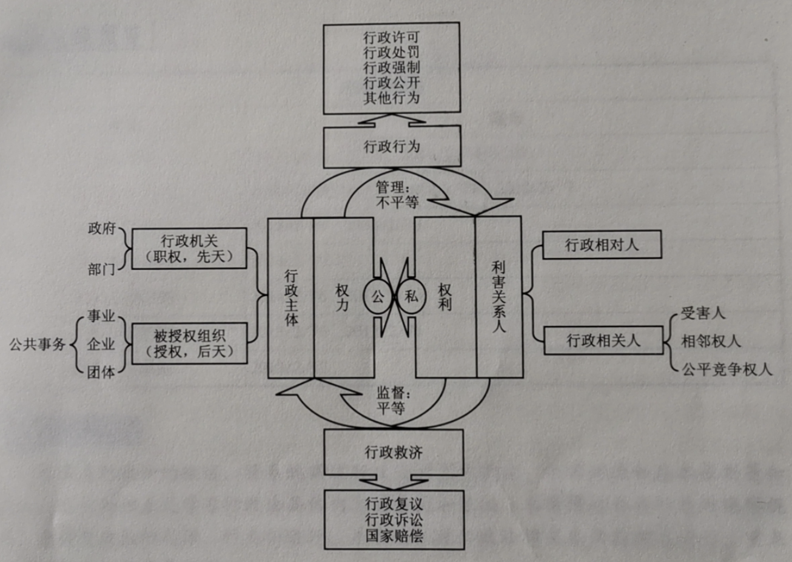
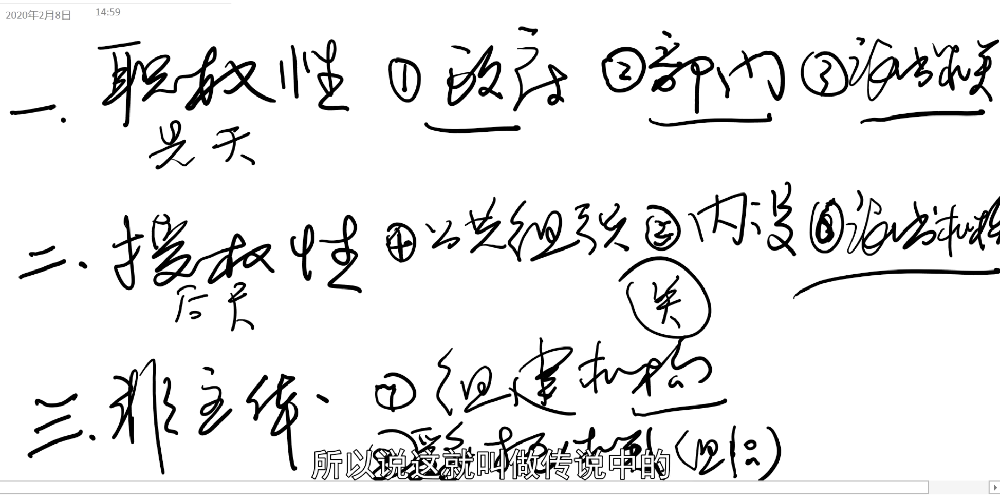
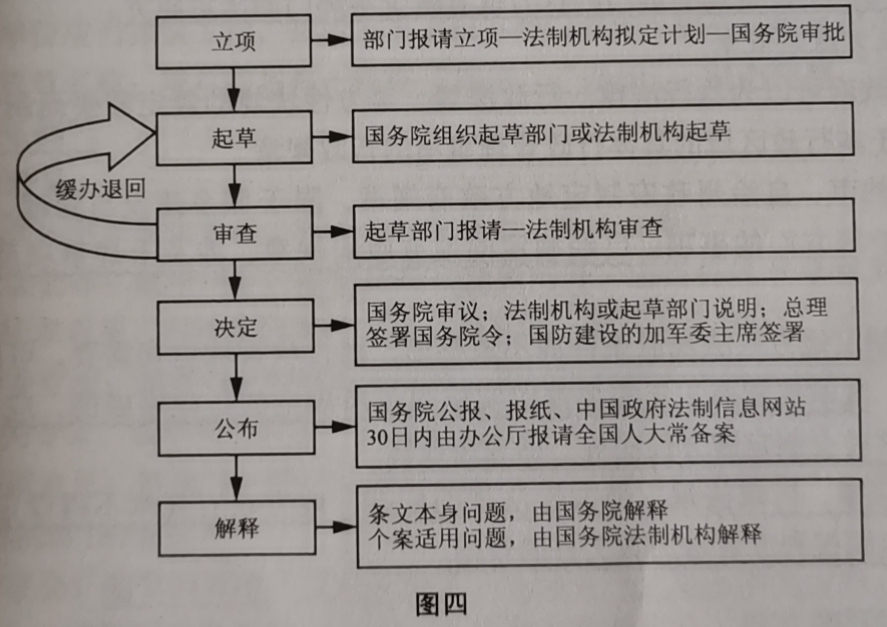
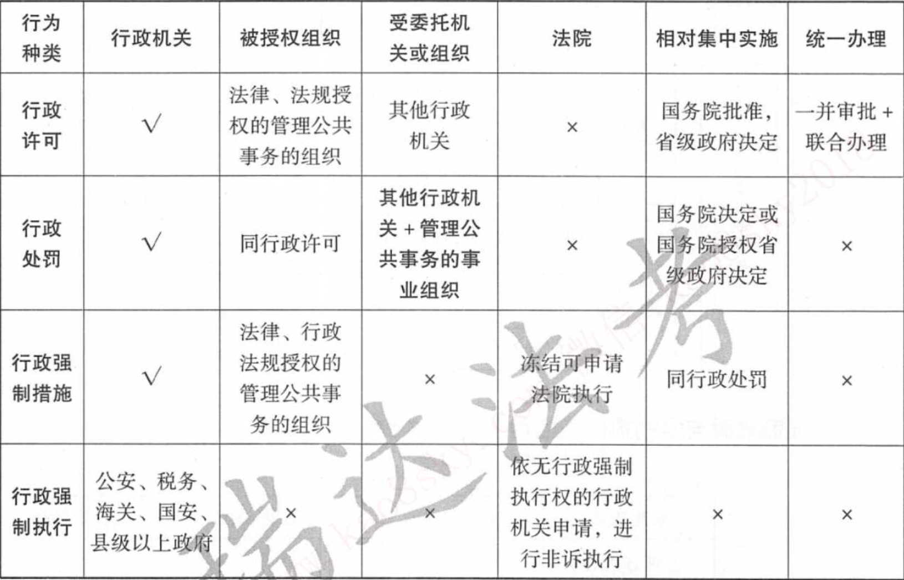
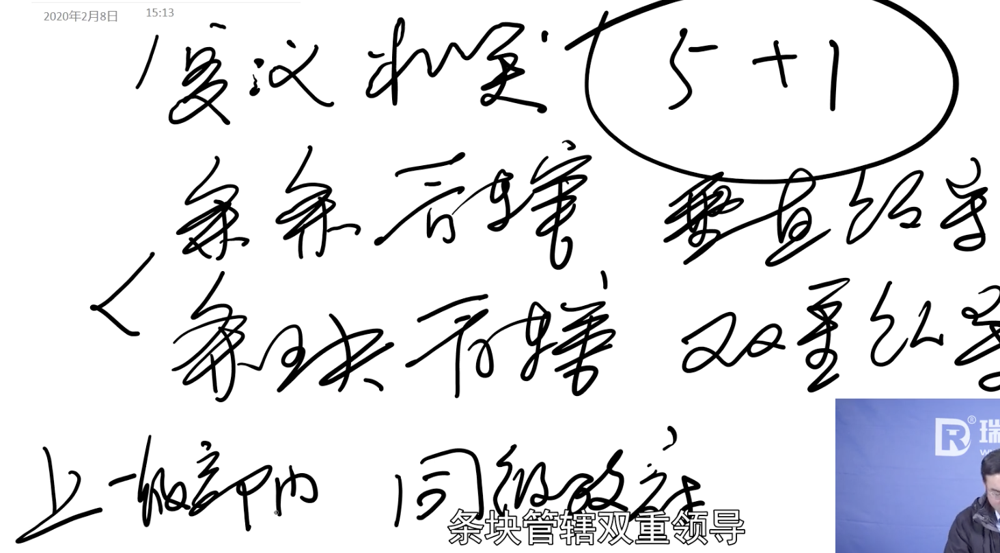

# 体系图

- 

# 行政主体

三大类八小类

# 行政行为

## 抽象行政行为

前10min

https://www.bilibili.com/video/BV1g7411h7bs?p=14	

- 行政法规

- 行政规章

  

## 具体行政行为

**考点**设定，实施主体，相对集中

### 行政许可

### 行政处罚

### 行政强制

## 政府信息公开

# 行政救济

## 行政复议

复议机关

## 行政诉讼

### 行政诉讼概述

### 行政诉讼受案范围

### 行政诉讼的管辖

### 行政诉讼的参加人

### 行政诉讼的证据和法律适用

### 行政诉讼程序

### 行政案的裁判和执行

16.40

### 行政诉讼的类型

#### 行政协议诉讼

#### 行政许可诉讼

#### 政府信息公开诉讼

#### 行政公益诉讼

## 国家赔偿

### 行政赔偿

### 司法赔偿

### 赔偿的方式、标准和费用

