# 民法

* auto-gen TOC:
{:toc}
## 导论

民事法律事实推动民事法律关系的产生

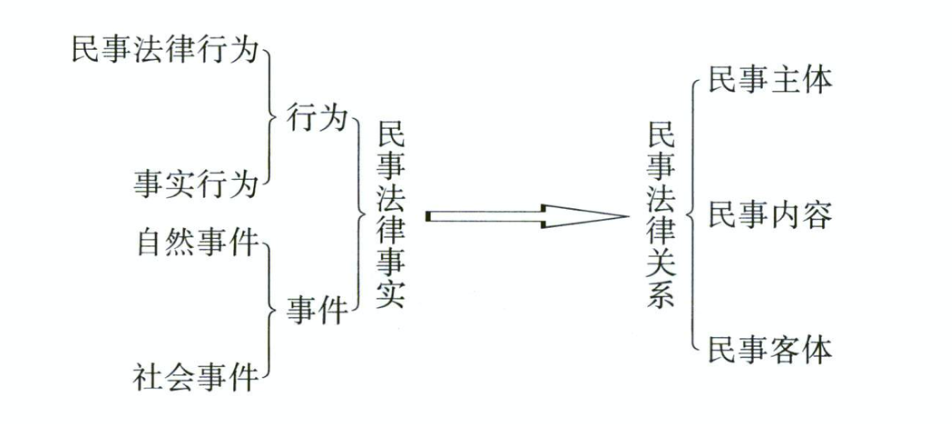

民事关系有主体，内容，客体

七编，民法总则，物权，合同，人格权，婚姻家庭，继承编，侵权责任

案例考察为重

图形化解题

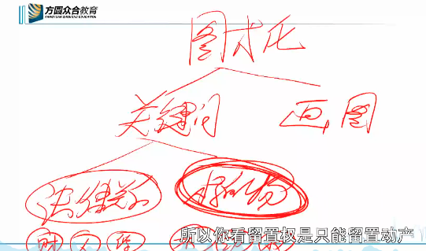

## 物权

物权调整财产的归属和利用关系

### 自物权

#### 物权变动

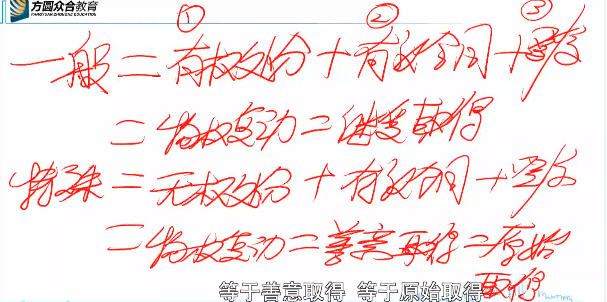

无权处分：以自己的名义处分他人的财产

#### 业主的建筑物区分所有权

- 专有权

#### 共有权(按份共有，共同共有(夫妻，继承，合伙))

- 成员权(表决权)
- 优先购买权(按份共有)

#### 相邻关系 

最低限度的容忍义务

地役权(从权利)，享受型权利，

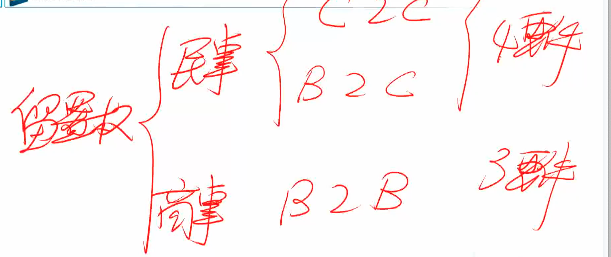

### 准物权

#### 占有

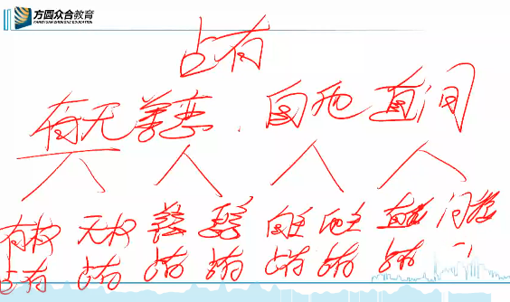

## 债权

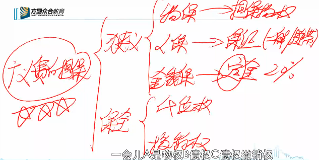

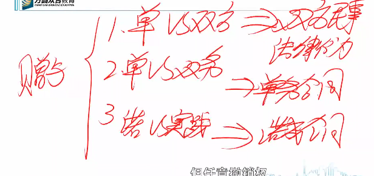

未到期的债权视为无债权

### 法定之债

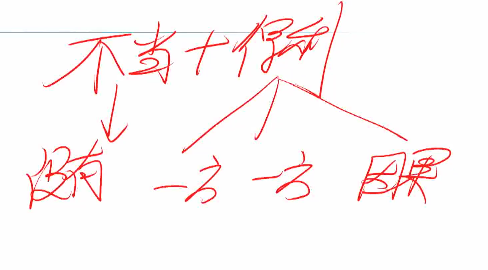

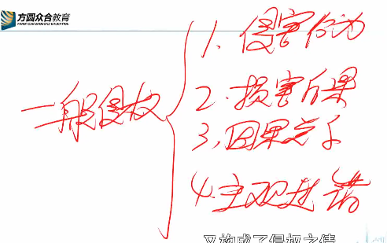

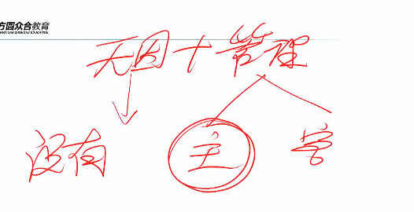

  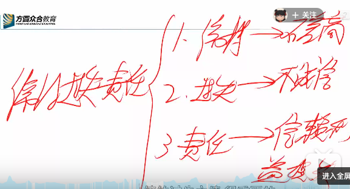

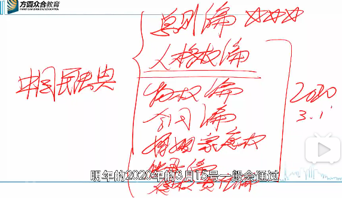

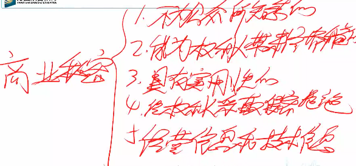

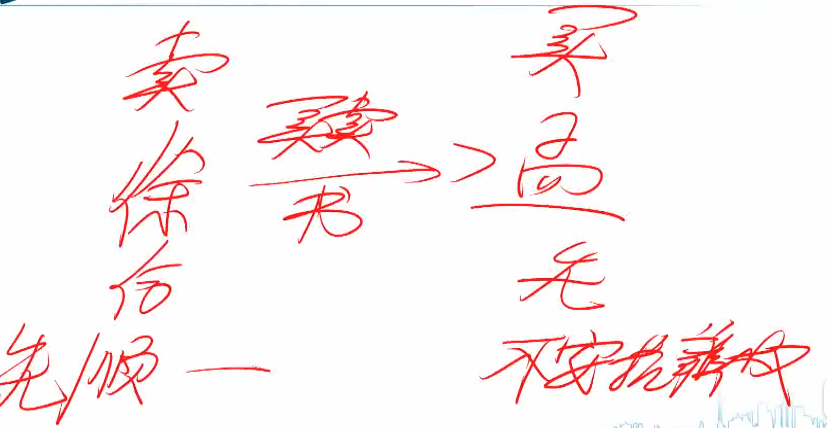

物权调整财产的归属和利用关系，调整方法就是物权法定 xx

