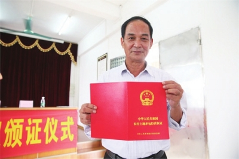
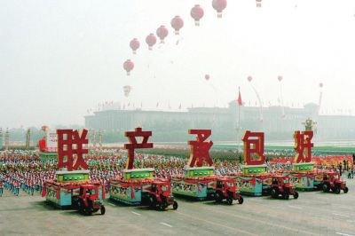
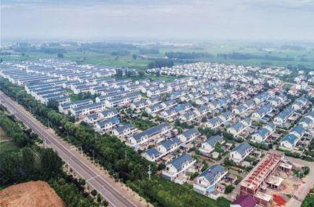

# 农村改革启大幕

浏览字号： [大](http://www.npc.gov.cn/npc/c35756/201812/cad6afa14c804ebeb82eb60d5969cec1.shtml#) [中](http://www.npc.gov.cn/npc/c35756/201812/cad6afa14c804ebeb82eb60d5969cec1.shtml#) [小](http://www.npc.gov.cn/npc/c35756/201812/cad6afa14c804ebeb82eb60d5969cec1.shtml#)来源： 农民日报　 　2018年12月28日 15:16:52

　　①村民喜获农村土地承包经营权证。

　　②1984年，在国庆的游行队伍中，农民开着拖拉机，载着“联产承包好”驶过天安门广场。

　　③如今的小岗村新貌。　　　　　　　　　　　　　　　　　　　　

  资料图

  本报记者余向东张伟宾

  大事记

  1978年11月24日，安徽凤阳小岗村18位农民按下“包干保证书”红手印。

  1980年9月，中央发出《关于进一步加强完善农村生产责任制的通知》，允许边远山区和落后地区的“三靠队”实行包产到户。

  1982年中央1号文件明确指出，目前实行的各种责任制，包括小的包工定额计酬，专业承包联产计酬，联产到劳，包产到户、到组，包干到户、到组等，都是社会主义集体经济的生产责任制。

  1991年11月，中共十三届八中全会通过了《中共中央关于进一步加强农业和农村工作的决定》，提出把以家庭联产承包为主的责任制、统分结合的双层经营体制作为我国乡村集体经济组织的一项基本制度长期稳定下来，并不断充实完善。

  1998年修订后的《土地管理法》以及党的十五届三中全会通过的《关于农业和农村工作若干重大问题的决定》，确定了土地承包期再延长30年的政策。

  1999年修改宪法时，将“家庭联产承包责任制”改为“家庭承包经营”。

  2017年中央1号文件提出，农村土地实行集体所有权、承包权、经营权三权分置。

  2017年党的十九大报告中提出，农村第二轮土地承包到期后，将再延长30年。

  中国农民，向来有着解不开的土地情结。从刀耕火种、茹毛饮血，到开疆辟土、男耕女织；从井田制、均田制到一条鞭法、摊丁入亩……一部中国农业文明史，就是一部中国农民与土地关系的变迁史。尽管土地制度一变再变，在土地上辛勤躬耕的农民，却始终难以摆脱饥饿与穷困的命运。

  1984年，国庆35周年游行，当载着“联产承包好”牌扁的拖拉机，轰隆隆驶过天安门广场时，现场观礼群众与电视机前的广大农民一片欢呼。这欢呼，源自内心无法抑制的喜悦，源自对未来美好生活的无限期待和想象。

  家庭联产承包责任制，是以农民家庭为单位、承包经营集体的土地和其他大型生产资料、自主进行生产和经营的“一项基本经济制度”，被誉为“在中国共产党领导下，中国农民的一项伟大创举”。为土地制度“解了扣”，为亿万农民“松了绑”，彻底解放了农业生产力。

  发端于家庭联产承包责任制的农村改革，拉开了中国改革开放大幕。

  2016年，习近平总书记在安徽省凤阳县小岗村主持召开农村改革座谈会时强调，小岗村是农村改革的主要发源地。以家庭承包经营为基础、统分结合的双层经营体制，是我们党农村政策的重要基石。

  回望改革开放四十年历程，总结四十年“三农”事业的伟大成就，“家庭联产承包责任制”这个关键词，总是令人心潮澎湃。

  永远难忘小岗村的十八个手印。农民的吁求，时代的选择，终于将星星之火燃成燎原之势

  大明王朝的开山祖地安徽省凤阳县，地处淮河中游南岸，厚土沃原，人均耕地面积相对宽裕，本来民可足食。凤阳花鼓本来也是庆丰收的“乡土芭蕾”，却常常用作当地人外出乞讨的技艺手段。

  饥饿线上千百年起起伏伏的挣扎，一言难尽。新中国对农村土地制度的探索，艰难曲折。

  1978年，安徽全省遭受百年一遇的大旱，凤阳县也再次遭遇“粮食危机”。11月24日晚上，凤梨公社小岗村西头严立华家低矮残破的茅屋里，挤满了18位农民。关系全村命运的一次秘密会议此刻正在这里召开。这次会议的直接成果是诞生了一份不到百字的“包干保证书”，其中最主要的内容有三条：一是分田到户；二是不再伸手向国家要钱要粮；三是如果干部坐牢，社员保证把他们的小孩养活到18岁。在会上，队长严俊昌特别强调，“我们分田到户，瞒上不瞒下，不准向任何人透露。”18位农民在这份保证书上，按下了十八个鲜红的手印。

  小岗村当年的这个举动，确属“惊天动地”，确确实实冒着很大的风险，确确实实需要豁出去的勇气。因为人民公社的体制还没有撤销，因为历史上“单干风”多次露头、又多次被打压批判。当时确有许多人在思想上想不通、在行动上难于接受，甚至有“辛辛苦苦30年，一夜回到解放前”的担忧。

  穷则思变。同样的探索，或早或晚，以各种联系农产品产量的责任制形式，在全国各地摸索着搞起来。在凤阳县不远的肥西县小井村，当地农民自发包产到户，比小岗村还要早三个月，至今村口立有一座纪念碑“中国农民包产到户发源地——小井村”。

  广东省湛江海康、海南岛文昌县、惠阳地区紫金县和广州市郊县的部分公社，为了解决吃饭和改变农村贫困面貌，率先行动起来，冲破禁区，实行包干到户、包产到户。

  海康县北和公社的潭葛大队，1977年就开始实施包产到户，比小岗村提前了一年。谭葛大队党支部书记吴堂胜壮着胆子，悄悄地将南五生产队的土地分下户耕作；1978年吴堂胜又在南五生产队进行“包产到户”试点，这个队有28户、141人、161亩耕地，当年虽然遇到自然灾害，仍然取得好收成。农民群众喜气洋洋、干劲倍添。吴堂胜说：“中央召开的三中全会不是提出要以经济建设为中心了吗？真话对大家说，我在南五生产队搞包产到户，群众再也不愁吃不饱、穿不暖了。包，一定要包！多大的责任我负责！”

  1980年，省、县、社组成联合调查组陪同4位新华社记者到谭葛大队进行了专程调研并上报中央。中央肯定了农村包产到户的做法，1980年秋，湛江地委开始在全地区公开推广谭葛大队包产到户的成功经验。

  潭葛村迈出了广东省的第一步，后来被称为广东农村改革出发地和“广东省包产到户第一村”。

  当时主政广东的习仲勋同志在基层调研时指出：“一些生产队一时找不到克服困难的其他办法，搞了包产到户，我们应当允许，不要因此去指责基层干部和党员，不要去硬扭。在群众自愿的原则下，用包产到户的办法去取代它，是可以的。边远山区、深山老林的单家独户，硬要合在一起大排工，费时误事，对生产不利，由这些农户对生产队实行包产到户，还不失为一种比较好的办法。”

  到1980年底，广东省有40%以上的农户实行了家庭联产承包责任制。其中梅县地区包干、包产到户的生产队占总队数的87.8%，汕头地区占66.1%，惠阳地区包括分田单干占79.7%，海南行政区和湛江地区包产、包干到户加上单干占40%—60%。农村包干、包产到户，不仅在贫困地区，而且在珠江三角洲等富裕地区也迅速推开；不仅粮食生产包干、包产到户，而且连林业、畜牧业、渔业和乡镇企业也实行了各种形式的承包责任制。

  1980年9月，中央发出《关于进一步加强完善农村生产责任制的通知》，允许边远山区和落后地区的“三靠队”实行包产到户。

  星星之火，渐成燎原之势。四川九龙坡村、浙江狄家？村……越多的农村开始实行包产到户。

  1980年11月初，全国农村实行包产到户的生产队比重占到15%，1982年6月该比重上升到67%；到1983年末，全国农村已有93%的生产队实行了这种责任制，已有1.75亿农户实行了包产到户，包产到户在所有责任制中的比重达到97.8%；1984年末进一步上升到98.9%。

  打破生产大呼隆、分配大锅饭，摆正生产力与生产关系的关系，党和政府因势利导之，开启改革先声，大潮汹涌而至实践是检验真理的唯一标准。社会主义初级阶段的根本任务，是解放生产力、发展生产力。

  1978年12月18日至22日，党的十一届三中全会在北京召开，大会决定将全党的工作重点转移到社会主义现代化建设上来，会议通过了《中共中央关于加快农业发展若干问题的决定（草案）》，总结了建国二十多年农业发展的经验教训，提出了发展农业的二十五项政策和措施。

  这次会议的召开，为农村经济体制改革创造了政治条件，也触动了小岗村等农村基层“风吹草动”般探路之举。

  天下之治，有因有革，趋时势至。

  1980年5月31日，邓小平在与中央负责同志谈到农村政策问题时指出：“农村政策放宽以后，一些适宜搞包产到户的地方搞了包产到户，效果很好，变化很快。安徽肥西县绝大多数生产队搞了包产到户，增产幅度很大。‘凤阳花鼓’中唱的那个凤阳县，绝大多数生产队搞了大包干，也是一年翻身，改变面貌。有的同志担心，这样搞会不会影响集体经济。我看这种担心是不必要的。”

  1982年1月1日，中共中央批转《全国农村工作会议纪要》，中国共产党历史上第一个关于农村工作的一号文件正式出台，指出农村实行的各种责任制，包括小段包工定额计酬，专业承包联产计酬，联产到劳，包产到户、到组，包干到户、到组，等等，都是社会主义集体经济的生产责任制。

  1983年中央下发文件，指出联产承包制是在党的领导下我国农民的伟大创造，是马克思主义农业合作化理论在我国实践中的新发展。

  上世纪八十年代，中央连续三年以下发“一号文件”的形式，对包产到户和包干到户的生产责任制给予充分肯定，并在政策上积极引导，从而使包产到户和包干到户的责任制迅速在全国广泛推行，人民公社制度随之解体。此后，家庭联产承包责任制不断完善，最终形成农民家庭承包经营制度。

  1991年11月召开的中共十三届八中全会通过了《中共中央关于进一步加强农业和农村工作的决定》。《决定》提出把以家庭联产承包为主的责任制、统分结合的双层经营体制作为我国乡村集体经济组织的一项基本制度长期稳定下来，并不断充实完善。

  家庭联产承包责任制作为农村经济体制改革第一步，突破了“一大二公”、“大锅饭”的旧体制。以“交够国家的，留足集体的，剩下全是自己的”为特征的包干到户，还促使国家改革农产品流通体制，推进了农产品购销的市场化进程。

  时任“大包干发源地”——安徽省滁县地委书记的王郁昭后来回忆说：“大包干，大包干，直来直去不拐弯。”大包干到户一出现，就以其独特的优越性，受到农民和农村干部的热烈欢迎。这种责任制形式“责任最明确、利益最直接、方法最简便”，同绝大多数农村的生产力水平、农民的经营水平、干部的管理水平相适应。

  摸着石头过河，尊重农民群众的选择，不搞一刀切，因地制宜，试点示范……在推行家庭联产承包制过程中，所得到的经验启示，后来成为党和政府推动各项新的农村改革举措、并得以顺利实施的成功模式。

  用世界上7%的耕地养活世界上22%的人口。从“吃粮难”到“卖粮难”，不过短短几年工夫，古老的中华民族好似跨越了几千年

  1979年春，小岗村将全队517亩耕地按人头、耕牛按户分包到户；打下的粮食，交售国家任务和留给集体的积累等按人包干到户，剩余部分全归自己。结果到了10月，小岗村打谷场上一片金黄，粮食总产量66吨，相当于1966年到1970年5年粮食产量的总和。油料产量和生猪饲养量都超过历史上任何一年。小岗村不仅结束了20多年吃“救济粮”的历史，而且还上缴国家粮食3200多公斤。

  砸了“大锅饭”，磨盘不推自己转。

  广东农村的经济状况得到了很大的改善，呈现出一派欣欣向荣的景象。1980年全省的粮食产量，在1979年增产21亿斤的基础上，又增产了11亿斤；农村人均收入达274元，比1979年增收51元。农村开始出现了盖新房子多、购置耕牛农具多、重视科学种田多的“三多”新气象。有些地区尽管遭受了自然灾害，但是仍然增产，农民大多吃饱了肚子。

  家庭联产承包责任制的实行，使中国广大农民获得了充分的经营自主权，极大地调动了农民的积极性，农业生产力有了质的飞跃，农产品供给大幅增加。全国粮食总产量从1978年的3亿吨猛增到1984年的4亿吨，增长速度超过历史上任何时期。四十年以后的今天，我国粮食产量已多年稳定在6亿吨以上。

  “经营权之争”目的指向“吃饱肚子”。从“吃粮难”到“卖粮难”，不过短短几年功夫。古老的中华民族好似跨越了几千年，因此创造出令世人瞩目的奇迹，用世界上7%的耕地养活世界上22%的人口。

  上世纪八十年代末期，在全国各地粮站门口，常常排起长长的交公粮队伍，农民群众自觉踊跃交售“爱国粮”。同时国家不断提升农产品收购价格，卖粮农民拿回大把大把的钞票。

  国家粮库充盈，集体有钱搞企业，个人吃饱肚子有存款。

  在获得了农业剩余产品后，农民通过市场将其变成现金收入，去购买非农产品，用于扩大农业再生产和改善生活。1978年到1985年，全国农民纯收入增长了1.69倍、消费增长了1.73倍。农村储蓄也开始快速增长，1978年农村居民储蓄存款55.7亿元，1985年增至564.8亿元，1990年又进一步增至1841.6亿元，12年间农村储蓄增长了32倍。

  承包之前集体劳动时，生产队长每天早上“吹哨子”通知大家出工，可有时候连吹两三遍都看不到一个人影出来。实行土地承包以后，种什么作物，选择什么品种，都由农户自己说了算；农民有权利自由安排自己的劳动时间，在自己承包的土地上实干加苦干，由此农业劳动效率大大提高，务农的用工量大幅度减少。根据统计资料测算，同1981年比，1990年全国五类主要农产品生产所需劳动力，实际减少4909万个。

  1985年，国家取消粮、棉、猪等主要农产品的统购派购，代之以合同收购，密切了农业生产与广大市场之间的联系，农户除了按合同规定完成承包生产任务外，还可以自购生产资料发展其他自营经济，独立进行商品生产。一批“乡土能人”的专长得到发挥，以多种经营为主的专业户、重点户成为发展生产力的先进代表和勤劳致富的带头人、示范户。

  1985年底，江苏省镇江市各类农村专业户、重点户达43902户，占总户数的8.6%，新经济联合体1260个，勤劳致富的“万元户”大批涌现。

  事实证明，在后来的三十多年发展中，我国选择的投资打头、出口导向、以劳动密集型产业为主导的发展模式，正是利用了土地制度改革带来的机会和条件，将潜在的人口红利转化为真实的经济增长动力。

  家庭联产承包责任制，解开了中国农民长期的土地情结。与此相关联的一系列土地制度改革，既收获现实政策红利，又把农村改革不断引向深入

  2008年，148位中国知名学者投票选出了对中国现实影响最大的原创经济理论——农村家庭联产承包责任制理论。这是中国经济学界对过去30年农村土地制度改革的集体致敬，是对农民自发实践引发系统革命的集体致敬。

  时至今日，小农经济仍是中国农村最主要的现实。如何把亿万农户与现代农业有机衔接起来，仍是摆在我们面前的一道时代课题。

  习近平总书记指出，新形势下深化农村改革，主线仍然是处理好农民和土地的关系。最大的政策，就是必须坚持和完善农村基本经营制度，坚持农村土地集体所有，坚持家庭经营基础性地位，坚持稳定土地承包关系。要尊重农民意愿和维护农民权益，把选择权交给农民，由农民选择而不是代替农民选择。

  深化土地制度改革，就是在不断调整农民与土地的关系、生产力与生产关系的矛盾中前行。

  1984年中央1号文件首次提出，土地承包期限一般应在15年以上，允许土地转包，但不允许买卖、出租。1993年“中发11号文件”提出，在原定耕地承包期到期之后，再延长30年不变。

  1998年修订后的《土地管理法》以及党的十五届三中全会通过的《关于农业和农村工作若干重大问题的决定》，确定了土地承包期再延长30年的政策。1999年再次修改宪法时，将“家庭联产承包责任制”改为“家庭承包经营”。

  2017年中央1号文件提出，农村土地实行集体所有权、承包权、经营权三权分置，成为农村改革又一重大制度创新。党的十九大报告中提出，农村第二轮土地承包到期后，将再延长30年，让农民吃上长效“定心丸”。

  有恒产者有恒心。早在两千多年前孟子就写下了对人性朴素而深刻的认识。回顾40年来中国农村土地制度历程，可以看出土地制度改革的趋势是，坚持土地集体所有权不变，稳定和扩大土地承包权，完善和放活土地经营权。正是在这样的改革过程中，农民与土地关系中的不确定性越来越少。

  当越来越多的农业经营者能够心无旁骛地从事生产，农业经营的生产效率就会越来越高，与农业农村现代化的距离也就越来越近。随着农村土地制度改革的内涵不断丰富，土地使用权和所有权分离之后的“确权”让农民有了财产，以此为基础，土地流转、股份合作制等不断为中国农业发展注入新活力、新动力。

  截至2017年12月底，全国31个省（区、市）均开展了承包地确权工作，共涉及2747个县级单位、3.3万个乡镇、54万个行政村；承包地确权面积11.59亿亩，占二轮家庭承包地（账面）面积的80%以上。“确实权、颁铁证”，广大农民拿上了土地承包权的“红本本”。另一方面，合作组织、家庭农场、专业大户、龙头企业等各种类型新型经营主体已经超过300万家，他们与普通农民一道，共同推动中国农业稳步向前，也带动着越来越多的普通农户成为现代农业的参与者和获益者。

  “无论从传统的马克思主义政治经济学，还是从现代西方经济学中都找不到现成的答案，我们只能自己摸索。”中国人民大学经济学院院长杨瑞龙在谈到家庭联产承包责任制时说，这一理论的提出和应用，不仅使中国解决了粮食短缺问题、温饱问题，而且为此后的更深层的改革和开放开辟了新的可能。

  劳动是财富之父，土地是财富之母。具有保障功能、发展功能的土地，是我国广大农民群众的“命根子”。坚持和完善农村基本经营制度，稳固农民与土地的密切关系，就是守住了农民的“命根子”。

Ref: <http://www.npc.gov.cn/npc/c35756/201812/cad6afa14c804ebeb82eb60d5969cec1.shtml>