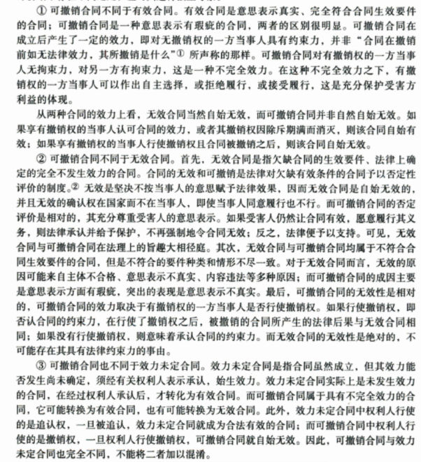

* auto-gen TOC:
{:toc}
# 0 民法典相关材料

- [中华人民共和国民法典](http://www.npc.gov.cn/npc/c30834/202006/75ba6483b8344591abd07917e1d25cc8.shtml)
- [中华人民共和国主席令（第四十五号）](http://www.npc.gov.cn/npc/c30834/202005/498f8c85ef7c4e0da99c778922ac9abc.shtml)
- [第十三届全国人民代表大会宪法和法律委员会关于《中华人民共和国民法典(草案)》审议结果的报告](http://www.npc.gov.cn/npc/c30834/202006/24bb6ed9144d46b6a246fe281cd19af7.shtml)
- [第十三届全国人民代表大会宪法和法律委员会关于《中华人民共和国民法典(草案修改稿)》修改意见的报告](http://www.npc.gov.cn/npc/c30834/202006/75c06ec8183847c7a6d8280bd87ba334.shtml)
- [中华人民共和国民法总则（2017年3月15日通过）](http://www.npc.gov.cn/npc/c12435/201703/7944f166a8194d788c63cc6610aebb4a.shtml)

- [中华人民共和国主席令（第六十六号）](http://www.npc.gov.cn/npc/c12435/201703/85b7f272fbd1480988f7cfdb0b5d2580.shtml)
- [第十二届全国人民代表大会法律委员会关于《中华人民共和国民法总则（草案）》审议结果的报告](http://www.npc.gov.cn/npc/c12435/201703/23e1fcfe184d401597d3b03a796e5705.shtml)
- [第十二届全国人民代表大会法律委员会关于《中华人民共和国民法总则（草案修改稿）》修改意见的报告](http://www.npc.gov.cn/npc/c12435/201703/99ceef8445964e31a4ae4aca3c6d2df5.shtml)
- [中华人民共和国民法通则（2009年8月27日修正）](http://www.npc.gov.cn/npc/c35177/201607/3178fd7caaa64b22a37ba1387dd2e1f2.shtml)
- [中华人民共和国物权法（2007年3月16日通过）](http://www.npc.gov.cn/npc/c35177/201607/2bdbde0ccd3943dda3395a5d267d534c.shtml)

- [中华人民共和国合同法（1999年3月15日通过）](http://www.npc.gov.cn/npc/c35177/201607/e5df587e286d4dfa93c4b1989d69cb3c.shtml)
- [中华人民共和国担保法（1995年6月30日通过）](http://www.npc.gov.cn/npc/c35177/201607/049a718430764363879df6a96b05e950.shtml)
- [中华人民共和国婚姻法（2001年4月28日修正）](http://www.npc.gov.cn/npc/c35177/201607/065342562bb144b7996afad03bf33526.shtml)
- [中华人民共和国继承法（1985年4月10日通过）](http://www.npc.gov.cn/npc/c35177/201607/6c13143d1e4945a68a8dceb5a5091936.shtml)
- [中华人民共和国收养法（1998年11月4日修正）](http://www.npc.gov.cn/npc/c35177/201607/86cde1932f7b4b9aa8fe623413f4cefa.shtml)

- [中华人民共和国侵权责任法（2009年12月26日通过）](http://www.npc.gov.cn/npc/c35177/201607/7073b58934c54b7fae5c3e64a8f3739f.shtml)

Ref:  

- [全国人大民法典相关材料](http://www.npc.gov.cn/npc/c35177/mfdgfbca_list.shtml)

- [民法典专题](http://www.npc.gov.cn/npc/c35174/mfdgfbca.shtml)

## **[民法总则(建议稿)](拓展资料/民法总则建议稿.md)**

**Ref**  [民法总则建议稿](http://www.iolaw.org.cn/showNews.aspx?id=49193)

# 1善意相对人和第三人的区别

>1. “善意第三人”主要涉及物权权利登记瑕疵的保护范围，权利范围全部是“不得对抗”等抗辩权。
>2. “善意相对人”主要涉及民事主体及民事法律行为内部瑕疵时的保护范围，权利范围包括“不得对抗”、“不受影响”等抗辩权，以及少数的撤销权类的形成权、损害赔偿类的请求权。
>3. 反映了目前立法、司法对于民商事行为外观主义的约束趋势。
>我们对《民法典（草案）》的上述“善意第三人”、“善意相对人”相关条款的梳理，可以明显看出立法机构在民法典的立法初衷。在物权、合同编上凡是涉及到相关权利登记的，都会产生不得善意第三人的对世权约束。而在总则编关于法人内部行为限制或程序缺位、限制民事行为或无权代理等导致的瑕疵民事行为，均赋予保护“善意相对人”的权利，包括抗辩权，甚至包括撤销权形成权，以损害赔偿请求权。
>由此，我们可以暂时得出一个开放性的结论：涉及到物权对世权利的登记要件缺位，其赋予了更加宽泛的利害方保护；而涉及到民事法律行为瑕疵，则仅仅压缩至“善意相对人”的保护范围，而尽量避免泛化到外部相关方的保护。
另外一层意思在于，民事法律行为（既包括法人等，也包括家庭这样的社会单位，例如夫妻内部约定、例如未成年人行为追认）因为内部约定或行为瑕疵导致的后果，也仅限于善意相对人得以有权抗辩或撤销。这一定程度上也反映了目前立法机关、司法机关对于商事行为外观主义保护边界的有意压缩。

ref:  [https://www.hightac.com/zyyj/5868.html](https://www.hightac.com/zyyj/5868.html)

>从相关立法理由及司法实践来看，“善意相对人”与“第三人”的主要区别在于前者的含义限定于与法人交易的相对人，而后者可涵盖任何第三人。《民法总则》第65条的修改意味着所有被排除在外的“第三人”不得再援引此条主张对公司登记的信赖利益保护，而《九民纪要》第3条进一步肯定了此修改。

ref: [https://www.lexology.com/library/detail.aspx?g=4b18fd16-2f3f-4f86-b1e1-36431260dcd7](https://www.lexology.com/library/detail.aspx?g=4b18fd16-2f3f-4f86-b1e1-36431260dcd7)

# 2 用益物权

>    指在法律规定的范围内，对他人所有的不动产，享有占有、使用和收益的权利。包括土地承包经营权、建设用地使用权、宅基地使用权等。 
>      （全国人大常委会法制工作委员会提供）  
>      中国人大网  2005年7月29日

ref: [http://www.npc.gov.cn/zgrdw/npc/oldarchives/zht/zgrdw/common/zw.jsp@label=wxzlk&id=339968&pdmc=1502.htm](http://www.npc.gov.cn/zgrdw/npc/oldarchives/zht/zgrdw/common/zw.jsp@label=wxzlk&id=339968&pdmc=1502.htm)

>**用益物权**（英语：usufruct；德语：Nießbrauch），基于一定的目的对他人的土地进行使用和收益的[限制物权](https://zh.wikipedia.org/wiki/限制物权)。这是与[担保物权](https://zh.wikipedia.org/wiki/担保物权)相对的概念。

> 现代人的生活都与土地的直接或间接利用有着密切的关系。首先，需要在土地上建立住宅或者工厂。或者，要在土地上种植农作物，放牧牛马，或者，为了取得建筑用的材料，需要种植树林等。民法所规定的用益物权，就是指可以利用具有上述[使用价值](https://zh.wikipedia.org/wiki/使用价值)（与[交换价值](https://zh.wikipedia.org/wiki/交换价值)相对）的土地的一种权利。虽然人们可以对自己所拥有的土地进行使用和收益，但是对于没有拥有土地的人，就必须要租借这些土地。所谓用益物权，就是不拥有土地的人向他人租借土地进行收益使用的一种权利。除用益物权外，还可以与土地所有者签订契约，取得他人土地的用益权。因此，用益物权与租赁权共同组成了非土地所有者使用他人土地的制度。用益物权包括[地上权](https://zh.wikipedia.org/wiki/地上权)、农育权、[不动产役权](https://zh.wikipedia.org/wiki/地役权)、[典权](https://zh.wikipedia.org/wiki/典权)等。

ref: [https://zh.wikipedia.org/wiki/%E7%94%A8%E7%9B%8A%E7%89%A9%E6%9D%83](https://zh.wikipedia.org/wiki/用益物权)

##  地役权

>三、地役权与我国相邻关系
>　　地役权早先源自罗马法，以后为各国民法继受并根据社会机能不断演变而有所发展。**它是为了自己使用、经营土地的便利而使用他人土地的一种物权。如通行权、排灌权等。**
>其中，地役权人使用、经营的土地为需役地，他人的土地即特指他人提供给地役权人使用的土地为供役地。
>　　地役权在性质上仍是一种用益物权，由于它是为供需役地的便利而设，一般须以需役地的所有权或使用权存在为前提，因而又是一种从物权。
>　　地役权的成立必须有两块土地，即需役地与供役地同时存在；并且，通常以彼此相毗邻来设立地役权。地役权以土地为客体，并以该土地属于他人所有或使用为要素。地役权中的供役地必然为需役地所用，如果供役地没有对需役地利用提供某种便利，就无须设定地役权。这就充分表明了地役权人使用他人土地，在于调节土地的利用，须以谋取对自己土地便利为目的，而不是以地役权本人便利为目的。如狩猎、散步、进行体育运动而使用他人的物，则不属地役权。便利是指供役地对于需役地必须提供利用土地之方便而相宜的经济利益和精神利益。便利的内容只要不违反法律、法规及社会公序良俗，可由当事人自由订立。法律一般规定必须以书面为主，且非经登记不生效力，地役权合同的主要内容有：地役权的使用（如通行权）、从供役地获取利益（如汲水权）、供役地使用人权利行使的限制（如禁止一定高度房屋的建筑权）、避免相邻关系的任意规定，等等。
>　　在地役权关系中，供役地人就其土地的利用，仅负有容忍或不作为的义务。需役地人则不得脱离实际需要而无故设立或扩大权限；不得与需役地分离而转让其地役权；不得将供役地作为抵押、租赁或其他的标的。如在供役地建立共同使用的设施及修缮等，是一方出资负担，不是双方出资负担，应协商确定。
>　　地役权还具有从属性与不可分性。设定地役权通常以有偿居多，但法律也不禁止设定无偿地役权。关于其存续期间法律亦有硬性限制，这些与地上权情形相类似，但与永佃权相异。
>我国现行民法制度中只确认了与地役权相类似的相邻关系，并无明文规定地役权这种用益物权的传统形式。实际上，地役权与相邻关系，除在利用邻地供自己便利上存有相同之处外，两者明显的区别点已为各国民法理论与社会实践所证实：相邻关系是直接由法律来确认，它属于所有权范畴，是所有权的延伸或限制，地役权则主要是依当事人间的设定地役权合同而发生，是用益物权的种类之一；相邻关系是法律对土地间利用关系的最窄小最基本限度的调节，谈不上有偿问题，而地役权则是在相邻权调节之外的一种更为宽泛的权利义务的有偿调节，目的在于充分利用土地，发挥土地效益，实为弥补相邻关系之不足；相邻关系必须以相互毗邻的土地为发生前提，其关系范围也十分广泛，情况亦很复杂，而地役权通常情况下反映的是土地相邻关系，但也不一定以需役地与供役地相互毗邻为限度，有时即使两地并不相连，但只要有事实上利用之需要，也可以设定地役权。鉴于上述区别，同时注意到在我国目前充分发展商品经济条件下，民事主体相互利用邻地供自己土地便利之用的情况日益增多，这些具有各特殊利益的土地所有人和土地使用人之间因邻地使用而发生的关系，许多都属于地役权范畴。但如果不从立法方面廓清相邻关系与地役权的界限或区别点，人们就无法分辨到底于何种情形下利用邻人不动产可径直得到法律认可，不必征得邻人允诺，而在另一种情形下，则必须克服随意性，与邻人达成使用其不动产的意思表示一致的协议，在接受契约以至法定手续（登记）的约束后，才得以使用邻人之不动产。也就是说，两项不同权利间若没有界限，民事主体便无所适从，其结果将不可避免地出现一系列本不该引发的相邻纠纷，既不利于社会安定和经济秩序的稳定，也势必影响到人民法院对此类案件的合法公正的审理裁决。因此，在我国现阶段，对相邻权与地役权分别给予应有的法律位置，明确其并非包含关系，且功能各异，这样，既合乎法理，又兼顾现实，将十分妥善，当为民事立法所吸纳。

https://web.archive.org/web/20050430082658/http://www.legalline.com.cn/2004-7/2004731232317.htm

# 3 无效和可撤销

> 与无效合同相比，可撤销合同在撤销前已经生效。在被撤销以前，其法律效果可以对抗除撤销权人以外的任何人。而无效合同在法律上当然无效，从一开始即不发生法律效力。而且可撤销合同的撤销，应由撤销权人以撤销行为为之，人民法院不主动干预。无效合同在内容上具有明显的违法性，故对无效合同的确认，司法机关和仲裁机构可以主动干预，宣告其无效。

ref: [https://m.fadada.com/notice/detail-505.html](https://m.fadada.com/notice/detail-505.html)

>可撤销合同与无效合同均为欠缺合同生效的要件，可撤销合同依法被撤销后与无效合同的法律后果相同，即均适用《合同法》第58条之规定，但二者区别在于：
>1．从内容上看，可撤销合同主要是涉及意思表示不真实的合同；无效合同主要是违反法律和行政法规强制性规定和社会公共利益的合同。
>2．从效力上看，可撤销合同在没有被撤销之前仍然是有效的；无效合同则为自始都不具有法律效力。
>3．从当事人主张看，可撤销合同只能是受损害方向人民法院或者仲裁机构请求撤销合同，人民法院或仲裁机构才依法确认合同是否被撤销；无效合同无须当事人申请，人民法院或仲裁机构均可依[职权](https://wiki.mbalib.com/wiki/职权)确认合同无效：
>4．从期限上看，可撤销合同中的具有撤销权的当事人知道或者应书知道撤销事由之日起一年内行使撤销权；[无效合同](https://wiki.mbalib.com/wiki/无效合同)则无期限限制，自始至终无效。

ref:  [https://wiki.mbalib.com/wiki/%E5%8F%AF%E6%92%A4%E9%94%80%E5%90%88%E5%90%8C](https://wiki.mbalib.com/wiki/可撤销合同)

> 

ref: [https://www.google.com/books/edition/_E5_90_88_E5_90_8C_E6_B3_95/DrD393_SqU4C?hl=en&gbpv=1&pg=PA95&dq=%E5%90%88%E5%90%8C%E6%97%A0%E6%95%88%E4%B8%8E%E5%8F%AF%E6%92%A4%E9%94%80](https://www.google.com/books/edition/_E5_90_88_E5_90_8C_E6_B3_95/DrD393_SqU4C?hl=en&gbpv=1&pg=PA95&dq=合同无效与可撤销)

# 4 连带责任

>  连带责任保证是一种责任较重的保证方式。当事人在保证合同中约定保证人与债务人承担连带责任保证的，为连带责任保证。在债务履行期届满债务人没有履行债务时，债权人既可以要求债务人履行债务，也可以要求保证人在其保证范围内履行债务。比如，甲向乙借10万元，由丙作保证人，并明确承担连带责任。到了还款期后，甲由于种种原因未能还款，在这种情况下，作为债权人乙既可以直接要求甲还款，也可以直接要求丙承担还款的责任，丙对于乙的要求不能拒绝。

ref: [http://www.npc.gov.cn/npc/c2418/200204/729596e8cd684b01b941fcd67a97ae56.shtml](http://www.npc.gov.cn/npc/c2418/200204/729596e8cd684b01b941fcd67a97ae56.shtml)

>（一）立法关于连带责任的规定
>
>1．《民法通则》关于连带责任的规定
>
>《民法通则》中关于连带责任的规定，主要集中在以下方面：
>
>(1)《民法通则》第87条关于连带责任的一般规定。(2)《民法通则》第35条关于合伙的连带责任规定。(3)《民法通则》第130条关于侵权责任的一般规定。(4)《民法通则》第66条第3款、第4款、第67条关于代理中的连带责任。
>
>2．我国《合伙企业法》关于连带责任的规定
>
>我国《合伙企业法》关于连带责任的规定主要集中在第2条、第38条、第39条及第40条。
>
>从《合伙企业法》的上述规定可以看出，这里关于连带责任的规定，与《民法通则》的规定已经完全不同了，这里仅仅是"数额连带"，但在请求顺序上是不可以由债权人任意选择的。这一规定对我国后来的司法实践影响很大，是引起责任形态混乱的源头之一。
>
>3．我国《侵权责任法》关于连带责任的规定
>
>我国《侵权责任法》关于连带责任的规定主要有14项条文，它们分别是第8条-第11条、第13条、第14条、第36条、第43条、第51条、第47条、第59条、第83条、第86条等。那么，第67条是存在疑问的，该条规定："两个以上污染者污染环境，污染者承担责任的大小，根据污染物的种类、排放量等因素确定。"那么，该条是关于污染者对受害者承担责任后内部责任的分担性规定还是外部责任的规定？从字面上可以作两种理解：一是外部责任规定，即受害者只能按照污染物的种类、排放量等因素请求污染者承担赔偿责任；二是两个以上污染环境受害者有权向任何一个污染者请求赔偿（污染者应当向受害者承担连带责任），任何一个污染者赔偿后，就超出自己赔偿数额的部分向其他污染者追偿。污染者之间的责任分配即按照污染物的种类、排放量等因素确定。从中国具体的司法实践看，第二种更有利于保护受害者。因为，如果让受害者证明污染物的种类、排放量等因素恐怕是特别困难的。即使作第一种理解，该条应该有两个辅助性规定：(1)规定举证责任倒置，即由污染者就自己的污染物的种类、排放量等进行举证；(2)不能证明的，平均承担责任。但是，该条没有这样规定，因此，最好作第二种解释。
>
>4．我国《担保法》及其司法解释对连带责任的规定
>
>我国《担保法》对连带责任的规定，主要集中在关于保证部分的规定，更具体地说，体现在第12条、第18条。
>
>《最高人民法院关于适用＜中华人民共和国担保法＞若干问题的解释》第20条规定亦对连带责任作出了规定。
>
>应该说，《担保法》及其司法解释的规定与《民法通则》的规定基本保持了一致。
>
>**法理**
>
>一般连带责任的原理上说，不真正连带责任与真正连带责任除了发生原因上有区别外，在对外效力上并无区别，只是在内部责任分担上有重大区别：真正连带责任人在承担了责任后，对其他连带责任人有求偿权，而不真正连带责任人承担责任后，对其他连带责任人并无求偿权，仅对终局责任人具有求偿权
>

ref: http://www.iolaw.org.cn/showNews.aspx?id=36551

>不真正连带的案例：
>
>甲出地，乙出钱，合资建楼，约定房产均分。因工钱拖欠，甲被执行工钱240w。执行后2年甲被丙股改成丁。丁诉丙应承担已付工钱债务。
>
>“不真正连带责任债务是指多数债务人就基于不同发生原因而偶然产生的同一内容的给付，各负全部履行之义务，并因债务人之一的履行而使全体债务人均归于消灭的债务”[[1\]](http://pkulaw.cn/fulltext_form.aspx?Db=art&Gid=4e88f8956451ca4c9769b9cf5be8af48bdfb&keyword=&EncodingName=&Search_Mode=&Search_IsTitle=1#m1)。不真正连带债务具有以下特征：“⑴、不真正连带债务的债务人是二人以上的多数；⑵、不真正连带债务的债务是基于同事实发生的两个债务；⑶、两个以上的债务在内容上相互重合；⑷、在相互重合的债务中只须履行一个债务即可实现债权人的权利”[[2\]](http://pkulaw.cn/fulltext_form.aspx?Db=art&Gid=4e88f8956451ca4c9769b9cf5be8af48bdfb&keyword=&EncodingName=&Search_Mode=&Search_IsTitle=1#m2)a>。本案债务符合不真正连带债务的法律特征。

ref: http://pkulaw.cn/fulltext_form.aspx?Db=art&Gid=4e88f8956451ca4c9769b9cf5be8af48bdfb&keyword=&EncodingName=&Search_Mode=&Search_IsTitle=1

>   **一、连带责任的来源和性质**
>
>   **(一)连带责任的来源**  民法研究普遍认为，<u>责任是从债务转化而来</u>，即所谓债务是第一性的义务、责任是第二性的义务。因此，连带责任在理论上应是来源于连带债务。  所谓连带债务，是指数人负同一债务，依其明示或法律之规定，对于债权人各负全部给付责任之多数人债务形态。据此定义，
>
>   连带债务的内涵主要体现在三个方面：①连带债务之债的关系为单数，只存在一个债；②连带债务的发生根据是当事人的约定或法律的规定；③连带债务人对债权人承担全部责任。
>
>   其中，关于连带债务之债的关系为单数的观点，与现实中的连带债务并不完全相符。例如，连带保证是一个债，与其相关联，势必还存在一个主债。两个债既为主从关系，又可相对独立。依笔者之见，连带债务之债的关系可以是单一的，也可以是多个的。单一债关系下的连带，称为共同连带债务，例如共同侵权之债、合伙之债等；多个债关系下的连带，称为可分连带债务，例如连带保证债务、否认公司法人人格的股东责任等。不论连带债务债的关系是单一的还是复合的，其给付内容均应是同一的，且存在当事人约定的或法律规定的数债务人各负全部给付之前提。给付内容的同一性和连带依据的确定性(意定与法定)是连带债务得以成立的关键。债数是否单一，不是判断连带债务构成与否的关键。
>
>   除连带债务外，不真正连带债务也被认为是连带责任的另一债源。所谓不真正连带债务，是指“数债务人基于不同之发生原因，对于债权人负以同一之给付为标的之数个债务，依一债务人之完全履行，他债务因目的之达到而消灭之法律关系。
>
>   ”不真正连带债务是数个债务的集合，判定数债务人承担连带责任的依据不是当事人的约定，也没有法律的规定，而是基于民法学说。国外立法虽无明确规定，但不真正连带债务学说已为许多法院判例所接受、肯定。我国大陆地区学者大多赞同这一学说，而且还进一步将由不真正连带债务所产生的民事责任称为“不真正连带责任”。  
>
>   (二)连带责任的性质  连带责任是指当事人按照法律的规定或者合同的约定，连带地向权利人承担责任。在此种责任中，权利人有权要求责任人中的任何一人承担全部或部分责任，责任人也有义务承担全部或部分责任。关于连带责任的性质，概言之，有如下两个方面：
>
>   *<u>第一，连带责任是数个独立的给付责任。</u>*这是连带责任的本质属性。为了使债权人的债权得以确保和满足，依据约定和法律规定，才有此数个给付责任的结合。因此主张连带责任的诉讼不是必要共同诉讼，原告对谁主张权利，是同时向多个责任人主张权利，还是先后向几个责任人主张权利，原告完全具有选择权。 
>
>   *<u>第二，连带责任的发生原因无须同一</u>*。各责任人承担连带责任既有出于相同发生原因的情况，也有出于不同发生原因的情况。两者皆为现实中的常态。
>
>   **二、连带责任的内外部关系**
>
>   (一)对外效力 
>
>   **1.原告(债权人)的权利。**原告可以对任何责任人，或一人、或数人、或全体，同时或先后请求全部或部分的给付；各连带责任人不得拒绝承担超过自己分担份额的责任；连带责任未得到全部履行前，全体责任人仍应负连带责任。  
>
>   **2.牵连关系的有无。**所谓牵连关系，系指连带责任人中之一人所发生的事项对其他责任人是否产生效力。我国现行立法没有对此作明确规定。台湾地区民法第274、276、278条规定：“因连带债务人中之一人为清偿、代物清偿、提存、抵销或混同而债务消灭者，他债务人亦同免其责任。”“债权人向连带债务人中之一人免除债务，而无消灭全部债务之意思表示者，除该债务人应分担之部分外，他债务人仍不免其责任。前项规定，于连带债务人中之一人消灭时效已完成者，准用之。”“债权人对连带债务人中之一人有迟延时，为他债务人有利益，亦生效力”。《欧洲合同法通则》第10：107条、第10：108条规定，一个连带债务人的履行或抵销、与债权人债务混同、债权人对一个债务人免除债务，其他债务人就上述履行或抵销部分、混同部分、免除部分解除责任。  
>
>   (二)对内效力  
>
>   **1.连带责任人内部分担的原则**  连带责任人之间，除有法律规定或另有约定以外，各责任人应平均分担。但存在责任人中之一人应该单独承担之事由的，应由该责任人全部承担。
>
>   **2.求偿权**  (1)求偿权成立的条件。
>
>   ①连带债务的消灭。值得注意的是，部分连带债务的消灭也能够成立求偿权。实践中有的判决书将涉及担保追偿的判决主文表述为“在被告(保证人)××承担全部保证责任后，有权向被告(债务人)××追偿。”这种表述提高了求偿权成立的条件，不符合立法意旨。
>
>   ②连带责任人有财产给付的行为。财产给付行为包括了抵销、有偿免除、混同等情形。如果没有财产上之给付，不发生求偿权，例如无偿免除、时效届满。但也有例外，当债务人进入破产程序后，担保人可以预先行使追偿权。担保人在实际承担责任前，即可以以未来应承担的责任为依据向法院申报债权，不以是否实际承担责任为条件。 
>
>   (2)求偿不能的部分如何分担。《民法通则》第87条没有对此情形作进一步规定。在担保法领域，根据最高人民法院《关于适用〈担保法〉若干问题的解释》第20条的规定，连带共同保证人在承担保证责任后，应先向债务人追偿，不足部分再由各连带保证人按约定比例分担或平均分担。但此条规定未就连带保证人中之一人不能偿还的情形作深入规定。台湾地区民法第282条规定：“连带债务人中之一人，不能偿还其分担额者，其不能偿还之部分，由求偿人与他债务人按照比例分担之。”学者称之为求偿权之扩大，并分析其成立要件为：其一，须连带债务人中之一人(或数人)不能偿还其分担额。此之不能，不以其他债务人无资力为必要，如债务人行踪不明，求偿额显有困难，亦应属之。其二，须其他债务人之不能偿还，非可归责于求偿人之过失所致。由于我国立法对此问题的空白，实践中不同法院的裁判难免会有不同的认识。最高人民法院2002年公报刊登的“英贸公司诉天元公司保证合同追偿权纠纷案”的判案思路与上述学者之见相同，可资借鉴。该案判决书指出：“如果珑艺公司(系下落不明的保证人)不能到案承担保证责任，其应当承担的保证份额就成为全体保证人共同的风险，此风险不能由英贸公司一家承担。因此珑艺公司应当承担的保证责任份额，应由现有的三家保证人分担。” 
>
>   **三、“不真正连带责任”问题述评**  正如前文所述，不真正连带债务被普遍认为是连带责任的债源之一，因此研究“不真正连带责任”的问题须从不真正连带债务入手。
>
>   (一)不真正连带债务的特征  **1.各债务人基于不同的法律关系内容而对债权人负有不同的债务**  由于可分连带债务下的法律关系内容也不具有同一性，因此不真正连带债务的这一特征尚不十分明显，但它首先是成立不真正连带债务的前提。  **2.无同一目的之同一给付**  不真正连带债务缺乏共同的目的，各债务人只有各自单一的目的。数个债务发生密切联系和给付内容的同一，纯属相关法律关系偶然地发生巧合，产生了一个结果。有学者认为这是一种“广义的请求权竞合”。 “是指债权人就同一给付对于数个债务人可以分别单独地发生请求权，因一个请求权的满足而使其他请求权归于消灭。”若一项请求权因目的达到以外的原因而消灭时，仍可以行使另外一项请求权。  **3.既无约定，又无法定**  各国立法均规定连带债务依法律明文规定或当事人约定才产生，不真正连带债务则是由法院根据请求权并存的情况酌情确定，毋须法律规定，更不须当事人的约定。但细究之，会发现不少法律以及司法解释规定的连带责任并不具有连带债务的性质，而是属于不真正连带债务的范畴。例如人身损害赔偿司法解释第11条第2款规定，雇员在从事雇佣活动中因安全生产事故遭受人身损害，发包人、分包人知道或应当知道接受发包、分包业务的雇主无相应资质或安全生产条件的，应当与雇主承担连带赔偿责任。可见，对于连带债务与不真正连带债务在学理上的识别，不能只以立法内容为依据。立法者出于衡平各种利益等考虑，可以把学理上本不属于连带债务的债务转化为法律上的连带债务，进而规定其连带责任。而这种转化一旦完成，司法就应毫无保留地予以接受。  
>
>   (二)不真正连带债务的效力  **1.对外效力。**(1)债权人对于债务人中之一人或数人，可以同时或先后请求全部或部分债务的履行。若债权人一并起诉各债务人的，在诉讼形式上属于普通共同诉讼。(2)债务人中之一人使债权人得到满足时，全体债务人的整体债务消灭。债权人对于债务人中之一人的免除、混同、更改或时效之完成，对于其他债务人不生效力。  **2.对内效力。**过去有学说和判例认为，在不真正连带债务人之间，各债务人彼此并无互应分担的部分，因此亦无求偿关系。王泽鉴教授的见解是，看是否有应负终局损害赔偿责任之人，若有，则已承担损害赔偿之人可以依照让与请求权的规定，向应负终局损害赔偿责任之人求偿。我国有关立法和学者的基本观点与之相近。我国《消费者权益保护法》第35条第2款规定，“……属于生产者责任的，销售者赔偿后，有权向生产者追偿。属于销售者责任的，生产者赔偿后，有权向销售者追偿。”该条文本身没有指出生产者与销售者的责任相互为连带，其实质为不真正连带债务，且为有终局责任人的不真正连带债务。较为疑惑的是，在法无明文规定而且无终局责任人或难分终局责任人的情形下，不真正连带债务是否存在求偿的问题。笔者的见解是，在债权债务关系中存在得益者的，依据收益与风险相一致、权利与义务相一致的原则，由实际得益者承担终局责任。实践中，我国法院已有此类司法先例。 
>
>   (三)“不真正连带责任”仍然是一种连带责任  从多数人承担同一给付责任的角度来观察，不真正连带债务所承担的责任也是一种连带责任。“不真正连带责任”的提法是否妥当，值得商榷。  第一，民事责任具有法律所赋予的强制力和约束力。将尚处于学说中的不真正连带债务所引发的民事责任称为“不真正连带责任”，显然赋予了不真正连带债务本来没有的国家强制力保障，造成在法律之外扩大连带责任适用范围的后果。  第二，连带责任与“不真正连带责任”在对外效力方面，两者并没有区别；如果没有终局责任人之情形，一般也可以发生内部求偿关系，例如进行平均分担。如果有终局责任人存在，则与连带责任中有终局责任人之情形相同。若终局责任人首先承担了责任，内部求偿就不再发生。若由非终局责任人首先承担了责任，内部求偿则可以发生。可见，连带责任与“不真正连带责任”在对内效力方面也无重大区别。
>
>   **四、共同责任概念的提出及其与连带责任之区别**  由于表现为多数人共同承担责任，因此人们对共同责任概念的理解一般等同于多数人责任，而笔者此处所指的共同责任相对于多数人责任来说是一个下位概念，它与连带责任、按份责任处于各自独立、相互并列的位阶上。它是指多数债务人就同一不可分的给付标的向债权人承担责任，且各债务人须负全部给付的责任。因共同责任的责任内容不可分，故也可称为不可分责任。产生共同责任的基础在于，数人因共同共有或共同占有某项财产(主要表现为特定物)所形成的一种特殊的牵连关系。这种牵连关系必须以其所共有或占有的财产作为承担责任的给付标的。  给付标的的不可分性，决定了共同责任与连带责任有着若干重大差别：(1)在债的关系方面，形成共同责任的债源只有一个债的关系，因而是单一之债；而连带责任的债源可以是单一的，亦可以是多个债。(2)在责任依据方面，承担共同责任固然亦须由法律所规定，但就其根本，源于共同责任人之间特殊的“血肉关系”，因此这种责任事实上无须法律加以拟制，更谈不上是一种加重责任；而承担连带责任的依据或为约定或为法定，在侵权责任中往往还是一种法律拟制的加重责任。(3)在承担责任的牵连性方面，共同责任人在以某项财产承担责任时必然是联动的，只要单个责任人拒绝以该项财产承担责任，则不能产生给付责任完成之结果；而连带责任人中之一人的给付行为具有自主性，它可以独立导致连带债务之消灭。(4)在内部求偿方面，由于共同责任的承担主要是通过共同给付某项财产的方式加以实现，因此在一般情况下不再发生内部求偿关系；连带责任则会产生内部求偿的问题。(5)在诉讼形式方面，主张共同责任的诉讼，应当是必要共同诉讼；主张连带责任的诉讼以普通共同诉讼为常态，必要共同诉讼为例外，例如涉及个人合伙的诉讼。

ref: http://www.shezfy.com/view.html?id=5467

# 5 **诉讼时效中止中断的含义**

> 1、中止：在诉讼时效期间的最后6个月内，因不可抗力或者其他障碍不能行使请求的，诉讼诉讼时效中止。<u>*从中止时效的原因消除之日起，诉讼时效==**继续计算**==。*</u>
>
> 2、中断：诉讼时效因提起诉讼、当事人一方提出要求或同意履行义务而中断。***<u>从中断时起，诉讼时效期间==重新计算==。</u>***

ref: http://bjgy.chinacourt.gov.cn/article/detail/2010/03/id/874548.shtml

# 6 股份制，租赁制，承包制的异同

>  股份制制和承包制、租赁制的共同点与不同点主要表现在以下几个方面： (一)  股份制、承包制与租赁制都是 
> 实现两权分离的经营形式 ，但在分离的方式和程度上又有明显的区别。 按照马克思主义的政治经济学理论 ， 
生产资料所有权和经营权是两个不同层次的既有联系又有区别的概念 。所有权既决定经营权性质 ，又通过经营权得到实现。
>股份制，只出钱，不管干，按股收益，自负盈亏
>租赁制，只给用，不管干，只要地租，多余收益算干活的，稳赚不赔
>承包制，既出钱，也出人管，分活给干，`包死基数，确保上缴，超收多留，欠收自补`，能亏不能赚，也就是交够国家的，剩下都是自己的

ref: [股份制与承包制、租赁制的比较研究.pdf](拓展资料/股份制与承包制、租赁制的比较研究.pdf)

拓展资料：[家庭联产承包责任制-农村改革启大幕](拓展资料/2.md)

# 7 要约和要约邀请

>中国人大网 www.npc.gov.cn　　　日期： 2002-04-22　　
>
>合同以要约和承诺的方式成立。有时当事人发出了订立合同的要求，对方作了承诺，但是合同并不成立，这是为什么呢？这是因为当事人发出的订立合同的要求并不是一个真正的要约，可能只是要约邀请。那么什么是要约，什么是要约邀请呢？
>    **一、要约。**
>
>**要约是希望和他人订立合同的意思表示，该意思表示应当符合下列规定：1．内容具体确定；2．表明经受要约人承诺，要约人即受该意思表示约束**。一般说来，要约成立的要件有四个：
>    1 ．<u>要约是特定合同当事人的意思表示</u>。发出要约的目的在于订立合同，要约人必须使接收要约的相对方能够明白是谁发出了要约以便作出承诺。因此，发出要约的人必须能够确定，必须能够特定化。虽然合同双方都可以作为要约人，但作为要约人的必须是特定的合同当事人。
>    2．要约必须向要约人希望与之缔结合同的相对人发出。**要约一般应向特定人发出**。因为，相对人的特定化意味着要约人对谁有资格作为承诺人，作为合同相对方作出了选择，这样对方一承诺，一个合同就成立了。如果相对人不确定，则作为合同的另一方当事人就是不确定的，既然不确定，作出承诺后合同也不一定成立。
>    3．要约必须具有**缔约目的**并表明经承诺即受此意思表示的拘束。这一点很重要，很多类似订约建议的表达实际上并不表示如果对方接受就成立了一个合同，如“我打算五千元把我的钢琴卖掉”，尽管是特定当事人对特定当事人的陈述，也不构成一个要约。能否构成一个要约要看这种意思表示是否表达了与被要约人订立合同的真实意愿。这要根据特定情况和当事人所使用的语言来判断。当事人在合同中一般不会采用诸如“如果承诺合同就成立”这样明确的词语来表示，所谓“表明”并不是要有明确的词语进行说明，而是整个要约的内容表明了这一点。
>    4．要约的内容必须具备足以使合同成立的主要条件。这要求要约的内容必须是确定的和完整的。所谓确定的是要求必须明确清楚，不能模棱两可、产生歧义。所谓完整的是要求要约的内容必须满足构成一个合同所必备的条件。要约的效力在于，一经被受要约人承诺，合同即可成立。因此，如果一个订约的建议含混不清、内容不具备一个合同的最根本的要素，是不能构成一个要约的。即使受要约人作出承诺，也会因缺乏合同的主要条件而使合同无法成立。
>
>​    **二、要约邀请**。要约邀请是希望他人向自己发出要约的意思表示。寄送的价目表、拍卖公告、招标公告、招股说明书、商业广告等为要约邀请。<u>商业广告的内容符合要约规定的，视为要约</u>。
>​    要约邀请，又称**要约引诱**，是邀请或者引诱他人向自己发出订立合同的要约的意思表示。要约邀请可以是向特定人发出的，也可以是向不特定的人发出的。要约邀请与要约不同，要约是一个一经承诺就成立合同的意思表示，而要约邀请只是邀请他人向自己发出要约，自己如果承诺才成立合同。虽然在理论上，要约与要约邀请有很大区别，但事实上往往很难区分。当事人可能原意是发出要约，但由于内容不确定只能被看作是一个要约邀请。当事人可能愿意是发出要约邀请，但由于符合了要约的条件而会被判定为是一个要约。下面对要约邀请作具体说明。
>​    1．寄送的价目表。价目表仅指明什么商品、什么价格，并没有指明数量，对方不能以“是”、“对”或者“同意”等肯定词语答复成立合同，自然不符合作为要约的构成要件，只能视作要约邀请。商品价目表的发送，是商品产生者或者销售者推销商品的一种方式。这种方式当然表达行为人希望订立合同的意思，但并不表明他人表示承诺就立即达成一个合同。
>​    2．拍卖公告。拍卖是一种特殊买卖方式。一般认为，在拍卖活动中，竞买人的出价为要约，拍卖人击锤（或者以其他方式）拍定为承诺。拍卖人在拍卖的刊登或者以其他形式发出拍卖公告、对拍卖物的宣传介绍或者宣布拍卖物的价格等，都属于要约邀请。
>​    3．招标公告。招标投标是一种特殊的签订合同的方式，广泛应用于货物买卖、建设工程、土地使用权出让与转让、租赁、技术转让等领域。为了公平、合理、有效地使用纳税人的财产，防止官商勾结产生腐败，一些国家规定，凡涉及国家与私人企业之间的大宗交易，如国家订货、市政建设等都必须采用招标投标方式。我国在土地使用权出让与转让、建设工程等方面也有规定采用招标投标方式。这种方式的好处是，能够在最接近公平、合理的价格上达成交易、签订合同。所谓招标是指招标人采取招标通知或者招标公告的方式，向不特定的人发出，以吸引投标人投标的意思表示。所谓投标是指投标人按照招标人的要求，在规定的期限内向招标人发出的包括合同全部条款的意思表示。对于招标公告或者招标通知，一般都认为属于要约邀请，不是要约。而投标是要约，招标人选定中标 人，为承诺。
>​    4．招股说明书。招股说明书是股份有限公司在公司设立时由公司发起人向社会公开募集股份时或者公司经批准向社会公开发行新股时，向社会公众公开的说明义书。按照我国公司法的规定，公司成立时，发起人向社会公开募集股份时，必须向国务院证券管理部门递交募股申请，并报送有关文件，招股说明书是其中之一。招股说明书应当附有发起人制作的公司章程并载明下列事项：发起人认购的股份数；每股的票面金额和发行价格；无记名股票的发行总数；认股人的权利、义务；本次募股的起止期限及逾期未募足时认股人可撤回所认股份的说明。发起人向社会公开募集股份，必须公告招股说明书，并制作认股书。公司经批准向社会公开发行新股时，必须公告招股说明书和财务会计报表及附属明细表，并制作认股书。规定要制定招股说明书并向社会公告，其目的是让社会公众了解发起人或者公司的情况和认股人自己所享有的权利和承担的义务。
>​    招股说明书是向社会发出的要约邀请，邀请公众向公司发出要约，购买公司的股份。认股人认购股份，为要约，公司卖出股份，为承诺，买卖股份的合同成立。但是，如果发起人逾期未募足股份的情况下，则依法失去承诺的权利，认股人撤回所认购的股份，招股说明书是要约邀请，但并非一般的要约邀请，是具有法律意义的文件。这一点与一般的要约邀请不同。
>​    5．商业广告。商业广告是指商品经营者或者服务提供者承担费用、通过一定的媒介和形式直接或间接地介绍自己所推销的商品或者所提供的服务的广告。商业广告的目的在于宣传商品或者服务的优越性，并以此引诱顾客购买商品或者接受服务。对于商业广告，均认为是要约邀请。但法律并不排除商业广告如果符合要约的要件也可以成为要约。如广告中称：“我公司现有某型号的水泥1O00吨，每吨价格200元，先来先买，欲购从速。”

Ref: <http://www.npc.gov.cn/zgrdw/npc/flsyywd/flwd/2002-04/22/content_293620.htm>

## 格式条款

>格式条款，又称为标准条款、标准合同、格式合同、定式合同等，是当事人为了重复使用而预先拟定，并在订立合同时未与对方协商的条款。
    格式条款，是自十九世纪以来发展起来的，是由于某些行业进行频繁地、重复性地交易的过程中为了简化合同订立的程序而形成的。这些行业一般是发展较大的具有一定规模的企业，往往具有垄断性。如水、电、热力、燃气、邮电、电信、保险、铁路、航空、公路、海运等等行业，有公用事业，也有一般的大企业。格式条款具有以下特点：
    一、作为要约，其对象具有广泛性。要约向公众发出，任何人只要同意要约的规定就可以签订合同。二、条款具有持久性。格式条款一般是经过认真研究拟定的，在一个相当长的时期内不会改变。三、条款具体细致。格式条款往往内容繁复，条款甚多，具体细致。四、由事业者提出。不论是由事业者自行拟定或由某行业协会拟定，无论以何种形式表现，可以合同书形式、票证形式或者其他形式，甚至其条款并不在书面形式上记载，但是由事业者一方提出。但如果格式合同是由政府部门拟定的，一般不作为格式条款。
    使用格式条款的好处是，简捷、省时、方便、降低交易成本，但其弊端在于，提供商品或者服务的一方往往利用其优势地位，制定有利于自己而不利于交易对方的条款，这一点在消费者作为合同相对方时特别突出。
    采用格式条款订立合同的，提供格式条款的一方应当遵循公平原则确定当事人之间的权利和义务，并采取合理的方式提请对方注意免除或者限制其责任的条款，按照对方的要求，对该条款予以说明。如果提供格式条款一方没有提请对方注意免除或者限制其责任的条款，这些条款是否一定无效？这要看情况而定。原则上，当事人一旦接受了对方的格式条款，就要受约束，无论其是否知道这些条款的详细内容，或是否完全了解含义。然而，如果这些格式条款是当事人根本不能合理预见的、是意外的，如果当事人知道这些条款就根本不会接受，则这些条款应当是无效的。
    如果格式条款有合同法规定的无效情形则是无效的，如果**格式条款中有免除人身伤害责任的条款，或者有免除因故意或者重大过失造成对方财产损失责任的条款，也是无效的**。

    　来源： 2002年04月22日

Ref: [什么是格式条款，什么情况下格式条款是无效的？](http://www.npc.gov.cn/npc/c2395/200204/ac92d18c2a5e464ebb584a031be324dc.shtml)

拓展阅读：

> 根据我国合同法的规定,格式条款即当事人为了重复使用而预先拟定,并在订立合同时未与对方协商的条款。通俗而言就是交易条款由商家预先拟定,消费者只能“要么接受,要么走开”。格式条款在我们工作生活中已经得到广泛应用,大到商品房买卖合同,小到手机APP的用户注册协议。但实践中常出现部分商家利用其经济优势地位滥用格式条款,损害消费者权益的情况,我们经常提到的霸王条款就是其中之一。例如前几年引起社会广泛关注的“本店谢绝自带酒水”条款,经过相关部门的整顿,近几年情况已经好转。但商家滥用格式条款仍屡见不鲜,霸王条款更是花样百出,例如“打折商品一经出售,概不退换”“本次活动最终解释权归商家所有”等等。许多消费者因不懂法,只能吃哑巴亏。

Ref: [格式条款“套路”深 消费者不能光吃哑巴亏](拓展资料/3.md)

# 8 给付受领迟延

# 9 企业注销便利化

re'f: [企业注销便利化](http://www.samr.gov.cn/zt/qyzxblh/zcfg/201908/t20190813_305965.html#minfazongze)

# 9  法人的终止和解散

# 10 提存

> 提存，指由于债权人的原因而无法向其交付合同标的物时，债务人将该标的物交给提存机关而消灭债务的制度。一般来说，有下列情形之一，难以履行债务的，债务人可以将标的物提存：
>
> 一、债权人无<u>正当理由</u>拒绝受领。债权人无正当理由拒绝受领，指在合同约定的履行期间，债务人提出履行债务的请求，债权人能够接受履行，却无理由的不予受领。构成**拒绝受领**的正当理由可以是：
>
> 1．债权人受到了不可抗力的影响。
>
> 2．债权人遇到了难以克服的意外情况，无法受领。比如得了传染病入院治疗，又无可代为受领人。
>
> 3．债务人交付的标的物存在严重质量问题，甚至与合同约定根本不符，比如购买的是造纸原料，运来的却是垃圾。
>
> 4．债务人迟延交付致使不能实现合同目的。
>
> 5．合同被解除、被确认无效等等。如果债权人拒绝受领提出了正当理由，债务人不能将标的物提存。
>
> 以下情况**不能认为**是债权人拒绝受领：
>
> 1．债务履行期间债务人没有提出履行请求；
>
> 2．债务履行期限没有届至，债务人提前履行债务，债权人没有接受履行。
>
> 二、债权人下落不明的。所谓下落不明，指债权人离开自己的住所不知去向。债权人下落不明，债务人无法给付，为消灭债权债务关系，债务人可以将标的物提存。
>
> 三、债权人死亡或者丧失行为能力而未确定继承人或者监护人。
>
> 四、法律规定的其他情形。法律对提存问题有规定的，应当依照法律规定。比如，担保法规定，抵押人转让抵押物所得的价款，应当向抵押权人提前清偿所担保的债权或者向与抵押权人约定的第三人提存。质物有损坏或者价值明显减少的可能，足以危害质权人权利的，质权人可以要求出质人提供相应的担保。出质人不提供的，质权人拍卖或者变卖质物，并与出质人协议将拍卖或者变卖所得的价款用于提前清偿所担保的债权或者向与出质人约定的第三人提存。
> 具备提存的情形之一的，必须是构成难以履行债务才应当提存。所谓难以履行，指债权人不能受领给付的情形不是暂时的、无法解决的，而是不易克服的。以下情况**不能认为是难以履行**：
>
> 1．迟延接受履行对债务人影响不大。比如，债权人表示迟延一、二天接受履行，或者迟延接受履行的期限能够为债务人接受。
>
> 2．下落不明的债权人有财产代管人可以代为接受履行。
>
> 3．债权人的继承人、监护人很快可以确定。
>
> 提存的标的物应当是合同规定应当给付的标的物，主要是货币、有价证券、票据、提单、权利证书、物品。
>
> 标的物不适于提存或者提存费用过高的，债务人依法可以拍卖或者变卖标的物，提存所得的价款。所谓标的物不适于提存，指标的物不适于长期保管或者长期保管将损害价值的，比如易腐烂、变质的物品，有危险性的物品等。
>
> 提存费用过高，一般指提存费与所提存的标的的价额不成比例。按照司法部颁布的《提存公证规则》规定，提存物六个月的保管费用超过物品价值5％的，应认为提存费用过高。标的物不适于提存或者提存费用过高有悖设立提存制度的目的，但不提存，债务人又达不到合同义务消灭的目的，为此，可以依照我国拍卖法等有关法律规定，拍卖或者变卖标的物的，提存所得的价款。

ref: [npc 提存](http://www.npc.gov.cn/npc/c2399/200204/811d2a62d7dc4c619ab6be3d97bc193f.shtml)

# 11 融资租赁合同

融资租赁合同是出租人根据承租人对出卖人、租赁物的选择，向出卖人购买租赁物，提供给承租人使用，承租人支付租金的合同。

> 释义】本条是关于融资租赁合同概念的规定。
> 融资租赁这一名称是从英文finance lease翻译过来的。finance一词意为财政、金融，也可译为筹集资金、提供资金。因此，finance lease通常译为融资租赁，也有的译为金融租赁。融资租赁是一种新兴的租赁形式，自本世纪50年代首先在美国出现至今，已有40多年的发展历史。80年代初，融资租赁在我国的经济生活中开始出现。1981年，我国成立了第一批专业租赁公司，如中国东方租赁有限公司和中国租赁有限公司。迄今为止，我国相继成立了近500家专营和兼营融资租赁的企业和机构，为我国航空，轻工、机械制造、电子和邮电等行业近7000个技术项目引进设备和技术共计150亿美元，成为我国利用外资、对国有大中型企业进行技术改造的一条重要渠道。
>
> 融资租赁是一种贸易与信贷相结合，融资与融物为一体的综合性交易。鉴于其复杂的法律关系，不同国家和地区对融资租赁有着不同的理解和定义。一般来说，融资租赁要有三方当事人（出租人、承租人和出卖人）参与，通常由两个合同（融资租赁合同、买卖合同）或者两个以上合同构成，其<u>内容**是融资，表现形式是融物**</u>。我国立法者在借鉴《国际融资租赁公约》和其他国家对融资租赁的定义的基础上，结合我国融资租赁界对融资租赁比较一致的看法后，对融资租赁作出规定。典型的融资租赁合同具有以下三方面的含义：
>     第一，出租人须根据承租人对出卖人和租赁物的选择出资购买租赁物。这是融资租赁合同不同于租赁合同的一个重要特点。租赁合同的出租人是以自己现有的财物出租，或者根据自己的意愿购买财物用于出租。而融资租赁合同是**出租人**按照<u>**承租人**</u>的要求，主要是对出卖人和租赁物的选择，出资购买出租的财物，**<u>使承租人不必付出租赁物的价值，即可取得租赁物的使用收益</u>**，从而达到融资的效果。正是从这一意义上，这种合同被冠以“融资”的称号。
>     第二，出租人须将购买的租赁物交付承租人使用收益。在融资租赁合同中，出租人虽然须向第三人购买标的物，但其购买的直接目的是为了交付承租人使用收益，而不是为了自己使用。这是融资租赁合同中出租人的买卖行为不同于买卖合同之处。
>     第三，承租人须向出租人支付租金。融资租赁合同的承租人对出租人购买租赁物为使用收益，并须支付租金。也正是在这种意义上，该种合同的名称中含有“租赁”一词。
>     除上述典型的融资租赁合同以外，目前国际上通行的融资租赁形式还有以下三种：
>     1．回租。所谓回租是指承租人将自己所有的物件卖给出租人，同时与出租人签订一份融资租赁合同，再将该物件租回使用的一种租赁形式。在回祖情况下，出卖人同时也是承租人，买受人同时也是出租人。
>     2．转租。所谓转租是指按合同约定，承租人将自己租人的租赁物转租给新承租人使用的一种租赁形式。在转租方式下，承租人同时也是出租人。
>     3．杠杆租赁。所谓杠杆租赁是指出租人一般只出资租赁物全部金额的一部分（一般不低于20％），就获得租赁物的所有权，租赁物的其他金额则以该租赁物作抵押，向金融机构贷款解决的一种租赁形式。在杠杆租赁中，金融机构提供的贷款是一种无追索权的贷款，但需出租人以租赁物、融资租赁合同和收取租金的受让权作为担保。

第二百三十八条  融资租赁合同的内容包括租赁物名称、数量、规格、技术性能、检验方法、租赁期限、租金构成及其支付期限和方式、币种、租赁期间届满租赁物的归属等条款。

>     融资租赁合同应当采用书面形式。
>     【释义】本条是关于融资租赁合同内容的规定。
>     典型的融资租赁涉及三方当事人（出租人、承租人、出卖人）和两个合同（融资租赁合同和买卖合同）。在签订合同时，通行的作法是：当某个企业需要某种设备又缺少所需资金时，可以向租赁公司提出，要求租赁公司出资购买并租给其使用，双方达成一个租赁意向。租赁公司根据承租人对设备和出卖人的要求，与出卖人签订一个买卖合同，由出卖人将设备直接送交承租人，由承租人验收。出租人凭承租人的验收合格通知书向出卖人支付货款。出租人付款前，与承租人正式签订一份融资租赁合同。由此可以看出，融资租赁交易行为所包含的融资租赁合同和买卖合同是相互联系、相互影响的，各自虽具有独立性，但又并不完全独立，而是在一定意义上以对方的存在为条件。
>     在实践当中，由于租赁方式的不同，融资租赁合同的内容往往也不同，本条是对典型的融资租赁合同内容的规定，主要包括以下几方面内容：
>     1．有关租赁物的条款
>     融资租赁合同的标的物是承租人要求出租人购买的设备，是合同当事人双方权利和义务指向的对象，因此，融资租赁合同首先应就租赁物作出明确约定。此条款应写明租赁物的名称、质量、数量、规格、型号、技术性能、检验方法等。由于关于租赁物的说明多涉及工程技术内容，专业性很强，而且繁杂具体，所以，一般只在合同正文中作简明规定，另附表详细说明，该附表为合同不可缺少的附件。
>     2．有关租金的条款
>     租金是合同的主要内容之一。合同对租金的规定包括租金总额、租金构成、租金支付方式、支付地点和次数、租金支付期限、每期租金额、租金计算方法、租金币种等。
>     3．有关租赁期限的条款
>     租赁期限一般根据租赁物的经济寿命、使用及利用设备所产生的效益，由双方当事人商定。此条款应当明确租赁起止日期。租赁期限对于明确租赁双方权利义务的存续期间具有非常重要的法律意义，由于融资租赁合同的一个很重要的特性就是合同的不可中途解约性，因此，此条款应当明确规定，在合同有效期内，当事人双方无正当、充分的理由，不得单方要求解约或退租。
>     4．有关租赁期间届满租赁物的归属的条款
>     租赁期间内，租赁物的所有权归出租人享有。租赁期间届满，承租人一般有三种选择权，即留购、续租或退租。在留购情况下，承租人取得租赁物的所有权。在续租和退租情况下，租赁物仍归出租人所有。
>     除上述条款外，融资租赁合同一般还应包括租赁物的交付、使用、保养、维修和保险、担保、违约责任、合同发生争议时的解决方法、合同签订日期和地点等条款。
>     由于融资租赁合同的法律关系比较复杂，同时，融资金额一般较大，履行期较长，为了明确当事人各方的权利义务关系，本法规定融资租赁合同必须采用书面形式。

第二百三十九条  出租人根据承租人对出卖人、租赁物的选择订立的买卖合同，出卖人应当按照约定向承租人交付标的物，承租人享有与受领标的物有关的买受人的权利。

>     【释义】本条是关于融资租赁的标的物交付的规定。
>     出卖人按照约定向承租人交付标的物，承租人享有与受领标的物有关的买受人的权利，是融资租赁与传统租赁的一个重要区别。在传统租赁中，出租人是将自己现有的物或者根据自己的意愿购买的物出租给承租人，承租人与出卖人之间不存在任何法律关系，出租人对租赁物负有瑕疵担保责任。而在融资租赁中，融资租赁合同的租赁物即是买卖合同的标的物。融资租赁合同最重要的法律特征就是融资与融物相结合，融资为融物服务。买卖合同是出租人根据承租人对出卖人和租赁物的选择订立的，作为买受人的出租人只负支付货款的义务，而承租人是租赁物的占有、使用、收益人，且了解租赁物。出租人实质上是为承租人购买租赁物提供资金，真正的买卖双方是承租人和出卖人，因此，出卖人应直接向承租人交付标的物。
>     出卖人不仅应向承租人直接交付标的物，而且应承担租赁物的瑕疵担保责任。这是因为之所以会有租赁物的质量问题，根本原因是出卖人没有按照合同约定的内容履行交付符合国家规定或者当事人约定的质量标准的标的物的义务。因此，在融资租赁合同中，出租人一般不负瑕疵担保责任，也不负迟延履行的责任。
>     承租人应当按照合同约定的时间、地点、验收方法接收标的物。接收标的物，既是承租人的权利，也是承租人的义务。作为义务，承租人应当接收标的物，无正当理由不接收的，应当承担相应的迟延履行责任；作为权利，承租人有权接收标的物，出卖人不得拒绝将标的物交付给承租人。
>

第二百四十条  出租人、出卖人、承租人可以约定，出卖人不履行买卖合同义务的，由承租人行使索赔的权利。承租人行使索赔权利的，出租人应当协助。

>     【释义】本条是关于行使索赔权的规定。
>     所谓索赔权，是指当义务人不履行义务而给权利人造成损失时，权利人依法享有向义务人索赔因此而造成的损失的权利。
>     在典型的融资租赁关系中，存在着承租人、出租人、出卖人三者关系。当出租人根据承租人的委托，出资向出卖人购买租赁物后，租赁物的所有权即转移给出租人，出租人同时享有因出卖人违反合同规定而造成损失时要求出卖人赔偿的权利。但由于融资租赁合同的特殊性，在买卖合同中、作为买受人的出租人的主要义务就是支付价款，由于租赁物是由承租人指定购买的，对其性能和生产要求等，出租人往往缺乏了解，很难对出卖人提供的租赁物做检验和判断，同时，租赁物的用益权也属于承租人，为了保证租赁物符合要求，便于解决使用中出现的问题，出租人往往将选择由谁来提供何种品质、规格的租赁物的决定权赋予承租人，由承租人负责收货验收，发现质量技术问题由承租人直接与出卖人交涉，即出租人将索赔权转让给承租人。对由于出卖人的过错，如租赁物质量不合格或者迟延供货等原因所造成的损失，承租人可以直接向出卖人行使索赔权而得到赔偿。这样，既简化了法律关系，同时又降低了索赔成本。因此，出租人、出卖人、承租人三方可以在买卖合同和融资租赁合同中明确规定，出卖人不履行买卖合同义务的，由承租人行使索赔的权利，直接向出卖人索赔。承租人行使索赔权的，出租人应协助承租人索赔。承租人直接向出卖人行使索赔权的内容主要有以下两种：
>     1．出卖人交付的标的物质量不符合约定时，承租人可以要求：
>     （l）减少价金。如果出卖人交付的标的物虽不符合合同约定，但不影响使用，而承租人也愿意继续使用的，可以按质论价，要求出卖人减少价金。
>     （2）修理，调换。当出卖人交付的标的物不能利用时，根据标的物的具体情况，承租人可以请求出卖人负责修理或者另行交付无瑕疵的标的物，并承担修理、调换而支付的实际费用。
>     （3）支付违约金。在出卖人交付的标的物不符合质量要求时，承租人可以请求出卖人支付约定的或者法定违约金。在违约金不足以抵偿损失时，承租人还可以要求出卖人支付损害赔偿金。
>     （4）解除合同并赔偿损失。当出卖人交付的标的物由于质量问题无法使用时，承租人不仅可以要求解除合同，而且可以要求赔偿损失。
>     2．出卖人未交付或者迟延交付标的物的，承租人可以请求出卖人继续履行交付义务，并请求支付违约金，或者解除合同并要求损害赔偿。

第二百四十一条  出租人根据承租人对出卖人、租赁物的选择订立的买卖合同，未经承租人同意，出租人不得变更与承租人有关的合同内容。

>     【释义】本条是关于出租人不得擅自变更买卖合同内容的规定。
>     融资租赁本身是由融资租赁合同与买卖合同两部分构成的，因此，为融资租赁而订立的融资租赁合同和买卖合同，均不同于传统的租赁合同与买卖合同。此处的融资租赁合同与买卖合同是融资租赁交易中相互联系、相互影响的两部分，各自具有独立性，但又并不完全独立，而是在一定意义上以对方的存在为条件的。就租赁与买卖的关系而言，租赁合同自当事人双方签订合同之日起成立，但合同自承租人收到出卖人交付的标的物时起生效。因此，若买卖合同不成立、无效或者解除，则融资租赁合同也就因标的物的履行不能而解除。同时，买卖合同虽由出租人与出卖人订立，但关于买卖的条件却是由承租人指定的，买卖的标的物是出租人用于租赁的物，因此，买卖合同在标的物交付前，若租赁合同不成立、无效或者解除，买卖合同可以解除，但在当事人协议变更、解除买卖合同时，除合同另有约定外，须出租人、承租人及出卖人三方当事人同意。
>     在融资租赁交易中，先签订的买卖合同是租赁物的依据，后签订的融资租赁合同是买卖合同成立的前提。两者缺一不可，构成联立联动关系。出租人与承租人和出卖人均形成正式合同关系，出卖人与承租人之间形成准合同关系。买卖合同虽是由出租人与出卖人订立的，在买卖合同未履行或者未完全履行前，出租人与出卖人只要协商一致，就可以对合同进行修改、补充。但由于买卖合同与融资租赁合同关系密切，出租人订立买卖合同的目的是为了承租人，而且买卖合同的条款往往是经承租人确认的，出租人和出卖人在变更买卖合同时，不得损害承租人的利益。未经承租人同意，出租人不得擅自变更与承租人有关的买卖合同的内容。
>     与承租人有关的买卖合同的内容的变更主要涉及以下几个方面：
>     1．主体的变更。买卖合同的主体是出租人与出卖人。由于出卖人是由承租人预先选择的，是承租人在融资租赁合同中指定的，因此，未经承租人同意，出租人不得擅自变更买卖合同的另一方当事人。
>     2．标的物的变更。由于买卖合同的标的物是融资租赁合同的租赁物，两者是一致的，它也是由承租人预先选择并在融资租赁合同中约定的，它必须合于承租人指定的条件，因此，未经承租人同意，出租人不得擅自变更买卖合同的标的物。
>     3．标的物的交付。由于买卖合同的标的物是由出卖人直接交付于承租人的，如果出租人与出卖人协商变更标的物的交付时间、地点和方式的，应当征得承租人的同意。如果因此而增加承租人的费用的，应由出租人和出卖人协商分担。
>     出租人按照承租人要求与出卖人订立的买卖合同，未经承租人同意擅自变更与承租人有关的合同内容的，即构成对承租人的违约，承租人首先可以要求出租人支付违约金。其次，承租人还可以拒收租赁物，并通知出租人解除合同。如果因此给承租人损失的，承租人还有权要求出租人赔偿损失。

第二百四十二条  出租人享有租赁物的所有权。承租人破产的，租赁物不属于破产财产。
>     【释义】本条是关于租赁物所有权的规定。
>     根据我国民法通则第七十一条的规定：“财产所有权是指所有人依法对自己的财产享有占有、使用、收益和处分的权利。”作为一种民事法律关系，它的主体是财产所有权，它的客体是财产，它的内容是财产所有权人对其财产所享有的权利和非财产所有权人负有不得侵犯的义务。作为一种民事权利，它是所有权人依法对自己的财产享有排除他人非法干预的支配权。所有权具有物权的一切法律特征，以标的物的占有、使用、收益和处分为其完整的内容。除法律规定的以外，这种支配权应当是不受限制的，财产所有权人可以按照自己的意愿决定标的物的命运。融资租赁合同之债与其他民事法律关系一样，也是以所有权为出发点和归宿的。在融资租赁过程中，在租赁期限届满之前，出租人始终对租赁物拥有所有权，它不需要承租人及他人的协助就能解决。
>     但是，在融资租赁交易中，所有权在行使过程中是处于不完整状态的，也就是说，租赁物所有权的四项权能并不是同时集中于一个主体手中的，它存在着分离。融资租赁合同中出租人向承租人转移的是租赁物的占有权、使用权和收益权，而不是所有权。但这种分离并不影响所有权人，即出租人行使权利。在融资租赁合同存续期间，在承租人最终行使购买选择权之前，租赁物的所有权始终属于出租人。这一权利使出租人有权要求承租人承担以下义务：
>     1．保管、保养租赁物，使之处于正常使用状态。
>     2．在融资租赁合同履行完毕之前，未经出租人同意，不得将租赁物进行抵押、转让、转租、赠与、迁离、重大改造、甩作投资等。
>     3．承租人破产时，租赁物不属于破产财产。出租人作为买卖合同的买受人，支付了合同规定的价款后，即取得了租赁物的所有权，这一权利并非来自融资租赁合同，而是自买卖合同，因此该项权利可以对抗包括承租人在内的一切人，当然也包括对抗承租人的其他债权人和承租人破产时的破产清算人。因此，承租人破产时，租赁物不列入承租人的破产财产，出租人可以解除合同，收回租赁物。当然，出租人收回租赁物时，也负有清算义务。

第二百四十三条  融资租赁合同的租金，除当事人另有约定的以外，应当根据购买租赁物的大部分或者全部成本以及出租人的合理利润确定。
>     【释义】本条是关于融资租赁合同租金构成的规定。
>     租金是融资租赁合同中一项非常重要的内容。由于租赁双方均以盈利为目的，而租金又直接影响到利润，所以租金的确定是融资租赁交易中至关重要的问题。
>     在融资租赁交易中，承租人负有支付租金的义务。但因其为“融资”租赁，所以承租人支付的代价并非是租赁物为使用收益的代价，而是融资的代价，因此，融资租赁合同中租金标准的确定，与租赁合同中租金的确定标准是不同的，它高于传统租赁中的租金。
>     与商品价格概念相对应，租金以出租人消耗在租赁物上的价值为基础，同时依据租赁物的供求关系而波动。通常情况下，出租人消耗在租赁物上的价值包括三部分，即租赁物的成本、为购买租赁物向银行贷款而支付的利息、为租赁业务而支付的营业费用。
>     1．租赁物的成本。租赁物成本是构成租金的主要部分。出租人购买租赁物所支付的资金，将在租赁业务成交后，从租金中得以补偿。同时，在购置过程中，出租人所支付的运输费、保险费、调试安装费等也要计入租赁物成本中，一起从租金中分期收回。所以，租赁物成本包括租赁物购买价金及其运输费、保险费等，也称租赁物总成本。
>     2．利息。出租人为购买租赁物向银行贷款而支付的利息，是租金构成的又一重要因素。利息按租赁业务成交时的银行贷款利率计算且一般以复利率来计算。
>     3．营业费用。营业费用是指出租人经营租赁过程中所开支的费用，包括业务人员工资、办公费、差旅费和必要的盈利。
>     通常情况下，融资租赁合同的租金应根据购买租赁物的大部分或者全部成本以及出租人的合理利润来确定，但目前国际和国内融资租赁领域，除保留传统的固定租金方式外，已越来越多地采用灵活的、多形式的、非固定的租金支付方式，以适应日趋复杂的融资租赁关系和当事人双方的需要。在融资租赁交易中，当事人经常根据承租人对租赁物的使用或者通过使用租赁物所获得的收益来确定支付租金的大小和方式，也可以按承租人现金收益的情况确定一个计算公式来确定租金，或由当事人约定并在融资租赁合同中规定以其他方式来确定租金。

第二百四十四条  租赁物不符合约定或者不符合使用目的的，出租人不承担责任，但承租人依赖出租
人的技能确定租赁物或者出租人干预选择租赁物的除外。

>     【释义】本条是关于租赁物质量瑕疵担保责任的规定。
>     租赁物瑕疵分为物的瑕疵（也称质量瑕疵）和权利瑕疵两种。对于租赁物质量瑕疵，确定其担保责任的承担主体是至关重要的，因为它直接关系到融资租赁交易本质特征能否体现，关系到融资租赁与传统租赁能否明确区分。在传统租赁中，出租人与买卖合同中的出卖人一样负有质量瑕疵担保责任，须使租赁物合于合同约定的使用收益的状态。而在融资租赁合同中，一般都明确规定，出卖人迟延交付租赁物或者租赁物的规格、式样、性能等不符合合同约定或者不符合使用目的的，出租人不承担责任，由承租人直接向出卖人索赔，并承担索赔不成时的损害后果。此即所谓出租人瑕疵担保的免责特约。这种约定既符合融资租赁交易的理论和实践，同时也不违背现行法律的规定。其理由如下：
>     1．虽然根据传统的民法理论，所有权人应对其货物承担质量瑕疵担保责任，但民法对瑕疵担保责任的规定为任意性规范，允许合同双方当事人以特约予以变更。因此，出租人与承租人在合同中约定免除出租人的质量瑕疵担保责任是有效的。
>     2．融资租赁的经济意义在于出租人以融物的方式向承租人提供融资，具有金融的性质。出租人的主要义务就是支付购买租赁物的货款，其权利是收取租金从而收回投资，并取得利润。除此之外，几乎所有关于购买租赁物的权利义务均应由承租人承受，出租人只拥有名义上的所有权，不承担包括质量瑕疵担保责任在内的任何实体义务和责任。
>     3．在融资租赁合同中，通常情况下，承租人完全基于自己的知识和经验选定租赁物的制造商、租赁物的种类、数量、规格等，由出租人按照承租人的指定出资购买租赁物。承租人作为买卖合同标的物的选择权人，自然应对行使选择权的不利后果承担责任。
>     4．作为出租人的租赁公司，其机能仅在向承租人提供融资购买租赁物，不可能对所有承租人选定的租赁物都有充分的了解。如果由出租人承担风险责任，必然导致出租人聘请专家检验，这就意味着增加费用。而所增加的费用最后必然通过租金的形式由承租人负担。而作为租赁物的最终用户，承租人对租赁物具有专门的知识。为避免增加成本，减少承租人的负担，应由承租人承担质量瑕疵责任。
>     5．融资租赁合同一般在规定出租人瑕疵担保免责的同时，往往订有索赔权转让条款，即在租赁物实际使用中，如发生质量问题，承租人可以向出卖人提出赔偿请求。这就保证了出租人和承租人之间权利义务的平衡。也只有这样，融资租赁交易才是公平的。
>     当然，并不是在任何情况下，出租人都免除其质量瑕疵担保责任。当承租人完全依赖出租人的技能和判断选择租赁物，或者出租人干预选择租赁物时，如出租人为承租人确定租赁物或者擅自变更承租人已选定的租赁物的，出租人应承担全部或者部分租赁物的质量瑕疵担保责任。此外，在以下几种特殊情况下，租赁物的质量瑕疵担保责任也应由出租人负担：
>     （l）出租人明知租赁物有瑕疵而来告知或者因重大过失不知有瑕疵的；
>     （2）出租人与出卖人有密切关系的；
>     （3）承租人无法或者不能直接向出卖人索赔的。

第二百四十五条  出租人应当保证承租人对租赁物的占有和使用。

>     【释义】本条是关于出租人保证承租人占有租赁物的规定。
>     租赁期间内，出租人应保证承租人对租赁物的占有和使用，这是融资租赁合同中出租人的一项主要义务，也是承租人的一项主要权利，它包含有以下三方面含义：
>     1．出租人不得妨碍承租人依照融资租赁合同所拥有的承租权，也不得擅自变更原承租条件。
>     2．承租人在租赁期间内，对租赁物拥有独占使用权。在融资租赁合同中，虽然承租人是通过租赁公司融通资金的，但承租人订立融资租赁合同的根本目的是要取得租赁物的使用权。所以、承租人在接受出卖人交付的标的物后，在租赁期间内，承租人对租赁物享有独占使用权，对使用租赁物所取得的收益可以独立处分。从买卖的角度看，出租人为买受人，出卖人虽将标的物直接交付给承租人，但标的物的所有权属于出租人，承租人则取得标的物的占有权、使用权和收益权。
>     3．出租人应保证承租人在租赁期间内对租赁物的占有和使用，不受第三人的干扰。例如，出租人转让租赁物所有权的，融资租赁合同对新的所有权人继续有效，新所有权人不得解除合同，取回租赁物。此即所谓“买卖不破租赁”原则。出租人将租赁物设定抵押时，出租人的抵押行为不得影响承租人的使用收益权。承租人的使用收益权可以对抗抵押权人的抵押权。当然，承租人在行使上述权利时，应以不危害出租人对租赁物的所有权为限。在租赁期间内，承租人如果受到对租赁物享有合法权利的人的干扰，出租人应承担违约责任。

第二百四十六条  承租人占有租赁物期间，租赁物造成第三人的人身伤害或者财产损害的，出租人不承担责任。

>     【释义】本条是关于出租人不负租赁物使用对第三人侵权责任的规定。
>     所谓对第三人的侵权责任，是指因租赁物本身及其设置、使用、保管等造成第三人的财产损害或者人身伤害。根据我国民法通则的规定，这种侵权责任通常有四种情形：
>     1．产品责任
>     根据民法通则第一百二十二条的规定，租赁物因本身存在缺陷，造成他人人身和财产损害的，应由租赁物的供应商或者制造商承担赔偿责任。出租人虽非租赁物的制造商，但在承租人于租赁期满行使留购选择权时，出租人便成为销售者。在这种情况下，出租人仍不负租赁物的产品责任。这是因为：第一，融资租赁的实质是出租人对承租人的融资，其经济地位接近于金融业者，而异于商业销售者，实质的买卖关系存在于承租人和出卖人之间。第二，在融资租赁中，出租人并不与租赁物发生直接联系，不具备有关租赁物的商品知识、信息、检测技术和手段等。
>     2．高度危险作业责任
>     根据民法通则第一百二十三条的规定，从事高度危险作业的经营者对因高度危险作业致人损害时，应承担无过错赔偿责任。当租赁物为高度危险作业的设备时，该设备的经营者应对设备造成的损害后果承担赔偿责任。依民法学说，判断经营者的标准有两条：运行支配和运行利益。对高度危险作业的设备拥有支配权并享受运行利益的人为经营者，应对租赁设备造成他人损害负赔偿责任。在融资租赁中，承租人对租赁物的运行拥有支配权，并享有运行利益，当然应作为经营者承担赔偿责任。而出租人并未实际占有租赁物，对租赁物的运行没有支配权，同时，出租人收取的租金与租赁物的使用收益并非对价关系，不存在租赁物的运行利益。因此，对租赁物属高度危险作业设备而致第三人损害的情形，出租人不负损害赔偿责任。
>     3．建筑物责任
>     根据民法通则第一百二十六条的规定，如果租赁物是建筑物或者构成建筑物的一部分，因倒塌、脱落等致人损害的，出租人作为租赁物的所有权人，承租人作为租赁物的管理人，均应承担民事责任。但在融资租赁中，出租人对租赁物只拥有名义上的所有权，这种所有权实际上是出租人为保证其收回投资的一种抵押担保物权，承租人则拥有租赁物的占有权、使用权和收益权，因此应由承租人承担赔偿责任。

第二百四十七条  承租人应当妥善保管、使用租赁物。

>     承租人应当履行占有租赁物期间的维修义务。
>     【释义】本条是关于承租人对租赁物所负保管、维修义务的规定。
>     在融资租赁中，承租人的一项非常重要的义务就是妥善保管租赁物、严格按照合同的技术操作规程使用租赁物，并对租赁物进行保养、维修。这是因为，一方面承租人得对租赁物为使用收益，出租人须容忍承租人为使用收益，另一方面租赁物虽为承租人选定，但为出租人所有，因此承租人为自己使用收益的需要，为保护出租人利益的需要，应负保管义务。承租人在租赁期间只得自己使用租赁物，而不得擅自转租，更不得处分租赁物。承租人擅自转租的，出租人可以解除合同，收回租赁物。承租人处分租赁物的，是对他人财产的处分，出租人可以解除合同，收回租赁物，或者在第三人善意取得租赁物且不能返还时请求损害赔偿。
>     在融资租赁中，出租人不负标的物的瑕疵担保责任，因而对租赁物无维修义务，但出租人却享有于租赁物期间届满后收回标的物加以使用或者处分的期待利益。因此，承租人需保障出租人期待利益的实现，不仅需妥善保管标的物，而且负有维修保养标的物的义务。
>     第二百四十八条  承租人应当按照约定支付租金。承租人经催告后在合理期限内仍不支付租金的，出租人可以要求支付全部租金；也可以解除合同，收回租赁物。
>     【释义】本条是关于承租人支付租金义务的规定。
>     在租赁期间，承租人应当按照合同约定向出租人支付租金，这是承租人的基本义务。由于融资租赁合同中的租金并非租赁物的对价，而是融资的对价，所以当租赁物存在瑕疵时，承租人不得以此为理由拒付租金。
>     承租人未按照约定支付租金时，出租人可以规定一个合理期限，要求承租人支付。经出租人催告，承租人在规定的期限内仍不支付租金的，即构成违约，出租人可以采取以下两种救济措施：
>     1．要求承租人支付全部租金。所谓全部租金，是指融资租赁合同中所规定的全部已到期而承租人未支付的租金，以及其他依约定未到期的租金。在融资租赁合同规定的每期租金支付期限到期之前，出租人无权请求承租人支付。但在融资租赁合同中往往规定，承租人不支付租金或者有其他违约行为时，出租人有权要求承租人付清全部租金。此即所谓期限利益丧失约款。出租人之所以要在合同中规定期限利益丧失约款，是因为在融资租赁合同中，租赁物是为了承租人的特殊需要，由承租人选定，出租人出资购买的，此类租赁物专用性较强，在承租人不支付租金时，出租人即使收回租赁物，也难以通过重新转让或出租收回所投资金。同时，在融资租赁交易中，出租人与承租人互负的义务并非是同时履行的，而是有先后层次的，出租人支付租赁物价款的义务履行在先，承租人支付租金的义务履行在后，出租人的利益缺乏一种相互制衡或者保障。由于一般情况下，承租人在迟延支付一期租金时，很有可能也无力支付剩余未到期的租金，所以此时出租人如果不能一次性主张全部租金或者不能收回租赁物，将使自己处于默视损失扩大却无能为力的被动局面。因此，在承租人违约不支付租金时，出租人有权要求承租人支付全部租金，这有利于保护出租人的利益，同时，承租人丧失了期限利益，也是对承租人违约行为的一种惩罚．有利于促使承租人更好地履行自己的义务。
>     2．解除合同，收回租赁物，并请求赔偿损失。出租人不选择要求承租人支付全部租金的，可以解除合同，收回租赁物。因为出租人对租赁物享有所有权，这一所有权具有担保其租金债权的功能，所以当承租人违约，出租人解除合同时，出租人可以收回租赁物。

第二百四十九条  当事人约定租赁期间届满租赁物归承租人所有，承租人已经支付大部分租金，但无力支付剩余租金，出租人因此解除合同收回租赁物的，收回的租赁物的价值超过承租人欠付的租金以及其他费用的，承租人可以要求部分返还。
>     【释义】本条是关于承租人请求部分返还租赁物价值的规定。
>     根据本法第二百四十八条的规定，承租人不支付租金时，出租人有权解除合同，收回租赁物。这是由出租人享有租赁物所有权所决定的。但是出租人所有权是一项受其租金债权严格制约的权利，在融资租赁交易中，与租赁物所有权有关的风险与收益实质上都转移给承租人了，出租人所有权只具有抵押权的意义。因此，当承租人违约时，出租人有权解除合同，收回租赁物，并要求承租人赔偿损失。在融资租赁实践中，损害赔偿金是以相当于残存租金额或者以残存租金额减去中间利息计算的。这样出租人不仅收回了租赁物，而且可以获得一笔相当于残存租金额的损害赔偿金。而在融资租赁合同完全履行时，出租人仅可取得全部租金及期满后取得租赁物的残余价值。由此可以看出，出租人中途解约取得的利益，比合同全部履行本应得到的利益还要多。这不仅不公平，而且由于利益驱动，会使出租人尽量使用解除合同的办法，不利于融资租赁合同关系的稳定。为了解决这一问题，本条规定，当事人约定租赁期间届满租赁物归承租人所有，承租人已经支付大部分租金，但无力支付剩余租金，出租人因此解除合同收回租赁物的，收回的租赁物的价值超过承租人欠付的租金以及其他费用的，承租人可以请求部分返还。也就是说，出租人因收回租赁物而所得，无论按所评估的公允价值，还是按公开拍卖的实际所得，都不直接归出租人所有。这一所得必须与出租人这时的租金债权，即承租人尚未付清的租金及费用作比较。只有出租人收回租赁物的所得等于出租人的租金债权的部分时，才归出租人所有，超出租金债权部分，是出租人多得的利益，应返还给承租人，或者充作承租人支付的损害赔偿金，不足部分仍应由承租人清偿。

第二百五十条  出租人和承租人可以约定租赁期间届满租赁物的归属。对租赁物的归属没有约定或者约定不明确，依照本法第六十一条的规定仍不能确定的，租赁物的所有权归出租人。
>     【释义】本条是关于租赁期间届满租赁物归属的规定。
>     在传统租赁中，承租人的一项主要义务就是于租赁期间届满时，将租赁物返还给出租人。而在融资租赁中，租赁期间届满，承租人一般可以有三种选择权：留购、续租或退租。留购是指租期届满，承租人支付给出租人一笔双方商定的设备残值（名义货价），取得租赁物的所有权。续租是指租期届满，承租人与出租人更新合同，继续承租租赁物，承租人按新合同支付租金；或者承租人未退回租赁物，出租人同意合同继续有效至承租人退回租赁物或者留购租赁物，承租人按原合同支付租金，直至合同终止。退租是指租期届满，承租人负责将处于良好工作状态的租赁物按出租人要求的运输方式运至出租人指定的地点。由此而产生的一切支出，如包装、运输、途中保险等费用均由承租人承担。在这三种租赁物的处理方式中，出租人更愿意选择留购这一处理方式。实践中，出租人关心的是如何收回其投入以及盈利，而对租赁物的使用价值没有多大兴趣，大多数融资租赁交易均把承租人留购租赁物作为交易的必要条件。如果选择另外两种方式处理租赁物，仍面临着租赁物的最终处理问题，出租人并不希望保留租赁设备。
>     如果当事人双方对于租赁物的归属没有约定或者约定不明确时，可以依照本法第六十一条的规定协议补充；不能达补充协议时，应依照合同有关条款或者交易习惯加以确定。如果合同双方当事人既不能就租赁物的归属达成补充协议，又不能根据合同有关条款或者交易习惯确定时，租赁物的所有权归出租人享有。这是因为，融资租赁与传统租赁一样，在租赁期间，租赁物的所有权归出租人。租赁期间届满时，如果承租人未支付名义货价，即使名义货价只值一分钱，承租人也不能取得租赁物所有权，租赁物所有权仍归出租人享有。

Ref: [融资租赁合同](http://www.npc.gov.cn/zgrdw/npc/flsyywd/minshang/2000-11/25/content_8376.htm)

# 13 保理合同 

>  一个案例讲清楚什么叫保理：

  1、<b>保理</b>：A是甲国卖汽车的，突然接了个大单子，来自一个乙国的汽车店B要进1000万的车。但B有个要求，说要3个月才能卖完，所以想等3个月后再结货款。A纠结了，一方面这是单大生意，他不想丢，另一方面又确实不了解B的商业信用如何，万车到了B手上，B就卷着车跑路了可怎么办呢？

  B知道了A的顾虑，就和合作过的一个甲国银行C商量这个事，C说没问题，我来出面，为你保证你的付款，让A放心的和你签协议发货，你给我交点好处费就行了，B说行。这样C就对A说，放心吧，你们这单交易，我来<b>保理——保（证）付（款）的代理</b>，你把你的应收账款卖给我，他的钱到不到账，我到期都给你付钱，你信的过我，就签约发货吧！A一听，也很高兴，就和B签约发货，和C签了应收账款转让协议，并且把这件事给B说，你到时候付款给C付就行了，这样C就成了这个贸易的保理商，A和B完成了交易。

  2、<b>保理融资</b>：有了保理商C，这下A就放心大胆的和B做起了生意，生意越做越大，麻烦也来了。这次B几个分店一次性要进5000万的车，A为了生产出这批汽车来，采购配件和原材料的费用需要支出，但是手头钱不够。于是A找到C说，我上次给B发的两批车，一共3000万，原计划下个月才回款才能拿到你支付应收账款的钱，可是我现在就需要用钱，你有没有办法呢？C说，没问题啊，我买你的之前3000万应收账款，我现在就给你结算吧，你不就拿到钱了？但是早结钱这么好的事，你不得给我打个折？至少让我垫钱这个月的利息得赚出来吧，A一听高兴了，好啊好啊，没问题。于是C就花2700万提前支付了对价，从A这把应收账款买走了，而A也从C这里获取了<b>保理融资</b>。

  3、<b>明保理和暗保理：</b>C做完保理之后一想，现在A和B关系越来越好了，万一A不和B说我们转让了应收账款，而是从我这拿完钱后，又偷偷去找B提前拿钱，那我手上这个应收账款，不就从B那收不到钱了么？于是C要求A，说你先发个通知给B，就说你这笔生意的回款，已经都给我了，所以B以后只能给我打这笔钱，不能给你打，这样要是B再给你打钱就和我这个应收账款没关系，他就逃脱不掉了，C这样子做的保理就叫<b>明保理</b>。

  日子又过了一段时间，B生意做的太大了，他已经每个月要从几十个合作伙伴那里赊购货物了，如果每次做保理，C都要和A去他们财务核对应收账款清单，变更回款流向，B的财务工作真的很难开展，于是B的老板一咬牙，说本来商业社会就是客大欺店，以后规定，所有要来我们财务做明保理业务的供应商我们都不配合了。C犹豫了一下，这单业务确实能赚不少钱，而且看着A和B交易了这么多年，出现付款拖延和信用风险的可能非常小，于是他也咬咬牙，那这次算了吧，不去告知B的财务了，但是你A的回款账户我得监管起来，而且通知书我都准备好，万一你到期钱没还上，我拿着通知书去找B，还能管他要剩下的应收账款，这种不告诉B开展的保理就叫<b>暗保理</b>。

  4、<b>无追索权的保理和有追索权的保理</b>：C原来买完应收账款以后，因为B很配合，他就不去考虑A的问题了，就跟着B要回款，哪怕B真的拖欠了，他也不会找A要钱，这就是<b>无追索权的保理</b>；可是开展了暗保理以后，他也害怕万一哪天真的应收账款被A通过其他方式提前套走了，B不认账怎么办，于是提供融资时就和A商量好，这笔钱可不是买断啊，就是借钱，如果B的这笔钱不能用来还账，你就得来还账，跑得了和尚跑不了庙。这种保留对A的债务追索权利的保理，就叫<b>有追索权保理</b>。

Src: <https://www.zhihu.com/question/50362442>

# 14 多式联运合同

多式联运合同，是指多式联运经营人<u>以两种以上的不同运输方式，负责将货物从接收地运至目的地交付收货人</u>，并收取全程运费的合同。
    多式联运合同与相继运输有以下区别：
    一、多式联运合同最主要的特征是运输方式的多样式，即同一个合同的履行，有可能运用海上运输方式、陆上运输方式或者航空运输方式等；而相继运输中，只有一种运输方式。
    二、承运人承担责任的制度不一样。在多式联运中，不管多式联运经营人与其他承运人如何约定，都由多式联运经营人对全程运输负责任；在相继运输中，首要原则是由与托运人订立合同的承运人对全程运输承担责任，但如果明确知道损失发生在某一运输区段的，则由该区段的承运人与订立合同的承运人承担连带责任。
    三、在多式联运中，多式联运经营人的赔偿责任和责任限额，因发生区段的不同适用不同的法律，例如如果货物的毁损、灭失发生陆上运输区段，则适用铁路运输法的规定；如果发生在航空运输区段，则适用民用航空法的规定。而在相继运输中，由于运输方式是单一的，所以承运人的赔偿责任和责任限额的适用法律是单一的。

Ref: <http://www.npc.gov.cn/zgrdw/npc/flsyywd/flwd/2002-04/24/content_294002.htm>

# 15 行纪合同

本章共十条，主要内容有：行纪合同的概念，行纪人享有介入权、处置权、留置权，以及自负费用的义务、妥善保管的义务，委托人享有指示权及支付报酬的义务等。
    

第四百一十四条  行纪合同是行纪人以自己的名义为委托人从事贸易活动，委托人支付报酬的合同。

> 【释义】本条是对**行纪合同概念**的规定。
>     行纪合同是指行纪人接受委托人的委托，以自己的名义，为委托人从事贸易活动，委托人支付报酬的合同。接受委托的一方为行纪人，而另一方则为委托人。如某配件厂（甲方）委托某销售公司（乙方）代销产品，乙接受甲的委托并以自己的名义代甲销售，代销价款归甲方，乙方收取代销费。在这个关系中，甲为委托人，乙为行纪人。

​    <u>行纪合同也称**信托**合同</u>，最早罗马法所称信托是一种遗产处理形式。是指被继承人将遗产的全部、一部或者一特定物，嘱托其继承人转交给指定的第三人，这时的信托并不产生法律上的效力。英美法信托是从英国中世纪所通行的用益权制度发展而来，源于英国的衡平法。信托是英美法中一项很重要的财产法律制度。其主要内容是受托人根据信托人（财产所有人）的委托，为受益人（第三人）的利益而运用此财产，对信托人的财产进行管理、处分。大陆法系由于有财团法人制度及法定代理制度，可以实现信托所想要达到的目的，因此大陆法无信托制度。随着行纪业务的发展，行纪合同逐渐被广泛应用，成为一种独立的合同类型，与委托合同并存。有些国家把行纪合同规定在商法典中，如法国商法典和德国商法典对行纪合同都作了专门详细的规定。我国台湾地区“民法典”对行纪也有专门的规定。
​    我国改革开放前受计划经济的限制，行纪业很不发达，只有一些国营和集体的信托商店、旧货寄售商店和贸易货栈等，主要是公民的寄售业务。改革开放后，全国各地相继恢复和新建许多贸易信托、行纪等机构，包括房地产中介机构独家销售公司等。由于行纪人往往是在一定领域内从事专门性行纪活动，比较了解行情，熟悉业务和供求关系，且手段简便、灵活，可以为委托人提供有效的服务，对扩大商品流通，促进贸易发展起着重要的作用。

​    如何理解本条对行纪合同的定义，重要的一点是分清**行纪合同**与**委托合同**的界限。<u>行纪合同和委托合同有相同点：如都是以提供劳务为合同的标的；都是以当事人双方的信任为基础；都是以处理一定事务为目的。</u>
​    两者的**区别**在于：
第一，适用**范围**不同。行纪合同适用范围窄，**仅**限于**代销等贸易**行为；而委托合同的适用范围宽。

第二。行纪合同的受托人**只能以自己的名义**处理委托事务；委托合同的受托人处理事务既可以用委托人名义，也可以用自己的名义。

第三，行纪人一般是**专门**从事贸易活动，其开业和经营**需**要经过国家有关部门的**审查、登记**；而委托合同的当事人不必是专门从事贸易活动的，可以是公民，也可以是法人。

第四，行纪合同是有偿合同；而委托合同既可以是有偿也可以无偿。

  第四百一十五条  行纪人处理委托事务支出的费用，由行纪人负担，但当事人另有约定的除外。

>   【释义】本条是对行纪人的费用负担的义务。
>     行纪人作为中介人当然应当具备法人成立的这些条件，既然是经营，就必然会有商业风险，所谓风险就行纪合同来说，反映在行纪人在为委托人处理委托事务，不仅需要尽职尽力，而且行纪的活动经费还需要行纪人自己负担，如交通费、差旅费等。行纪人所支出的这些费用，应该说是处理委托事务的成本。只有当行纪合同履行完毕，才能由委托人支付报酬，报酬就包括成本与利润。如果行纪人没有处理好委托事务，他所负出的代价，即支出的成本费用，也就算商业风险，由其自己负担了。但是也有例外情形，如委托人与行纪人事先有约定，不论事情成功与否，行纪人为此支出的活动费用，都由委托人偿还。行纪人处理委托事务的费用由行纪人自己负担是与委托合同的不同之处。

   第四百一十六条  行纪人占有委托物的，应当妥善保管委托物。

>    【释义】本条是对行纪人保管义务的规定。
>     行纪合同的性质决定了其为有偿合同，行纪人对于自己为委托人购进或者出售的物品，妥善保管委托物应当是行纪人履行义务的一项重要义务。其具体实施应以选择对委托人最有利的条件，并以善良管理人的注意进行保管。许多国家法律均要求“行纪人应当以普通商人的注意处理行纪事务”。
>     寄售商品通常以积压商品、旧物品等居多，由此行纪人有义务尽心尽力尽职地妥善保管好，如果因保管不善造成物品损坏灭失、缺少、变质、污染的，行纪人应承担赔偿责任。除非行纪人能证明其已经尽了善良管理人的注意。对于灭失、毁损的财物，如果是由于不可抗力或物品本身的自然损耗等不可归责于行纪人的事由造成损失，行纪人可以免除责任，由委托人自己承担损失。如果委托人对财物有特别指示，如委托人支付投保费，请行纪人代委托人投保财物保险，行纪人没有投保保险的，其损失的责任理应由行纪人承担。但行纪人在既无约定又无指示的情况下，对其占有的财物投保保险，如果其保险是为了保险人的利益且不违反委托人明示或可推定的意思，有权请求委托人支付保险费及自支出时起的利息。
>    

第四百一十七条  委托物交付给行纪人时有瑕疵或者容易腐烂、变质的，经委托人同意，行纪人可以处分该物；和委托人不能及时取得联系的，行纪人可以合理处分。

> 【释义】本条是对行纪人处置委托物义务的规定。
>     行纪人是为了满足委托人所追求的经济利益而为其处理事务的，所以行纪人应当按照委托人的指示，从维护委托人利益的角度出发，选择最有利于委托人的条件完成行纪事务。行纪合同的目的决定了行纪人遵从委托人指示的义务。在行纪合同的履行过程中，委托出卖的物品，在委托人交付给行纪人的时候，已表现出有瑕疵或者根据物品的性质是属于容易腐烂、变质的，行纪人为了保护委托人的利益，有义务及时通知委托人，在征得委托人同意的前提下，行纪人可以按照委托人的指示对委托物进行处置，如拍卖、变卖。
>     一般情况下，行纪人不得擅自改变委托人的指示办理行纪事务，但如果处在委托物在交付时有瑕疵，快要腐烂、变质了，行纪人又无法与委托人取得联络，如通讯中断、委托人远行等原因，致使行纪人不可能征得委托人的同意。在这种时候，如果不及时合理的处置，就会使委托人的利益遭受更大的损失。为了保护委托人的利益，法律赋予行纪人有权以合理的注意来处置委托物。
>     对于行纪人未尽到其应尽的义务，如发现委托物有瑕疵或者即将腐烂、变质，而怠于通知委托人，又没有采取合理的措施，致使损失进一步扩大的，给委托人造成损失的，应负赔偿责任。如果行纪人对于出售的物品、购进商品不作检查，或虽已作检查但对发现的物品的瑕疵没有按照规定程序记录存证，并且没有及时通知委托人的，行纪人就应对委托物的瑕疵或者毁损、灭失承担责任。

第四百一十八条  行纪人低于委托人指定的价格卖出或者高于委托人指定的价格买入的，应当经委托人同意。未经委托人同意，行纪人补偿其差额的，该买卖对委托人发生效力。
    行纪人高于委托人指定的价格卖出或者低于委托人指定的价格买入的，可以按照约定增加报酬。没有约定或者约定不明确，依照本法第六十一条的规定仍不能确定的，该利益属于委托人。
    委托人对价格有特别指示的，行纪人不得违背该指示卖出或者买入。

> 【释义】本条是对行纪人按照委托人指定价格买卖的规定。
>     行纪人应当依照委托人已明确指定的价格操作，行纪人违反委托人指示的交易而进行买卖的，委托人可以拒绝承受，因此而造成的损害，由行纪人赔偿。
>     行纪人不按指示价格处理事务无非有两种情况：
>     一是行纪人以低于指示价格卖出或者以高于指示价格买入。商场如战场，风云变化莫测，其价格此一时彼一时，行情不利于委托人时，行纪人为了避免损失进一步的扩大，以劣于委托人的指示从事行纪活动的，即以低于委托人指定的价格卖出或者高于指定的价格买入时，应当及时取得委托人的同意；在没有征得委托人同意的情况下，行纪人擅自作主变更指示而作为的，对于违背委托人利益而带来的后果，委托人有权拒绝接受对其不利的行纪行为，并有权要求行纪人赔偿损失。但是行纪人把损失的差额部分补足时，应认为行纪人的行为对于委托人发生法律效力，委托人不得以违反指示为由拒绝接受。例如，甲委托乙以一台电脑1万元的价格代其销售100台电脑，由于电脑市场受金融风波的影响，出现供大于求不景气的现象，在没有征得甲同意的情况下，乙以一台电脑8000元的价格卖出这批电脑，这时乙应该补偿甲为此而受到的损失，即按照一台电脑补2000元的价格计算。
>     二是当执行委托任务的结果比合同规定的条件更为优越时，即行纪人以高于委托人的指示卖出或者以低于指定价格买入，使委托人增加了收入或者节约了开支，其增加的利益（高价卖出多出的价款或低价买入结余的价款），应当归属于委托人，但行纪人可以要求增加报酬。如果行纪合同没有约定或者约定不清楚的，双方可以协商解决；如果还不能达成补充协议的，按照合同有关条款或者按照商业交易的习惯确定，还不能确定的，利益归委托人，行纪人不能取得报酬。

​    第四百一十九条  行纪人卖出或者买入具有市场定价的商品，除委托人有相反的意思表示的以外，行纪人自己可以作为买受人或者出卖人。
​    行纪人有前款规定情形的，仍然可以要求委托人支付报酬。

>   【释义】本条是对行纪人介入权的规定。
>     行纪人可以作为出卖人或者买受人，卖出或者购买委托人的委托物。这就是通常说的行纪人的介入权，即行纪人按照委托人的指示，实施行纪行为时，有权以自己作为买受人或者出卖人与委托人进行交易活动。行纪人的介入权由商业习惯发展而来的，最早出现于《德国商法》，此后，《日本商法》、《瑞士商务法》等纷纷仿效。
>     行纪人行使介人权，实际上就是行纪人自己作为买受人或出卖人，其与委托人之间直接订立买卖合同。买卖合同的成立，一般认为介入是实施行纪行为的一种特殊方法，行纪人虽然实施介入到买卖合同中来，但依然是行纪人。
>     行纪合同的委托物必须是有市场价格的商品。这是介入权构成的要件。这一要件既是行纪人产生介入权的要件，又是判定行纪人是否在对委托人不利时实施介入以及行纪人实施介入对委托人不利时损害赔偿的标准。行纪人所依据的价格应当明确，以便能公平地行使介人权。
>     既然行纪人仍然是行纪合同的一方当事人，委托人就应当按照行纪合同约定的报酬支付给行纪人，而不能以行纪人是买卖合同的买受人为由，拒绝支付报酬。因为这是买卖合同和行纪合同两个合同关系，就应当分别由这两个合同关系的法律调整，不能混合。例如，甲委托乙购买一部汽车。乙正好有一辆车同型号同质量的新车，便按照委托人指定的价格，自己以出卖人的身份把该辆汽车卖给甲。这时乙既是买卖合同的出卖人，又是行纪合同的行纪人。甲不仅要向乙支付买车的价款，而且还应向乙支付行纪合同所约定的报酬。
>     但是，如果在订立行纪合同或者行纪人在履行义务时告之委托人自己想作为买受人或者出卖人时，委托人明确表示不同意的，行纪人便不能实施该行为。

第四百二十条  行纪人按照约定买入委托物，委托人应当及时受领。经行纪人催告，委托人无正当理由拒绝受领的，行纪人依照本法第一百零一条的规定可以提存委托物。
>     委托物不能卖出或者委托人撤回出卖，经行纪人催告，委托人不取回或者不处分该物的，行纪人依照本法第一百零一条的规定可以提存委托物。

> 【释义】本条是对行纪人提存的规定。
>     1．委托人无正当理由拒绝受领买入商品时，行纪人的提存权
>     行纪人按照委托人的指示和要求为其购买的买入物，委托人应当及时受领，并支付报酬，从而终止委托合同。行纪人行使提存权的条件是：第一，行纪人应当催告委托人在一定期限内受领；第二，委托人无正当理由逾期仍拒绝受领买人物的；第三，行纪人应当按照本法第一百零一条关于提存的规定行使提存权。
>     2．委托人不处分、不取回不能出卖的委托物时，行纪人的提存权
>     委托行纪人出卖的委托物，如果不能卖出或者委托人撤回出卖委托物时，行纪人应当通知委托人取回，行纪人虽然可以暂时代为保管，但行纪人没有继续保管委托物的义务。经过行纪人的催告，在合理期限内，委托人逾期仍不取回或者不处分委托物的，行纪人可以行使提存权。
>     3．行纪人享有拍卖权
>     拍卖权是指委托人无故拒绝受领或者不取回出卖物时，法律赋予行纪人依照法定程序将委托物予以拍卖的权利，并可以优先受偿，即就拍卖后的价款中扣除委托人应付的报酬、偿付的费用以及损害赔偿金等，如果还有剩余，行纪人应当交给有关部门进行提存。

​    第四百二十一条  行纪人与第三人订立合同的，行纪人对该合同直接享有权利、承担义务。

 第三人不履行义务致使委托人受到损害的，行纪人应当承担损害赔偿责任，但行纪人与委托人另有约定的除外。

> 【释义】本条是对行纪人的直接履行义务的规定。
>     行纪合同的法律关系较之其他要复杂一些，这当中有两层法律关系，既有行纪人与委托人之间的委托合同关系，又有行纪人与第三人之间的买卖合同关系；同时涉及三方主体，即委托人和行纪人与第三人之间的法律关系。而在行纪人与第三人订立的买卖合同中，行纪人是作为合同一方的当事人为委托人的利益而与第三人订立的合同。既然行纪人是合同的当事人，就必须自己直接对合同享有权利承担义务。在从事买卖事务时，不论行纪人是否告诉第三人自己是代理人的身份，或者第三人是否知道委托人的姓名，都不影响行纪人以自己的名义参与的买卖关系的法律效力。由于委托人与第三人之间不产生直接的法律关系，委托人无权对行纪人与第三人之间的买卖关系提出自己的异议。
>     在发生合同违约行为、追究违约责任时，第三人不得直接对委托人主张损害赔偿权，而只能向行纪人主张权利，而且行纪人也不得以自己没有过错为由而拒绝承担违约责任，行纪人只能先承担责任后，再向委托人行使追偿权。同样的，第三人如果违约的，不得直接对委托人行使请求权，而只能向行纪人主张权利，行纪人此时也不得以自己无过错为由而拒绝承担自己的责任。行纪人承担责任向委托人履行后，再行使向第三人的追偿权。

​    第四百二十二条  行纪人完成或者部分完成委托事务的，委托人应当向其支付相应的报酬。委托人逾期不支付报酬的，行纪人对委托物享有留置权，但当事人另有约定的除外。

>  【释义】本条是对委托人支付报酬义务的规定。
>     1．请求报酬的权利
>     行纪人就自己处理委托事务的不同情况，可以按照合同的约定请求委托人支付报酬。有以下几种情况：（l）行纪人按照委托人的指示和要求履行了全部合同的义务，有权请求全部报酬；（2）因委托人的过错使得合同义务部分或者全部不能履行而使委托合同提前终止，行纪人可以请求支付全部报酬；（3）行纪人部分完成委托事务的，可以就已履行的部分的比例请求给付报酬。
>     报酬数额，一般由合同双方事先约定，如有国家规定，则应当按照国家规定执行。原则上应于委托事务完成之后支付报酬，但当事人约定预先支付或分期支付的也可以按约定执行，如果寄售物品获得比原约定更高的价金，或者代购物品所付费用比原约定低，可以约定按比例增加报酬。
>     2．行纪人享有留置权
>     委托人不按照约定支付报酬时，行纪人对其占有的委托物可以行使留置权。留置期届满后，以留置物折价或者从变卖留置物所得价款中优先受偿。留置委托物需具备几个条件：
>     （1）已合法占有委托物。行纪人行使留置权，必须是行纪人已经合法占有委托物，非法占有委托物的不得行使留置权。
>     （2）委托人没有理由的拒绝支付报酬。行纪人行使留置权，必须具有委托人按期不予支付报酬的事实存在。
>     （3）委托合同中没有事先约定过不得留置的条款。如果委托人与行纪人在行纪合同订立时已经约定，不得将委托物进行留置的，行纪人就不得留置委托物，但是，委托人需要提供其他物品作为担保。
>     委托人向行纪人支付报酬超过了合同约定的履行期限的，应当承担逾期不支付报酬的责任，此时行纪人对占有委托物品享有留置权。
>     按照担保法对留置物的规定，行纪人留置委托后，已经合理期限的催告，委托人逾期仍不履行的，行纪人就可以行使留置权，并以留置物折价或者从拍卖、变卖留置物的价款中优先受偿。如果留置物经过折价、拍卖、变卖后，其价款超过了委托人应支付的报酬，剩余部分还应当归委托人所有，如果结果不足以支付行纪人的报酬，行纪人还有权利请求委托人继续清偿。合同法第四百二十六条规定：“行纪人完成或者部分完成委托事务的，委托人应当向其支付相应的报酬。委托人逾期不支付报酬的，行纪人对委托物享有留置权，但当事人另有约定的除外。

​    第四百二十三条  本章没有规定的，适用委托合同的有关规定。

>    【释义】本条是对适用委托合同的规定。
>     行纪合同与委托合同有许多共同点，行纪关系中委托人与行纪人的关系就是委托关系，只不过委托的事项特殊固定，所以，本条规定，本章没有规定的，适用委托合同的有关规定。

ref: <http://www.npc.gov.cn/zgrdw/npc/flsyywd/minshang/2000-11/25/content_8384.htm>

